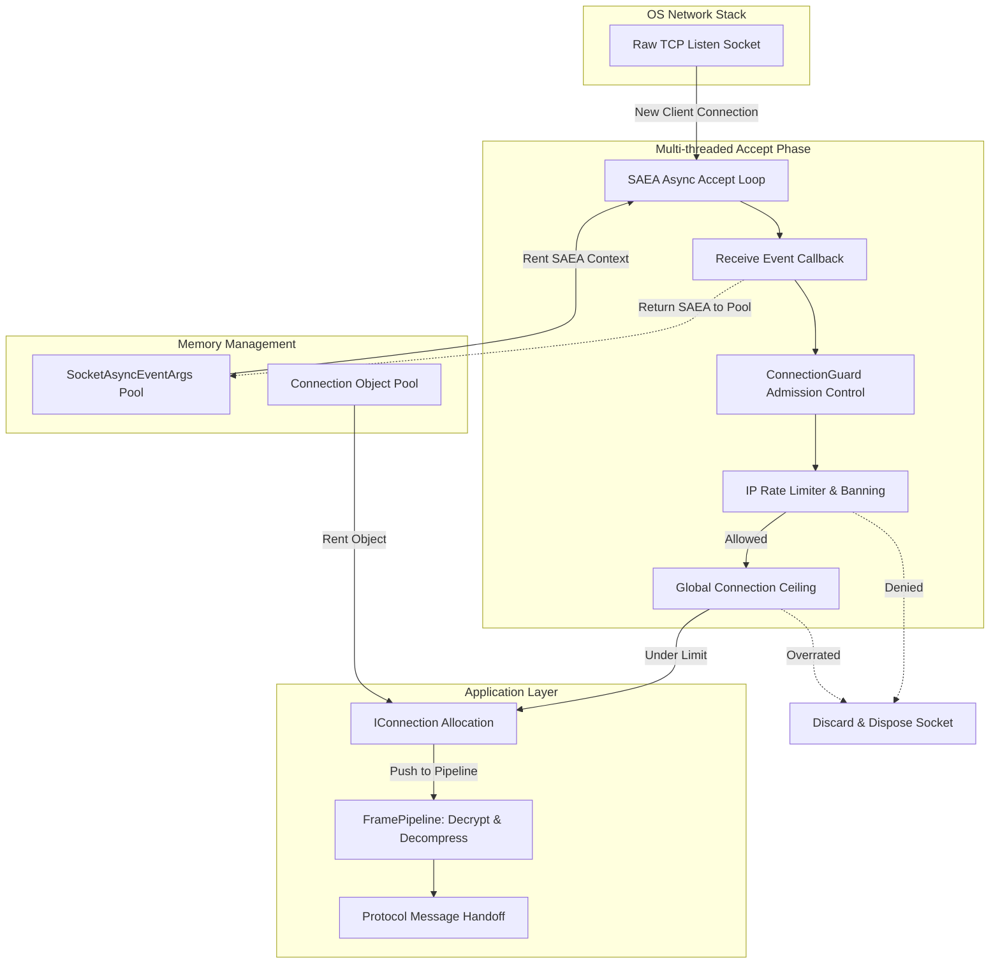

# TCP Listener (Low-Level Transport)

`TcpListenerBase` is the low-level TCP listener foundation in Nalix. It owns socket activation, accept throttling, connection admission, a bounded processing channel for accepted connections, and the handoff into `Protocol.OnAccept(...)`.

## Source Mapping

- `src/Nalix.Network/Listeners/TcpListener/TcpListener.PublicMethods.cs`
- `src/Nalix.Network/Listeners/TcpListener/TcpListener.ProcessChannel.cs`
- `src/Nalix.Network/Listeners/TcpListener/TcpListener.Core.cs`
- `src/Nalix.Network/Options/NetworkSocketOptions.cs`
- `src/Nalix.Network/Options/ConnectionLimitOptions.cs`

!!! note "Use Case"
    Application developers should use `NetworkApplicationBuilder` (the Hosting layer) which automatically orchestrates the TCP Listener. `TcpListenerBase` is primarily manipulated by framework developers building middleware or transport hooks.

---

## 1. Architectural Model

The `TcpListenerBase` avoids standard `async/await` overhead on the hot accept path. Instead, it utilizes pre-allocated `SocketAsyncEventArgs` (SAEA) coupled with a multi-worker accept loop.

```mermaid
flowchart TD
    subgraph OS[OS Network Stack]
        Raw[Raw TCP Listen Socket]
    end

    subgraph Pools[Memory Management]
        SAEA[SocketAsyncEventArgs Pool]
        Leases[Connection Object Pool]
    end

    subgraph AcceptPhase[Multi-threaded Accept Phase]
        Loop[SAEA Async Accept Loop]
        Callback[Receive Event Callback]
        Guard[ConnectionGuard Admission Control]
        GuardIP[IP Rate Limiter & Banning]
        GuardCount[Global Connection Ceiling]
    end

    subgraph ApplicationPhase[Application Layer]
        Init[IConnection Allocation]
        BufferPipe[FramePipeline: Decrypt & Decompress]
        Protocol[Protocol Message Handoff]
    end

    Raw -->|New Client Connection| Loop
    SAEA -->|Rent SAEA Context| Loop
    Loop --> Callback
    Callback -.->|Return SAEA to Pool| SAEA
    
    Callback --> Guard
    Guard --> GuardIP
    GuardIP -->|Allowed| GuardCount
    GuardIP -.->|Denied| Drop[Discard & Dispose Socket]
    GuardCount -->|Under Limit| Init
    GuardCount -.->|Overrated| Drop
    
    Leases -->|Rent Object| Init
    Init -->|Push to Pipeline| BufferPipe
    BufferPipe --> Protocol
```

## 2. Low-Level Mechanics

### 2.1. Accept Pipeline

Nalix uses pooled accept contexts and pooled `SocketAsyncEventArgs` for the accept path. During construction, `TcpListenerBase` loads `PoolingOptions`, validates them, and preallocates:

- `PooledAcceptContext`
- `PooledSocketAsyncEventArgs`

The listener also validates `NetworkSocketOptions` up front.

### 2.2. Admission Control (`ConnectionGuard`)

Before a `Socket` is promoted to a `Connection` object, it traverses the `ConnectionGuard`.

- **IP Rate Limiting**: Drops rapid reconnects from identical IPs to prevent SYN/Connection flooding.
- **Global connection limits**: Enforces connection safety rules before accepted sockets reach protocol processing.
- Dropped sockets at this phase are handled on the fast path and avoid creating a `Connection` object, though logging and error handling may still allocate in some paths.

### 2.3. Inbound Pipeline

To prevent slow acceptance-side work from exhausting accept workers, `TcpListenerBase` routes accepted `IConnection` instances through a bounded internal process channel.

- The channel capacity comes from `NetworkSocketOptions.ProcessChannelCapacity`.
- Full mode is `DropWrite`, so saturation drops newly accepted connections instead of blocking producers.
- A dedicated `TaskManager` worker drains the channel and calls `ProcessConnection(...)`.
- `Protocol.OnAccept(...)` then decides whether to validate and start `connection.TCP.BeginReceive(...)`.

## 3. Public API Surface

| Method | Description |
| :---: | :---: |
| `Constructor(..., IConnectionHub)` | Requires an explicit `IConnectionHub` instance for centralized connection management. |
| `Activate(CancellationToken)` | Binds the socket, begins listening, and starts accept/process workers. |
| `Deactivate(CancellationToken)` | Stops accepting new connections and begins listener shutdown. |
| `Dispose()` | Actively terminates the listening socket and all pending accept args. |
| `GenerateReport()` | Creates a diagnostic summary string of the transport's real-time health. |
| `GetReportData()` | Generates diagnostic data as key-value pairs for structured logging and automation. |

### Internal Notes

- The listener creates a bounded process channel with `SingleReader = true` and `DropWrite` backpressure in `src/Nalix.Network/Listeners/TcpListener/TcpListener.ProcessChannel.cs`.
- Accept workers are scheduled through `TaskManager.ScheduleWorker(...)` under the `net/tcp/{port}` worker group in `src/Nalix.Network/Listeners/TcpListener/TcpListener.PublicMethods.cs`.
- Listener shutdown closes the socket, stops the process channel, cancels grouped tasks, and deactivates the `TimingWheel` when timeout support is enabled.

## 4. Tuning for Production

To optimize TCP Listener behavior at the OS level, Nalix dynamically sets the following flags (if supported):

- `NoDelay = true`: Disables Nagle's Algorithm for real-time responsiveness.
- `KeepAlive = true`: Enables TCP keep-alive with the listener's configured probe timings so dead peers can be detected at the OS level.

!!! warning
    Backpressure is intentional. If your `ProcessChannel` metrics show it is frequently full, you must scale the internal Protocol Processing layer or optimize packet handlers instead of merely increasing connection limits.
