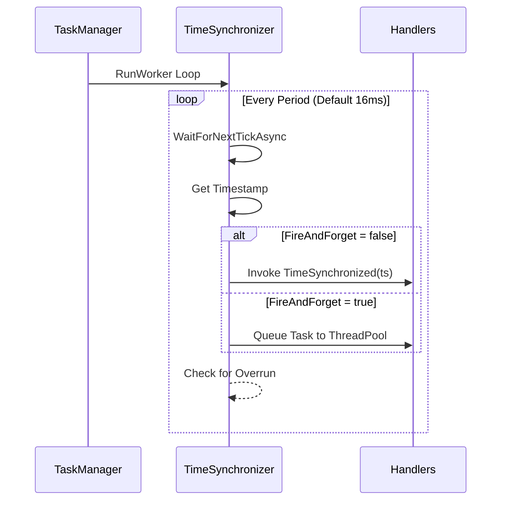

# Time Synchronizer

`TimeSynchronizer` emits periodic time-synchronization ticks at a high-resolution cadence (~60 Hz). It is primarily used to synchronize logic across the network runtime that depends on a shared high-precision clock.

## Flow



## Source mapping

- `src/Nalix.Network.Pipeline/Timekeeping/TimeSynchronizer.cs`

## Role and Design

`TimeSynchronizer` acts as a central heartbeat for the application. It is designed to be lightweight, typically registered as a singleton.

- **High Precision**: Uses `PeriodicTimer` which is more accurate than traditional `Timer` for stable frequencies.
- **Worker-Backed**: Integrated with `TaskManager` for consistent lifecycle management and diagnostics.
- **Safety**: Includes overrun detection; if a tick takes longer than 150% of its period, a warning is logged.

## Public API

### Events
| Member | Description |
|---|---|
| `TimeSynchronized` | Raised every tick with the current Unix timestamp in milliseconds. |

### Properties
| Member | Description |
|---|---|
| `IsRunning` | Read-only. True if the background loop is active. |
| `IsTimeSyncEnabled` | Main on/off switch. Setting this to `true` calls `Activate()`. |
| `Period` | Tick interval (Default: 16ms). Restarts the loop when changed while running. |
| `FireAndForget` | If true, handlers are dispatched to the `ThreadPool` to avoid blocking the sync loop. |

### Methods
| Member | Description |
|---|---|
| `Activate()` | Enables synchronization and ensures the loop is running. |
| `Deactivate()` | Disables synchronization and stops the loop. |
| `Restart()` | Re-applies current settings (like `Period`) by restarting the loop. |
| `Dispose()` | Stops the loop and clears all handlers. |

## Basic usage

```csharp
var sync = InstanceManager.Instance.GetOrCreateInstance<TimeSynchronizer>();

// Subscribe to heartbeat
sync.TimeSynchronized += ts =>
{
    // Update game logic, physics, or delta-time states
};

// Configure for 30Hz instead of 60Hz
sync.Period = TimeSpan.FromMilliseconds(33.3);

// Start emitting ticks
sync.IsTimeSyncEnabled = true;
```

## Related APIs

- [Timing Wheel](./timing-wheel.md)
- [TCP Listener](./tcp-listener.md)
- [UDP Listener](./udp-listener.md)
- [TaskManager](../framework/runtime/task-manager.md)
