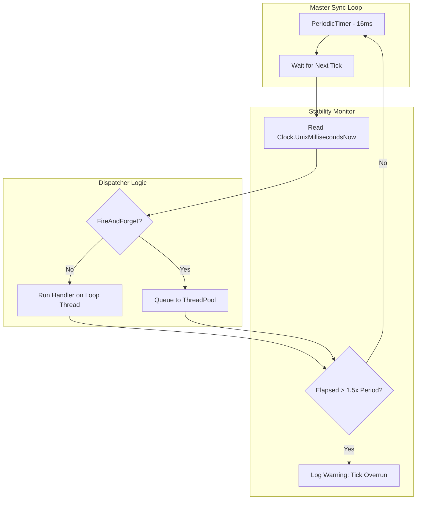

# Time Synchronizer

`TimeSynchronizer` is a high-precision, low-latency service that emits periodic "ticks" to synchronize state across the server. It is typically used for 60Hz heartbeat logic, physics-step synchronization, or periodic traffic flushing.

## Source Mapping

- `src/Nalix.Network.Pipeline/Timekeeping/TimeSynchronizer.cs`

## Why This Type Exists

Maintaining a consistent "Server Time" cadence is critical for deterministic real-time systems. `TimeSynchronizer` provides:
- **Fixed Cadence**: Built-in support for ~16ms (~60 FPS) ticks using high-precision timers.
- **Worker Isolation**: Runs in a managed background worker to prevent application logic from drifting the server's master clock.
- **Drift Detection**: Automatically identifies and logs "Tick Overruns" if a handler blocks the synchronization line for too long.

## Synchronization Pipeline

The following diagram shows the internal loop and how it dispatches time signals to registered handlers.

## Internal Responsibilities (Source-Verified)

### 1. High-Precision Timing
The synchronizer utilizes the .NET `PeriodicTimer`, which is more efficient than `Task.Delay` for long-running loops. It defaults to a **16ms period** (equivalent to 62.5 ticks per second), providing a smooth baseline for real-time networking.

### 2. Execution Modes (FireAndForget)
You can control how handlers are executed via the `FireAndForget` property:

- **FireAndForget = false (Default)**: Handlers run directly on the synchronization thread. This provides the lowest possible latency but risk "Tick Overruns" if the handler logic is heavy.
- **FireAndForget = true**: Handlers are dispatched to the `ThreadPool`. This protects the sync loop's precision but introduces a small dispatch delay.

!!! tip "Performance Tip"
    If your `TimeSynchronized` handlers perform any I/O or heavy calculations, enable `FireAndForget = true` to prevent degrading the server's heartbeat stability.

### 3. Stability Monitoring
If a tick takes longer than **150% of the allocated period** to complete, the synchronizer emits a warning:
`[NW.TimeSynchronizer] tick overrun elapsed=Xms period=Yms`
This is a critical diagnostic for identifying identifying bottlenecks in the real-time hot path.

## Public APIs

- `event TimeSynchronized`: The primary event raised every tick, providing the current Unix timestamp in milliseconds.
- `Period`: Gets or sets the tick interval (Default 16ms). Setting this while running triggers an internal `Restart()`.
- `Activate() / Deactivate()`: Explicitly starts or stops the background synchronization loop.
- `FireAndForget`: Toggle between synchronous and asynchronous handler execution.

## Related Information Paths

- [Real-time Engine Concepts](../../../concepts/real-time.md)
- [Clock Infrastructure](../../framework/runtime/clock.md)
- [Task Manager](../../framework/runtime/task-manager.md)
- [Worker Options](../../framework/options/worker-options.md)
