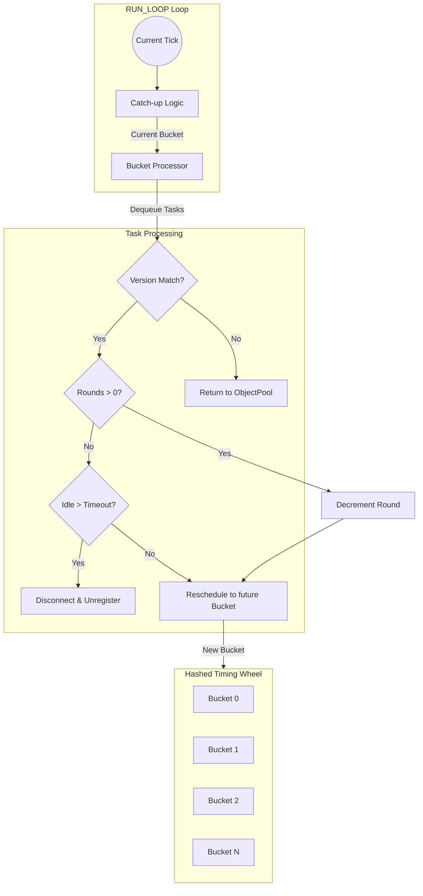

# Timing Wheel

`TimingWheel` is an ultra-lightweight, high-performance **Hashed Wheel Timer** specifically optimized for managing idle connection timeouts across tens of thousands of concurrent sessions with minimal CPU and GC overhead.

## Source Mapping

- `src/Nalix.Network/Internal/Time/TimingWheel.cs`

## Why This Type Exists

In a large-scale server, using a separate `System.Timers.Timer` or `CancellationTokenSource` per connection is extremely expensive. `TimingWheel` addresses this by:

- **Hashed Buckets**: Grouping thousands of connections into a fixed number of "buckets" based on their expiration time.
- **Single Background Loop**: Using one dedicated worker to periodically "tick" and process only the connections in the current bucket.
- **Zero-Allocation Execution**: Recycling `TimeoutTask` objects through an object pool and using version-based checks to handle rescheduling without complex queue removals.

## Hashed Wheel Architecture

The diagram below illustrates how connections are distributed across the wheel and how the background loop (Tick) processes them.

## Key Mechanisms (Source-Verified)

### 1. Version-Based Lazy Removal

Unlike traditional timers that require O(n) or O(log n) removal from a queue, Nalix uses a **Lazy Removal** strategy:

- When a connection sends data, its "expected version" is incremented in a `ConcurrentDictionary`.
- The old task remains in its original bucket.
- When the `RUN_LOOP` eventually hits that bucket, it compares the task's version with the "live" version. If they don't match, the task is discarded and returned to the pool instantly.

### 2. Rounds Handling

If a requested timeout exceeds the total duration of one full wheel rotation (`WheelSize * TickMs`), the task is assigned a `Rounds` count.

- The task sits in the calculated bucket.
- Each time the pointer passes that bucket, `Rounds` is decremented.
- The task only fires (or checks for idle state) when `Rounds == 0`.

### 3. Catch-up Logic

Total system load can sometimes delay the background loop. `TimingWheel` uses `PeriodicTimer` combined with high-precision monotonic timestamps (`Clock.MonoTicksNow`) to detect slipped ticks and "catch up" by processing missed buckets in a tight loop, ensuring no timeouts are permanently delayed.

## Public APIs

- `Activate()`: Starts the background worker.
- `Deactivate()`: Stops the worker and drains all remaining tasks back to the pool.
- `Register(IConnection)`: Enrolls a connection into the timing cycle.
- `Unregister(IConnection)`: Markedly removes a connection from monitoring (lazy).

## Configuration

The behavior of the wheel is controlled via `TimingWheelOptions`:

| Option | Description | Typical Value |
| :---: | :---: | :---: |
| `TickDuration` | Frequency of wheel ticks (precision). | 20-100 ms |
| `BucketCount` | Total number of buckets in the wheel. | 512-4096 |
| `IdleTimeoutMs` | The threshold for closing idle connections. | 30,000-60,000 ms |

## Best Practices

- **Avoid Blocking**: The `TimingWheel` loop is a shared resource. If you implement custom cleanup logic, ensure any I/O is truly asynchronous.
- **Fine-Tuning**: For servers with very short timeouts (e.g., fast handshake timeouts), reduce `TickDuration`. For long-lived idle sessions, increase `BucketCount` to reduce bucket density.
- **Automatic Cleanup**: `TimingWheel` automatically unregisters connections when they close, so manual `Unregister` is usually only needed for specialized state transitions.

## Related APIs

- [IConnection](../connection/connection.md)
- [Clock Infrastructure](../../framework/runtime/clock.md)
- [Object Pooling](../../framework/memory/object-pooling.md)
- [Object Map](../../framework/memory/object-map.md)
- [Typed Object Pools](../../framework/memory/typed-object-pools.md)
- [Task Naming Conventions](../../framework/runtime/task-manager.md)
