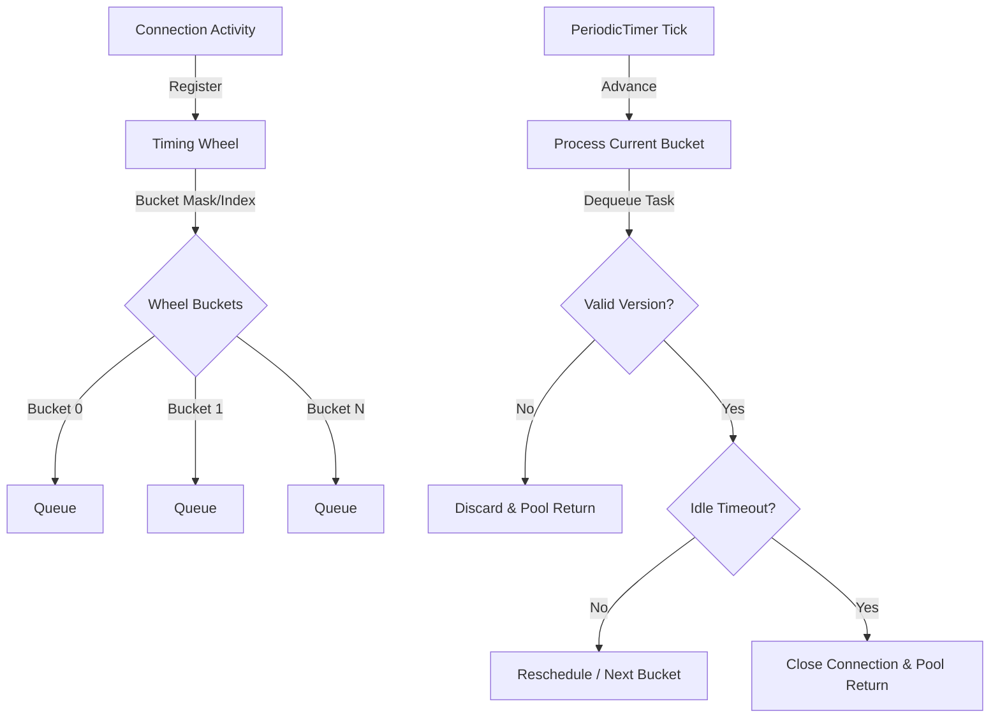

# Timing Wheel

`TimingWheel` provides an ultra-lightweight **Hashed Wheel Timer** optimized for idle connection cleanup. It minimizes per-tick overhead by avoiding full connection scans and uses versioned tasks to eliminate race conditions between registration and background eviction.

## Architecture



## Source mapping

- `src/Nalix.Network/Internal/Time/TimingWheel.cs`

## Role and Design

The timing wheel is the primary mechanism behind connection reaper logic. Instead of iterating over all active connections every few seconds, it groups connections into finite "buckets" based on their expected expiration time.

- **O(1) Registration**: Adding a connection to the wheel is a simple queue operation.
- **O(k) Ticking**: Each tick only processes connections in the current bucket (`k` items).
- **Zero Allocations**: `TimeoutTask` instances are pooled via `ObjectPoolManager`.
- **Race Safety**: A `Version` counter tracks re-schedules. If an old task version is dequeued after an `Unregister` or re-register, it is safely discarded.

## Public API

| Member | Description |
|---|---|
| `Activate()` | Starts the background loop using `TaskManager`. |
| `Deactivate()` | Stops the loop and drains all tasks back to the pool. |
| `Register(IConnection)` | Begins monitoring a connection for idleness. |
| `Unregister(IConnection)` | Stops monitoring. The underlying task is returned to the pool by the loop. |
| `Dispose()` | Full resource cleanup. |

## Basic usage

```csharp
// Typically managed via InstanceManager
var wheel = InstanceManager.Instance.GetOrCreateInstance<TimingWheel>();

wheel.Activate();
wheel.Register(connection);

// The connection is now automatically closed if it stays idle 
// longer than TimingWheelOptions.IdleTimeoutMs.
```

## Configuration

The wheel behavior is tuned via two main option types:

### TimingWheelOptions
- `BucketCount`: Number of slots in the wheel (ideally a power of two).
- `TickDuration`: Resolution of the timer (e.g., 1000ms).
- `IdleTimeoutMs`: Time until an inactive connection is reaped.

### PoolingOptions
- `TimeoutTaskCapacity`: Max size of the task object pool.
- `TimeoutTaskPreallocate`: Number of tasks to create at startup.

## Related APIs

- [TimingWheelOptions](./options/timing-wheel-options.md)
- [PoolingOptions](./options/pooling-options.md)
- [Connection](./connection/connection.md)
- [TaskManager](../framework/runtime/task-manager.md)
