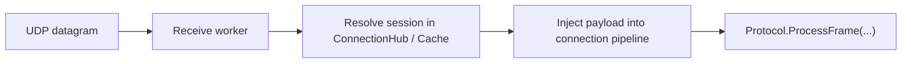

# Udp Listener

`UdpListenerBase` is the base class for UDP-based listeners in Nalix.Network. It owns the raw `Socket`, activation and deactivation flow, datagram receive worker, protocol integration, and runtime counters used in diagnostics.

!!! caution "UDP is not a shortcut around session security"
    In Nalix, UDP should usually extend an already trusted session model.
    If you do not have a clear session and authentication story yet, start with TCP first.

## Datagram flow



## Source mapping

- `src/Nalix.Network/Listeners/UdpListener/UdpListener.Core.cs`
- `src/Nalix.Network/Listeners/UdpListener/UdpListener.PublicMethods.cs`
- `src/Nalix.Network/Listeners/UdpListener/UdpListener.PrivateMethods.cs`
- `src/Nalix.Network/Listeners/UdpListener/UdpListener.Receive.cs`
- `src/Nalix.Network/Listeners/UdpListener/UdpListener.SocketConfig.cs`

## Lifecycle

`Activate(ct)`:

- throws if disposed
- initializes the UDP socket if needed
- creates a linked cancellation source
- marks the listener as running
- schedules a background receive worker through `TaskManager`

`Deactivate(ct)`:

- cancels the CTS
- closes and nulls the `Socket`
- resets running state

`Dispose()`:

- cancels and disposes the CTS
- closes the UDP socket
- disposes the internal semaphore lock

## Public members at a glance

| Type | Public members |
|---|---|
| `UdpListenerBase` | `Activate(...)`, `Deactivate(...)`, `Dispose()`, `GenerateReport()`, `IsAuthenticated(...)`, `IsListening`, `Metrics` |

## Inbound authentication model

`ProcessDatagram(...)` extracts the fixed 7-byte `SessionId` (Snowflake) from the beginning of the datagram.

The base class then:

- resolves the target `Connection` from `ConnectionHub` or the endpoint cache
- calls your overridden `IsAuthenticated(...)` for application-level checks

Only after all of those steps pass does the payload get injected into the connection.

### Failure modes worth knowing

- short packets are dropped before any connection lookup
- unknown sessions are counted separately from authentication failures
- replay-window failures should be treated as client/server clock or nonce issues, not generic transport loss

## Extensibility points

- `IsAuthenticated(IConnection connection, EndPoint remoteEndPoint, ReadOnlySpan<byte> payload)` is required and decides whether an inbound datagram is accepted.

## Diagnostics tracked in code

The class keeps counters for:

- received packets and bytes
- short-packet drops
- unauthenticated drops
- unknown-packet drops
- receive errors
`GenerateReport()` prints listener state, socket settings, worker-group details, traffic counters, error counts, and whether the live `Socket` and `CancellationTokenSource` currently exist.

## Notes

- `IsTimeSyncEnabled` cannot be changed while the listener is running.
- The scheduled worker uses `NetworkSocketOptions.MaxGroupConcurrency` as its concurrency limit.
- short packets are dropped before any connection lookup
- unknown sessions and auth failures are tracked separately in diagnostics

### Common pitfalls

- treating UDP as if it can safely work without a session identity
- making `IsAuthenticated(...)` slow or non-deterministic
- forgetting that the listener expects the authenticated trailer to be present on every accepted datagram

!!! tip "Keep authentication fast"
    `IsAuthenticated(...)` should be deterministic and cheap.
    Expensive lookups or slow policy checks belong in a safer layer upstream of sustained UDP traffic.

## Basic usage

```csharp
var protocol = new SampleProtocol();
var listener = new SampleUdpListener(protocol);

await listener.Activate(ct);
Console.WriteLine(listener.GenerateReport());
```

Typical flow:

1. establish the trusted session over TCP
2. activate UDP only after the session exists
3. validate datagrams through `IsAuthenticated(...)`
4. use `GenerateReport()` to confirm drops and time-sync state

## Related APIs

- [Protocol](./protocol.md)
- [UDP Session](../sdk/udp-session.md)
- [Connection Hub](./connection/connection-hub.md)
- [Network Options](./options/options.md)
