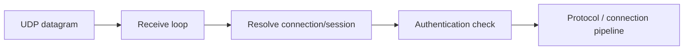

# UDP Listener

`UdpListenerBase` is the abstract UDP listener runtime used for datagram receive, session-token-based connection resolution, and protocol handoff.

## Audit Summary

- Existing page provided good lifecycle coverage but referenced one non-existent file path (`UdpListener.PrivateMethods.cs`).
- Needed tighter alignment to current public member surface.

## Missing Content Identified

- Explicit mention that accepted datagrams are associated to connections through session-token flow.
- Correct source mapping and API list.

## Improvement Rationale

Correct source references and lifecycle boundaries reduce confusion during UDP troubleshooting.

## Source Mapping

- `src/Nalix.Network/Listeners/UdpListener/UdpListener.Core.cs`
- `src/Nalix.Network/Listeners/UdpListener/UdpListener.PublicMethods.cs`
- `src/Nalix.Network/Listeners/UdpListener/UdpListener.Receive.cs`
- `src/Nalix.Network/Listeners/UdpListener/UdpListener.SocketConfig.cs`

## Why This Type Exists

`UdpListenerBase` provides shared UDP socket lifecycle and receive-loop infrastructure while allowing subclasses to define authentication policy.

## Core Public Members

- `Activate(CancellationToken cancellationToken = default)`
- `Deactivate(CancellationToken cancellationToken = default)`
- `GenerateReport()`
- `GetReportData()`
- `Dispose()`
- `IsListening`

## Required Extension Point

Derived listeners must implement authentication/validation logic for inbound datagrams before they are treated as connection traffic.

## Mental Model

## Best Practices

- Use UDP only after session identity is established by your control flow.
- Keep authentication checks deterministic and low-latency.
- Monitor drop counters (short/unknown/unauthenticated) to distinguish protocol errors from transport pressure.

## Related APIs

- [Protocol](./protocol.md)
- [Connection Hub](./connection/connection-hub.md)
- [Network Options](./options/options.md)
