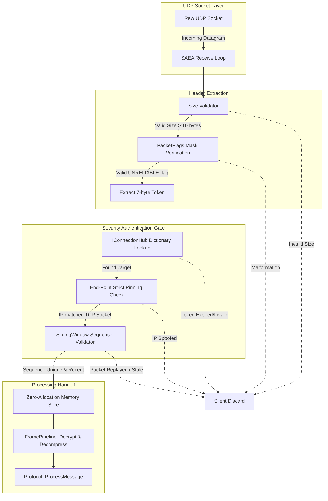

# UDP Listener (Low-Level Transport)

`UdpListenerBase` orchestrates high-performance Datagram reception. Unlike TCP, UDP is connectionless. Therefore, the Nalix UDP implementation acts as a **stateless router and authenticator** that securely maps incoming datagrams to stateful TCP `Connection` objects.

!!! danger "Security Prerequisite"
    Nalix strictly enforces that UDP communication cannot exist without an active TCP connection. All UDP packets must leverage the `SessionToken` issued by the successful TCP handshake.

---

## 1. Zero-Allocation Receive Loop

The UDP Listener avoids heap allocations completely on its hot path by coupling `SocketAsyncEventArgs` with internal pooling (`BufferLease` and `SpinLock`).

### 1.1. Lock-Free Rate Limiting

The UDP listener integrates a high-performance **`DatagramRateLimiter`**. This component uses atomic CAS (Compare-And-Swap) operations on a 64-bit packed window state to enforce per-IP packet limits (e.g., 128 PPS) without any lock contention. This is critical for scaling on many-core systems under flood conditions.

## 2. Low-Level Security Pipeline

UDP is vulnerable to spoofing and reflection attacks. Nalix hardens the listener via a 3-stage validation gate:

### Stage 1: Protocol & Token Validation
- **Minimum Size Guard**: Any datagram smaller than 10 bytes is instantly dropped.
- **Flag Verification**: The listener validates `payload[6]` (the `PacketFlags` byte) to ensure it carries the `PacketFlags.UNRELIABLE` mask identifying a UDP frame.
- **Session Lookup**: The first 7 bytes (`SessionToken`) are read natively via `ReadOnlySpan<byte>` and cross-referenced with the `IConnectionHub`. Extremely fast mapping occurs without object allocation.

### Stage 2: IP Pinning (SEC-30)
Even if an attacker steals a `SessionToken`, the listener verifies that the source `IPEndPoint` of the UDP datagram stringently matches the `Connection.NetworkEndpoint` bound to the TCP socket. Spoofed IPs are instantly dropped down to the networking stack.

### Stage 3: Sliding Replay Window (SEC-27)
Due to UDP's nature, an attacker could capture a valid packet and replay it iteratively. 
- Nalix utilizes an internal lock-free (via `SpinLock`) `SlidingWindow` instance attached to the connection.
- It parses the 16-bit `SequenceId` at offset 8.
- If the packet sequence is historical or already observed within the window, the datagram is rejected.
- **Performance**: Executing the bit-shift operations inside a low-level struct SpinLock ensures the validation cost rests under 10 nanoseconds per datagram.

## 3. Buffer Lifecycle & Pipeline Handoff

Once authenticated, the UDP payload follows a standardized processing pipeline:
1. **Extraction**: Nalix extracts a `BufferLease` (rented from the `ByteArrayPool`) containing the raw datagram.
2. **Slicing**: The 7-byte `SessionToken` prefix is mathematically sliced off using `Memory<byte>` operations without array copies.
3. **Async Dispatch**: The datagram is offloaded to the **`ThreadPool`** via the `AsyncCallback` dispatcher. This aligns the UDP processing model with TCP, ensuring that heavy decryption or application logic does not block the low-level receive loop.
4. **Processing**: The remaining payload is routed to the `FramePipeline` for decryption and decompression.
5. **Protocol Delivery**: The resolved `IProtocol` receives the clean payload via `ProcessMessage(...)`.
6. **Automatic Disposal**: The `IConnectEventArgs` (carrying the lease) is automatically disposed and returned to its pool via an internal **Event Bridge** once processing is complete.

## 4. Public API Surface

| Method | Description |
|---|---|
| `Constructor(..., IConnectionHub)` | Requires an explicit `IConnectionHub` instance for session tracking. |
| `Activate()` | Initializes the `Socket` and launches the continuous SAEA asynchronous receive loops. |
| `Deactivate()` | Cancels active receive tasks safely. |
| `IsAuthenticated` | **(Abstract)** The final application logic hook used by derived classes for custom datagram acceptance strategy. |

!!! tip "Performance Tuning"
    For immense traffic scenarios, ensure that `NetworkSocketOptions.BufferSize` is appropriately sized (typically between `2MB` and `10MB`) to accommodate OS-level network queuing preventing datagram drop under load spikes.
