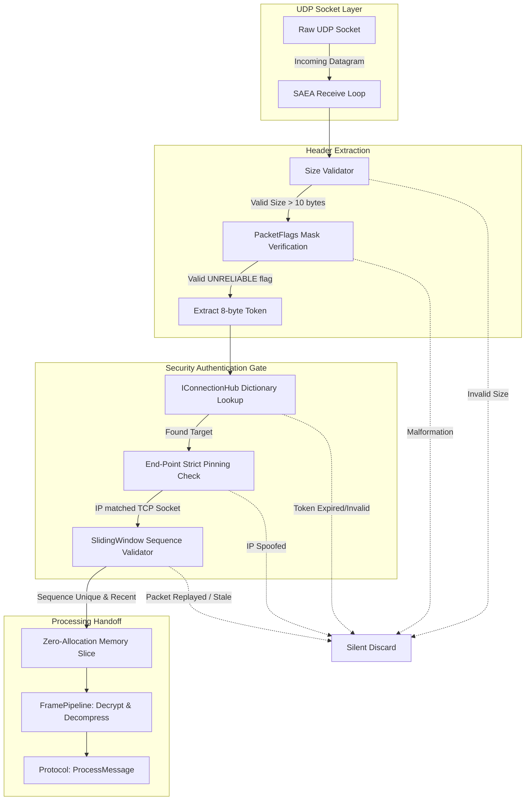

# UDP Listener (Low-Level Transport)

`UdpListenerBase` orchestrates high-performance datagram reception. Unlike TCP, UDP is connectionless, so Nalix resolves each datagram back to an existing TCP-backed `Connection` using the 8-byte session token prefix.

!!! danger "Security Prerequisite"
    Nalix strictly enforces that UDP communication cannot exist without an active TCP connection. All UDP packets must leverage the `SessionToken` issued by the successful TCP handshake.

---

## 1. Zero-Allocation Receive Loop

The UDP listener avoids heap allocations on its hot path by coupling `SocketAsyncEventArgs` with internal pooling (`BufferLease` and the internal rate-limiter state).

```mermaid
flowchart TD
    subgraph Transport[UDP Socket Layer]
        Raw[Raw UDP Socket]
        Loop[SAEA Receive Loop]
    end

    subgraph Extraction[Header Extraction]
        SizeCheck[Size Validator]
        FlagCheck[PacketFlags Mask Verification]
        Token[Extract 8-byte Token]
    end

    subgraph Security[Security Authentication Gate]
        HubLookup[IConnectionHub Dictionary Lookup]
        IPPinning[End-Point Strict Pinning Check]
        SlidingWindow[SlidingWindow Sequence Validator]
    end

    subgraph Handoff[Processing Handoff]
        Slice[Zero-Allocation Memory Slice]
        Pipeline[FramePipeline: Decrypt & Decompress]
        AppHandoff[Protocol: ProcessMessage]
    end

    Raw -->|Incoming Datagram| Loop
    Loop --> SizeCheck
    
    SizeCheck -->|Valid Size > 10 bytes| FlagCheck
    SizeCheck -.->|Invalid Size| Drop[Silent Discard]
    
    FlagCheck -->|Valid UNRELIABLE flag| Token
    FlagCheck -.->|Malformation| Drop
    
    Token --> HubLookup
    HubLookup -->|Found Target| IPPinning
    HubLookup -.->|Token Expired/Invalid| Drop
    
    IPPinning -->|IP matched TCP Socket| SlidingWindow
    IPPinning -.->|IP Spoofed| Drop
    
    SlidingWindow -->|Sequence Unique & Recent| Slice
    SlidingWindow -.->|Packet Replayed / Stale| Drop
    
    Slice --> Pipeline
    Pipeline --> AppHandoff

```

### 1.1. Datagram Guard

The UDP listener creates a `DatagramGuard` from `ConnectionLimitOptions` and `DatagramGuardOptions`. Incoming datagrams from an `IPEndPoint` first pass `_rateLimiter.TryAccept(ip)` before deeper processing continues.

## 2. Low-Level Security Pipeline

UDP is vulnerable to spoofing and reflection attacks. Nalix hardens the listener via a 3-stage validation gate:

### Stage 1: Protocol & Token Validation

- **Minimum Size Guard**: Any datagram shorter than the 8-byte session token is dropped immediately. The payload itself must also be at least 10 bytes.
- **Flag Verification**: The listener validates `payload[6]` (the `PacketFlags` byte) to ensure it carries the `PacketFlags.UNRELIABLE` mask identifying a UDP frame.
- **Session Lookup**: The first 8 bytes (`SessionToken`) are resolved through `TryResolveConnection(...)` against the active `IConnectionHub`.

### Stage 2: IP Pinning (SEC-30)

Even if an attacker steals a `SessionToken`, the listener verifies that the source endpoint matches the pinned TCP-side `Connection.NetworkEndpoint`. Address mismatch, and port mismatch when a pinned port exists, are both rejected.

### Stage 3: Sliding Replay Window (SEC-27)

Due to UDP's nature, an attacker could capture a valid packet and replay it iteratively.

- Nalix uses the connection's `UdpReplayWindow`.
- It parses the 16-bit `SequenceId` at offset 8.
- If the packet sequence is historical or already observed within the window, the datagram is rejected.

## 3. Buffer Lifecycle & Pipeline Handoff

Once authenticated, the UDP payload follows a standardized processing pipeline:

1. **Extraction**: Nalix extracts a `BufferLease` (rented from the `ByteArrayPool`) containing the raw datagram.
2. **Slicing**: The 8-byte `SessionToken` prefix is mathematically sliced off using `Memory<byte>` operations without array copies.
3. **Async Dispatch**: The payload is wrapped into `ConnectionEventArgs` and forwarded through `AsyncCallback.Invoke(...)`.
4. **Processing**: `ProcessFrame(...)` applies `FramePipeline.ProcessInbound(...)`.
5. **Protocol Delivery**: The resolved `IProtocol` receives the clean payload via `ProcessMessage(...)`.
6. **Automatic Disposal**: The `IConnectEventArgs` (carrying the lease) is automatically disposed and returned to its pool via an internal **Event Bridge** once processing is complete.

## 4. Public API Surface

| Method | Description |
| :---: | :---: |
| `Constructor(..., IConnectionHub)` | Requires an explicit `IConnectionHub` instance for session tracking. |
| `Activate(CancellationToken)` | Initializes the `Socket` and launches the continuous SAEA receive workers. |
| `Deactivate(CancellationToken)` | Cancels active receive tasks safely. |
| `Dispose()` | Releases all resources and stops the listener. |
| `IsAuthenticated(IConnection, EndPoint, ReadOnlySpan<byte>)` | Protected hook used by derived listeners for custom datagram acceptance logic after built-in token, endpoint, and replay checks pass. |

!!! tip "Performance Tuning"
    For large datagram bursts, tune `NetworkSocketOptions.BufferSize` together with `ConnectionLimitOptions.MaxPacketPerSecond` and the datagram guard capacities instead of relying on one oversized socket buffer alone.
