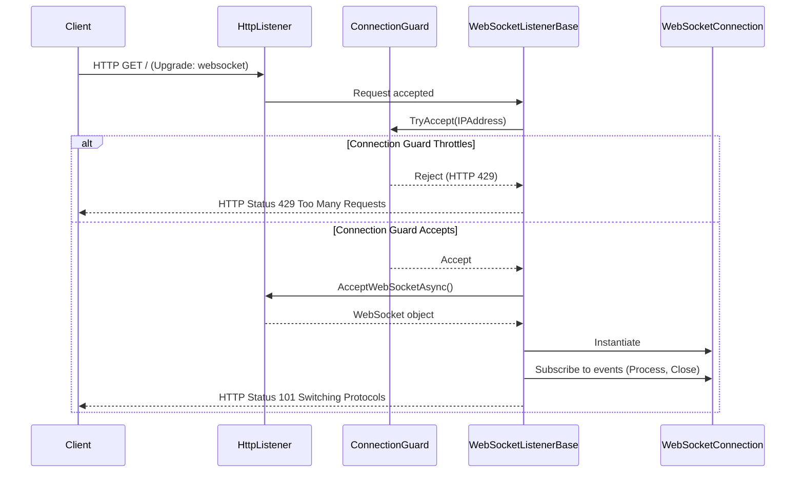

# WebSocket Listener

The `WebSocketListenerBase` provides a high-performance HTTP-based listener that accepts incoming WebSocket connection requests, performs preliminary security checks, and initializes active WebSocket sessions. It uses `System.Net.HttpListener` under the hood.

## Overview

Unlike raw TCP or UDP listeners, a WebSocket listener operates on top of HTTP. It listens for incoming HTTP requests, verifies if they are WebSocket upgrade requests, checks connection limits via the `ConnectionGuard`, and upgrades accepted requests to full duplex `WebSocketConnection` channels.

### Architecture Flow



## Configuration

`WebSocketListenerBase` is configured via `NetworkWebSocketOptions`. Key configuration parameters include:

* **Port**: The listening port (default: standard WebSocket ports).
* **Path**: The request path suffix (e.g. `/` or `/ws`).
* **SubProtocol**: Optional sub-protocol used in WebSocket handshakes.
* **ProcessChannelCapacity**: Bounded channel size for accepting connections concurrently.
* **ProcessChannelDrainTimeout**: Time allowed to drain accepted connection queue before hard stopping.

See [WebSocket Options](../options/network/websocket-options.md) for a complete list of settings.

## API Reference

### WebSocketListenerBase Class

```csharp
namespace Nalix.Network.Listeners.Web;

public abstract class WebSocketListenerBase : IListener, IDisposable
```

#### Constructors

* `protected WebSocketListenerBase(ushort port, string path, IProtocol protocol, IConnectionHub hub)`  
  Initializes a new instance bound to the specified port and HTTP path.

* `protected WebSocketListenerBase(IProtocol protocol, IConnectionHub hub)`  
  Initializes a new instance using defaults resolved from the configuration system.

#### Public Methods

* `public void Activate(CancellationToken cancellationToken = default)`  
  Starts listening on the configured HTTP prefix. Spawns background workers to accept connections.

* `public void Deactivate(CancellationToken cancellationToken = default)`  
  Stops the listener, closes open sockets, and cancels background tasks.

* `public abstract void ProcessFrame(object? sender, IConnectEventArgs args)`  
  Must be implemented by subclasses to process inbound connection events (e.g. framing, sequence verification).

* `public string GenerateReport()`  
  Generates a string diagnostics report of the listener state.

* `public void WriteReportData(System.Text.Json.Utf8JsonWriter writer)`  
  Writes structured JSON diagnostic information.

#### Protected Methods

* `protected virtual void Initialize()`  
  Configures and starts the underlying `HttpListener` with appropriate prefixes.

* `protected void ProcessConnection(IConnection connection)`  
  Invokes protocol accept logic and registers the connection inside the connection hub.

* `protected async Task AcceptConnectionsAsync(IWorkerContext ctx, CancellationToken cancellationToken)`  
  Worker loop accepting incoming connection upgrades.

* `protected void HandleConnectionClose(object? sender, IConnectEventArgs args)`  
  Cleans up connection event subscriptions on disconnect.

## Usage Example

The following example shows how to subclass `WebSocketListenerBase` inside a custom server implementation:

```csharp
using System;
using Nalix.Abstractions.Networking;
using Nalix.Network.Connections;
using Nalix.Network.Listeners.Web;

public sealed class CustomWebSocketListener : WebSocketListenerBase
{
    public CustomWebSocketListener(IProtocol protocol, IConnectionHub hub) 
        : base(protocol, hub)
    {
    }

    public override void ProcessFrame(object? sender, IConnectEventArgs args)
    {
        // Decode inbound data lease, perform protocol parsing, etc.
        var lease = args.Lease;
        Console.WriteLine($"Received {lease.Length} bytes via WebSocket");
        
        // Pass to standard protocol dispatcher
        this.Protocol.ProcessMessage(sender, args);
    }
}
```

## See Also

* [WebSocket Connection](websocket-connection.md)
* [Connection Hub](connection/connection-hub.md)
* [WebSocket Options](../options/network/websocket-options.md)
