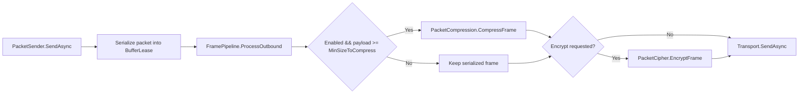

# Compression Options

`CompressionOptions` controls whether outbound packet frames may be compressed and
how large a serialized payload must be before compression is attempted.

## Source Mapping

- `src/Nalix.Codec/Options/CompressionOptions.cs`
- `src/Nalix.Codec/Transforms/FramePipeline.cs`
- `src/Nalix.Runtime/Dispatching/PacketSender.cs`
- `src/Nalix.Hosting/Bootstrap.cs`

!!! note "Package"
    `CompressionOptions` is defined in `Nalix.Codec`, not `Nalix.Framework`.

## Defaults and Validation

| Property | Default | Validation | Runtime effect |
| --- | ---: | --- | --- |
| `Enabled` | `true` | None. | Allows outbound compression when the frame size threshold is met. |
| `MinSizeToCompress` | `1024` | `1..int.MaxValue` | Minimum payload size, in bytes, before outbound compression is attempted. |
| `MaxDecompressedSize` | `33554432` (32 MB) | `1024..268435456` (256 MB) | Maximum allowed size in bytes for a decompressed payload. Packets declaring a larger original size are rejected (zip-bomb / allocation-DoS protection). |

`Validate()` uses manual range checks and throws `ValidationException` when constraints are violated.

## Hosting Initialization

`Bootstrap.Initialize()` loads `CompressionOptions` during server startup so the
configuration template is materialized into `server.ini`:

```csharp
_ = ConfigurationManager.Instance.Get<CompressionOptions>();
```

## Outbound Runtime Flow

`PacketSender` reads `CompressionOptions` as a static configuration instance and
passes its values into `FramePipeline.ProcessOutbound(...)` for each send.



The exact source condition is:

```csharp
bool doCompress = enableCompress &&
    (current.Length - FrameTransformer.Offset) >= minSizeToCompress;
```

`FrameTransformer.Offset` is subtracted before comparing with the threshold, so the
threshold applies to the payload portion rather than the full frame length.

## Transform Ordering

| Direction | Source order | Notes |
| --- | --- | --- |
| Outbound | Compress, then encrypt | Compression is attempted before encryption so encrypted data is not compressed. |
| Inbound | Decrypt, then decompress | The pipeline re-reads frame flags after decryption before checking compression. |

`CompressionOptions` only controls the outbound compression decision. Inbound
`FramePipeline.ProcessInbound(...)` relies on packet flags; if a received frame is
marked `COMPRESSED`, the pipeline attempts decompression regardless of local
`CompressionOptions.Enabled`.

## Buffer Ownership

`FramePipeline.ProcessOutbound(...)` mutates the current lease by `ref`. When a
transform produces a replacement lease, it disposes the previous lease and assigns
the new one back to `current`. `PacketSender` then disposes any replacement lease
after `Transport.SendAsync(...)`, and always disposes the original raw lease in its
outer `finally` block.

## Operational Guidance

The default `MinSizeToCompress = 1024` avoids spending CPU on small payloads that
may not benefit from compression after headers and framing overhead. Lower the
threshold only when payload characteristics show a measurable bandwidth win.

## Related APIs

- [Packet Sender](../../runtime/routing/packet-sender.md)
- [Network Options](./options.md)
