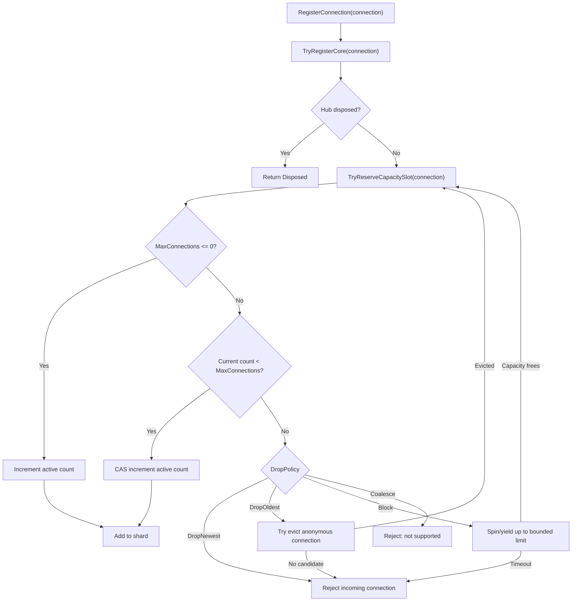

# Connection Hub Options

`ConnectionHubOptions` configures server-wide connection capacity, connection-hub
sharding, broadcast batching, bulk-disconnect parallelism, and latency diagnostics
for `ConnectionHub`.

## Source Mapping

- `src/Nalix.Network/Options/ConnectionHubOptions.cs`
- `src/Nalix.Network/Connections/Connection.Hub.cs`
- `src/Nalix.Hosting/Bootstrap.cs`

## Defaults and Validation

| Property | Default | Validation | Runtime consumer |
| --- | ---: | --- | --- |
| `MaxConnections` | `-1` | `-1..int.MaxValue`; `0` rejected by `Validate()` | Global active-connection capacity in `TryReserveCapacitySlot(...)`. |
| `DropPolicy` | `DropNewest` | Must be a `DropPolicy` enum value | Capacity handling strategy when `MaxConnections` is reached. |
| `ParallelDisconnectDegree` | `-1` | `-1..int.MaxValue`; `0` rejected by `Validate()` | `ParallelOptions.MaxDegreeOfParallelism` in `CloseAllConnections(...)`. |
| `BroadcastBatchSize` | `0` | `0..int.MaxValue` | Enables `BroadcastBatchedAsync(...)` when greater than zero. |
| `ShardCount` | `max(1, Environment.ProcessorCount)` | `1..int.MaxValue` | Number of internal `ConcurrentDictionary` shards. |
| `IsEnableLatency` | `true` | Boolean | Gates performance timing logs for register, unregister, and broadcast paths. |

`Validate()` runs data-annotation validation, then explicitly rejects `0` for
`MaxConnections` and `ParallelDisconnectDegree`. Use `-1` for the default/unlimited
mode or a positive value for an explicit limit.

## Hosting Initialization

`Bootstrap.Initialize()` materializes this option set during server startup:

```csharp
_ = ConfigurationManager.Instance.Get<ConnectionHubOptions>();
```

This ensures the generated `server.ini` includes the connection-hub capacity and
concurrency policy.

## Construction and Sharding

`ConnectionHub` loads and validates `ConnectionHubOptions` in its constructor. It
then derives immutable runtime fields from the options:

- `_maxConnections` caches `MaxConnections`.
- `_shardCount` is clamped with `Math.Max(1, ShardCount)`.
- `_shardMask` and `_isPowerOfTwoShardCount` optimize shard lookup for powers of two.
- `_trackEvictionQueue` is enabled only when `MaxConnections > 0` and
  `DropPolicy == DropOldest`.
- Each shard is a `ConcurrentDictionary<ulong, IConnection>` sized from the global
  capacity when a positive limit is configured.

Shard selection hashes the `ulong` connection id. Power-of-two shard counts use a
bit mask; other counts use modulo.

## Registration and Capacity Flow



A successful capacity reservation increments `_count` before the connection is added
to the selected shard. If shard insertion fails, the `finally` block detaches the
close handler and decrements `_count` to roll back the reservation.

## Drop Policy Semantics

### `DropNewest`

Rejects the incoming connection immediately and calls `Disconnect("connection limit
reached")`. The hub increments `_rejectedConnections` and raises
`CapacityLimitReached` with reason `drop-newest`.

### `DropOldest`

Only anonymous connections are eligible for eviction. The hub tracks anonymous
connections in `_anonymousQueue` when `DropOldest` is active. During eviction it
removes stale queue entries, verifies the candidate is still anonymous, removes it
from the shard, decrements `_count`, increments `_evictedConnections`, raises
`ConnectionUnregistered`, and disconnects the evicted connection.

If no anonymous candidate is available, the incoming connection is rejected with
reason `evict-oldest-no-candidate`.

### `Block`

The hub spins while capacity is full, yielding after the first few spins. The wait is
bounded: after more than `10_000` spin iterations the incoming connection is rejected
with reason `block-timeout`. This prevents an infinite CPU-burning wait when the
server remains at capacity.

### `Coalesce`

The enum value is recognized by the runtime but not implemented for connection-hub
admission. It rejects the incoming connection with reason `coalesce-not-supported`.

## Broadcast Behavior

`BroadcastAsync(...)` captures a point-in-time connection snapshot using an
`ArrayPool<IConnection>` buffer. The public method then chooses the send strategy:

- `BroadcastBatchSize == 0`: send through `BroadcastCoreAsync(...)` and await all
  incomplete send tasks together.
- `BroadcastBatchSize > 0`: send through `BroadcastBatchedAsync(...)`, renting arrays
  sized to the configured batch and awaiting each full batch before continuing.

`BroadcastWhereAsync(...)` always uses `BroadcastCoreAsync(...)` with a predicate;
it does not use `BroadcastBatchSize`.

Both broadcast implementations rent task/owner arrays and return them in `finally`.
Failed asynchronous sends are mapped back to owning connections for diagnostic logs.

## Bulk Close Behavior

`CloseAllConnections(...)` snapshots current connections, detaches the close event
handler from each connection, then disposes connections through `Parallel.ForEach`.
`ParallelDisconnectDegree` is passed directly to
`ParallelOptions.MaxDegreeOfParallelism`:

- `-1` uses the runtime default parallelism.
- Positive values cap the maximum concurrent dispose workers.

After disposal, every shard and the anonymous queue are cleared and `_count` is reset
to zero.

## Latency Diagnostics

When `IsEnableLatency` is `true` and the logger has `Information` enabled, the hub
records elapsed time for:

- `RegisterConnection`
- `UnregisterConnection`
- `BroadcastAsync`

The timing path uses `TimingScope.Start()` and logs `[PERF.NW.*]` messages. Disabling
`IsEnableLatency` removes this measurement work even when information logging is
enabled.

## Reporting

`ConnectionHub` implements report-style diagnostics through:

- `GenerateReport()` for a human-readable status summary;
- `GetReportData()` for structured values such as total connections, evictions,
  rejections, shard count, anonymous queue depth, capacity policy, byte totals,
  uptime statistics, algorithm summary, permission-level summary, and sampled
  connection rows.

## Tuning Guidance

- Use `MaxConnections = -1` for unlimited capacity only when an upstream limiter is
  already enforcing admission.
- Prefer `DropNewest` for predictable overload rejection.
- Use `DropOldest` only when anonymous connections are disposable and authenticated
  sessions should be preserved.
- Avoid `Block` on public-facing listeners unless connection churn is very low.
- Choose a power-of-two `ShardCount` for the fastest shard-index path.
- Set `BroadcastBatchSize` when large broadcasts create too many simultaneous send
  tasks.
- Tune `ParallelDisconnectDegree` for shutdown behavior; high values close faster but
  can create I/O bursts.

## Related APIs

- [Connection Hub](../../network/connection/connection-hub.md)
- [Connection Limiter](../../network/connection/connection-limiter.md)
- [Connection Limit Options](./connection-limit-options.md)
- [Session Store Options](./session-store-options.md)

