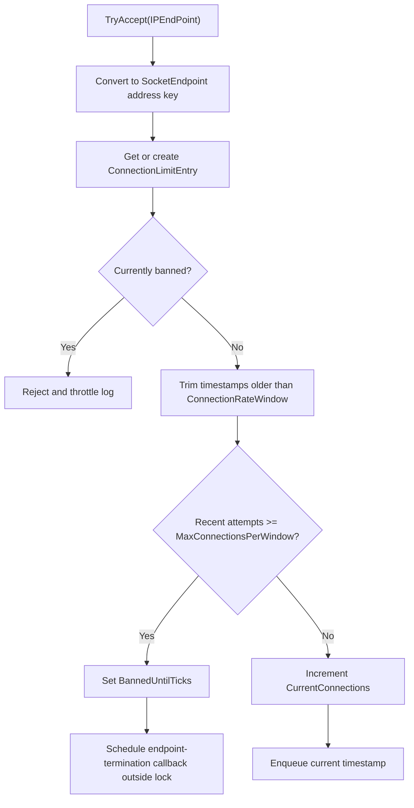

# Connection Quota Options

`ConnectionQuotaOptions` configures per-IP connection limits, concurrency caps, rate window admission checks, and cleanup behavior used by `ConnectionGuard`.

## Source Mapping

- `src/Nalix.Network/Options/ConnectionQuotaOptions.cs`
- `src/Nalix.Network/RateLimiting/Connection.Guard.cs`
- `src/Nalix.Hosting/Bootstrap.cs`

## Defaults and Validation

| Property | Default | Validation | Runtime consumer |
| --- | ---: | --- | --- |
| `MaxConnectionsPerIpAddress` | `10` | `1..10_000` | `ConnectionGuard` concurrent slot limit per endpoint. |
| `MaxConnectionsPerWindow` | `10` | `1..10_000_000` | `ConnectionGuard` rate-window admission check. |
| `ConnectionRateWindow` | `00:00:05` | `00:00:01..00:10:00` | Sliding window used to trim recent connection timestamps. |
| `CleanupInterval` | `00:01:00` | `00:00:01..01:00:00` | Recurring cleanup interval for stale endpoint entries. |
| `InactivityThreshold` | `00:05:00` | `00:00:01..1.00:00:00` | Age cutoff for removing inactive zero-connection entries. |
| `MaxCleanupKeysPerRun` | `0` | `0..10_000_000` | Max endpoint keys scanned per cleanup cycle; `0` auto-scales based on tracked entry count. |
| `DailyResetTimeOffset` | `00:00:00` | `-14:00:00..14:00:00` | UTC offset used to determine the start-of-day for daily connection-limit resets. |

`Validate()` uses manual range checks and throws `ArgumentOutOfRangeException` when constraints are violated.

## Hosting Initialization

`Bootstrap.Initialize()` loads `ConnectionQuotaOptions` during server startup so the server configuration template includes every quota knob:

```csharp
_ = ConfigurationManager.Instance.Get<ConnectionQuotaOptions>();
```

Runtime consumers validate the loaded instance before using it. For example, `ConnectionGuard` validates in its constructor.

## Admission Control Flow



`ConnectionGuard.TryAccept(...)` tracks endpoints by IP address using `SocketEndpoint.FromIpAddress(...)`. It does not include the remote port in the key, so the limits apply per source address.

The entry lock protects mutations to the `ConnectionLimitInfo` value snapshot. The recent-attempt queue is a `ConcurrentQueue<DateTime>` and is trimmed against `ConnectionRateWindow` before each admission check.

## Release and Cleanup Behavior

`OnConnectionClosed(...)` decrements the endpoint's current connection count.

A recurring cleanup job is scheduled with:

- `interval = CleanupInterval`
- `NonReentrant = true`
- `BackoffCap = 15s`
- `Jitter = 250ms`
- `ExecutionTimeout = 2s`

Each run scans at most `MaxCleanupKeysPerRun` endpoint keys per cycle; when `MaxCleanupKeysPerRun` is `0` (the default), the scan count is auto-scaled to a percentage of the current tracked entry count. Entries are removed only when they have no active connections and `LastConnectionTime` is older than `now - InactivityThreshold`. Removed entries have their timestamp queues cleared.

## Related APIs

- [Connection Limiter](../../network/connection/connection-limiter.md)
- [Connection Guard Options](./connection-guard-options.md)
- [Trusted Proxy Options](./trusted-proxy-options.md)
- [Network Options](./options.md)
