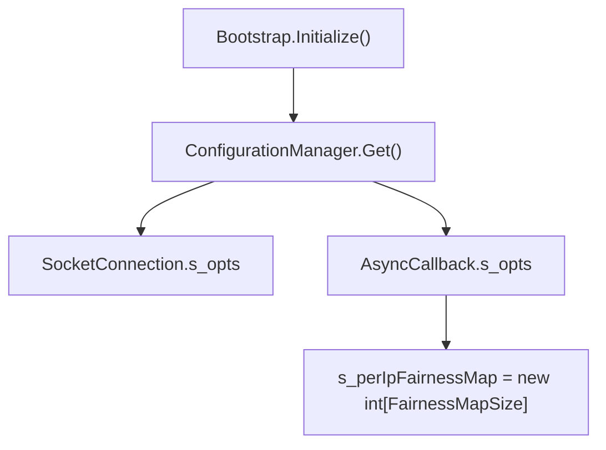
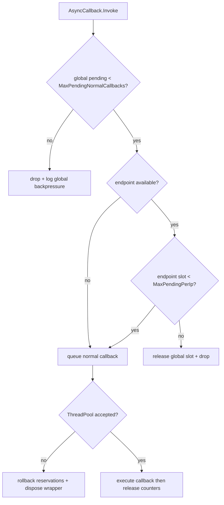

# Network Callback Options

`NetworkCallbackOptions` configures two independent callback-pressure layers:
per-connection receive throttles in `SocketConnection` and global/per-IP
normal-callback throttles in `AsyncCallback`.

## Source Mapping

- `src/Nalix.Network/Options/NetworkCallbackOptions.cs`
- `src/Nalix.Hosting/Bootstrap.cs`
- `src/Nalix.Network/Internal/Transport/SocketConnection.cs`
- `src/Nalix.Network/Internal/Transport/AsyncCallback.cs`
- `src/Nalix.Network/Connections/Connection.cs`
- `src/Nalix.Network/Internal/Pooling/PooledConnectEventContext.cs`

## Defaults and Validation

| Property | Default | Valid range | Runtime effect |
| --- | ---: | --- | --- |
| `MaxPerConnectionPendingPackets` | `16` | `1..1024` | Layer 1 cap for receive-path packets queued for one connection but not yet processed. |
| `MaxPerConnectionOpenFragmentStreams` | `4` | `1..256` | Layer 1 cap for concurrently open fragmented streams for one connection. |
| `MaxPendingNormalCallbacks` | `10000` | `100..1000000` | Layer 2 global cap for normal-priority callbacks pending in `AsyncCallback`. |
| `CallbackWarningThreshold` | `5000` | `0..1000000` | Enables high-backpressure warnings when the pending count is at or above the threshold and divisible by `1000`; `0` disables warnings. |
| `MaxPendingPerIp` | `64` | `1..10000` | Layer 2 cap for normal-priority callbacks hashed to one remote endpoint slot. |
| `MaxPooledCallbackStates` | `1000` | `64..100000` | Declared configuration knob for reusable callback state objects. See the wiring note below. |
| `FairnessMapSize` | `4096` | `1024..65536` | Allocates the fixed `int[]` used by endpoint-hash fairness accounting. |

`Validate()` first runs DataAnnotation validation and then enforces two cross-field
constraints:

- `CallbackWarningThreshold` must be lower than `MaxPendingNormalCallbacks` when
  warnings are enabled.
- `MaxPendingPerIp` must not exceed `MaxPendingNormalCallbacks`.

## Bootstrap and Option Materialization

`Bootstrap.Initialize()` materializes this option class through
`ConfigurationManager.Instance.Get<NetworkCallbackOptions>()`. The active values are
then captured by static fields when `SocketConnection` and `AsyncCallback` are first
loaded.



Because the consumers store static readonly snapshots, treat these settings as
startup-time configuration. Changing the INI file after the transport classes are
loaded does not resize the fairness map or update already-captured thresholds.

## Layer 1: Per-Connection Receive Throttles

`SocketConnection.PROCESS_FRAME_FROM_BUFFER()` increments the connection-local
`_pendingProcessCallbacks` counter before handing a complete frame to the callback
dispatcher. If the incremented value is greater than
`MaxPerConnectionPendingPackets`, the frame is dropped immediately and the counter is
rolled back.

For regular frames, the payload is copied into a `BufferLease`, wrapped in
`ConnectionEventArgs`, and queued with:

```csharp
AsyncCallback.Invoke(_callbackProcess, _sender, args, releasePendingPacketOnCompletion: true)
```

The `releasePendingPacketOnCompletion` flag causes the callback wrapper to call back
into the connection after execution so the pending packet slot is released.

### Fragment Stream Limit

When a frame contains a `FragmentHeader` and starts a new fragment stream,
`SocketConnection.HANDLE_FRAGMENTED_FRAME()` increments `_openFragmentStreams`. If the
new value exceeds `MaxPerConnectionOpenFragmentStreams`, the stream is rejected, the
open-stream counter is rolled back, the pending-packet counter is decremented, and the
input lease is disposed in the `finally` block.

Expired fragment streams are also evicted periodically in the receive loop by
`FragmentAssembler.EvictExpired()`. Any evicted count is subtracted from
`_openFragmentStreams`.

## Layer 2: AsyncCallback Backpressure

`AsyncCallback.Invoke()` handles normal-priority callbacks such as packet processing
and post-processing. The admission order is:

1. Reserve one global slot with `TRY_RESERVE_GLOBAL_SLOT()`.
2. Resolve the endpoint from `IConnectEventArgs.NetworkEndpoint`.
3. Reserve one endpoint-hash slot with `TRY_RESERVE_ENDPOINT_SLOT()`.
4. Log high-backpressure warnings if the warning rule matches.
5. Queue the wrapper with `ThreadPool.UnsafeQueueUserWorkItem()`.

If global reservation fails, the callback is dropped before any work item is queued.
If per-IP reservation fails, the global reservation is rolled back before the method
returns `false`. If ThreadPool queueing fails, both global and endpoint reservations
are rolled back and the wrapper is disposed.



### High-Priority Lane

`AsyncCallback.InvokeHighPriority()` is used for close/disconnect cleanup callbacks.
It bypasses `MaxPendingNormalCallbacks`, `MaxPendingPerIp`, and the warning threshold
so cleanup can still be scheduled during callback floods.

## Per-IP Fairness Map Semantics

The fairness map is a fixed `int[]` allocated to `FairnessMapSize`. A callback's slot
is selected with:

```csharp
int index = (endpoint.GetHashCode() & 0x7FFFFFFF) % s_perIpFairnessMap.Length;
```

This intentionally uses the endpoint's optimized hash instead of converting the
address to a string, avoiding hot-path allocations. Collisions are shared: multiple
endpoints that hash to the same slot also share the same `MaxPendingPerIp` budget.
Increasing `FairnessMapSize` reduces collision-driven false backpressure at the cost
of a larger static array.

## Callback State Ownership

`AsyncCallback.QUEUE()` obtains a `PooledConnectEventContext` from the connection's
local eight-slot context pool when the sender is a `Connection`; otherwise it falls
back to `PooledConnectEventContext.Get()`, which uses `ObjectPoolManager`.

`AsyncCallback` also validates `PoolingOptions` in its static constructor and wires
`ConnectEventContextCapacity` / `ConnectEventContextPreallocate` into
`ObjectPoolManager` for this fallback pool.

!!! important "Callback-state capacity"
    `MaxPooledCallbackStates` is validated as part of `NetworkCallbackOptions`, but the
    current source does not read it from `AsyncCallback`. The retained callback-state
    capacity is presently controlled by `PoolingOptions.ConnectEventContextCapacity` and
    `PoolingOptions.ConnectEventContextPreallocate`, plus each `Connection`'s fixed local
    eight-slot context pool.

## Local Connection Pools and Effective Concurrency

`Connection` lazily creates two fixed-size local pools:

- eight `ConnectionEventArgs` objects for packet events;
- eight `PooledConnectEventContext` objects for callback handoff wrappers.

These local pools are independent of `MaxPerConnectionPendingPackets`. If the local
pool is exhausted, the code falls back to global pooling paths rather than treating
that as the documented callback throttle. The source comment still says the local
pool size matches the default pending-packet setting, but the current default is `16`
while the local pool size is `8`.

## Diagnostics

`AsyncCallback.GetStatistics()` returns:

- `PendingNormal` from the live global normal-callback counter;
- `Dropped` from callbacks rejected by global/per-IP/queue backpressure;
- `Total` from accepted scheduling attempts for both normal and high-priority lanes.

`ResetStatistics()` clears `Dropped` and `Total`, but intentionally does not reset
`PendingNormal` because it tracks live queued work.

## Tuning Guidance

- Raise `MaxPerConnectionPendingPackets` only when handlers legitimately perform slow
  asynchronous work and clients need deeper per-connection burst tolerance.
- Keep `MaxPerConnectionOpenFragmentStreams` low unless the protocol requires many
  concurrent fragmented messages from a single peer.
- Size `MaxPendingNormalCallbacks` for total ThreadPool and memory headroom; rejected
  callbacks are preferable to unbounded work-item growth under flood conditions.
- Increase `FairnessMapSize` when many legitimate remote endpoints trigger apparent
  per-IP backpressure despite low individual traffic.
- Tune callback wrapper retention in `PoolingOptions`, not `MaxPooledCallbackStates`,
  until the source wires that property into `AsyncCallback`.

## Related APIs

- [Connection Limiter](../../network/connection/connection-limiter.md)
- [Pooling Options](./pooling-options.md)
- [Network Options](./options.md)
