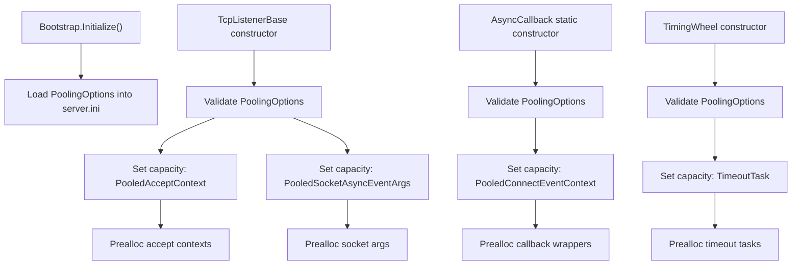

# Pooling Options

`PoolingOptions` configures the bounded object pools used by the network layer to
avoid hot-path allocations during accept, receive, callback dispatch, and timing-wheel
registration.

## Source Mapping

- `src/Nalix.Network/Options/PoolingOptions.cs`
- `src/Nalix.Hosting/Bootstrap.cs`
- `src/Nalix.Network/Listeners/TcpListener/TcpListener.Core.cs`
- `src/Nalix.Network/Internal/Transport/SocketConnection.cs`
- `src/Nalix.Network/Internal/Transport/AsyncCallback.cs`
- `src/Nalix.Network/Internal/Time/TimingWheel.cs`
- `src/Nalix.Network/Internal/Pooling/*.cs`

## Defaults and Validation

| Pool | Capacity property | Default | Preallocate property | Default | Validation |
| --- | --- | ---: | --- | ---: | --- |
| Accept context | `AcceptContextCapacity` | `4096` | `AcceptContextPreallocate` | `20` | Capacity `1..1_000_000`; preallocate `0..1_000_000`; preallocate must be `<=` capacity. |
| Socket async event args | `SocketArgsCapacity` | `4096` | `SocketArgsPreallocate` | `32` | Capacity `1..1_000_000`; preallocate `0..1_000_000`; preallocate must be `<=` capacity. |
| Receive context | `ReceiveContextCapacity` | `4096` | `ReceiveContextPreallocate` | `32` | Capacity `1..1_000_000`; preallocate `0..1_000_000`; preallocate must be `<=` capacity. |
| Timeout task | `TimeoutTaskCapacity` | `8192` | `TimeoutTaskPreallocate` | `64` | Capacity `1..1_000_000`; preallocate `0..1_000_000`; preallocate must be `<=` capacity. |
| Connect event context | `ConnectEventContextCapacity` | `4096` | `ConnectEventContextPreallocate` | `32` | Capacity `1..1_000_000`; preallocate `0..1_000_000`; preallocate must be `<=` capacity. |

`Validate()` first runs data-annotation validation for every numeric property, then
performs pair-wise checks so no `*Preallocate` value can exceed its matching
`*Capacity` value.

## Hosting Initialization

`Bootstrap.Initialize()` materializes this option set during server startup:

```csharp
_ = ConfigurationManager.Instance.Get<Network.Options.PoolingOptions>();
```

This ensures `server.ini` includes the network pool sizing knobs even before the TCP
listener, callback dispatcher, or timing wheel are constructed.

## Runtime Initialization Flow



The option object can therefore be validated multiple times by different subsystems.
Validation is deterministic and only reads the configured values.

## Pool Consumers

### Accept Context Pool

`TcpListenerBase` configures `PooledAcceptContext` capacity and preallocation during
listener construction. Each accept-loop worker rents an accept context while an
`AcceptAsync` operation is in flight. The default `AcceptContextPreallocate = 20`
matches the typical default accept-worker count.

### Socket Async Event Args Pool

`TcpListenerBase` also configures `PooledSocketAsyncEventArgs`. These SAEA wrappers
are shared by accept and receive paths. `PooledSocketReceiveContext.EnsureArgsBound()`
lazily rents a `PooledSocketAsyncEventArgs` when a receive context first needs one.

### Receive Context Pool

`SocketConnection` rents one `PooledSocketReceiveContext` when the connection starts
and keeps it for the receive loop. The context wraps a reusable
`ManualResetValueTaskSourceCore<int>` so asynchronous receives avoid per-call
`TaskCompletionSource` allocations, while synchronous completions return through the
`ValueTask<int>` fast path.

!!! important "Receive context capacity"
    The current source defines `ReceiveContextCapacity` and
    `ReceiveContextPreallocate`, but no source path currently calls
    `SetMaxCapacity<PooledSocketReceiveContext>(...)` or
    `Prealloc<PooledSocketReceiveContext>(...)`. The receive context is still pooled
    through `ObjectPoolManager`, but these two knobs are not wired to a runtime
    initializer in the audited source.

### Timeout Task Pool

`TimingWheel` validates `PoolingOptions`, configures `TimeoutTaskCapacity`, and
preallocates `TimeoutTaskPreallocate`. Each active timing-wheel registration owns one
`TimeoutTask` until the connection disconnects, is refreshed, or times out.

### Connect Event Context Pool

`AsyncCallback` loads `PoolingOptions` in its static constructor, configures the
`PooledConnectEventContext` capacity, and preallocates callback wrappers. Normal and
high-priority connection callbacks use these wrappers before queuing work to the
ThreadPool. The wrapper is returned in `EXECUTE_AND_RETURN(...)` after the callback
runs.

## Ownership and Return Contracts

- Capacity controls the maximum number of returned objects retained by
  `ObjectPoolManager`; objects beyond the ceiling are discarded and later collected.
- Preallocation eagerly creates reusable instances at subsystem startup to reduce the
  first-use allocation spike.
- Pooled objects implement `IPoolable` and reset their internal state before reuse.
- `PooledSocketReceiveContext.ResetForPool()` waits for in-flight SAEA work to settle
  before returning the underlying `PooledSocketAsyncEventArgs`; if the SAEA remains
  busy, it is intentionally not returned to the pool to avoid buffer corruption.
- `PooledConnectEventContext` is returned after callback execution, and optionally
  releases the owning connection's pending-packet slot.

## Tuning Guidance

- Set capacities to peak concurrent usage plus headroom, not to total historical
  traffic volume.
- Keep preallocation near steady-state warm usage. Very high preallocation reduces
  early allocations but increases startup memory and initialization time.
- Align `AcceptContextCapacity` and `AcceptContextPreallocate` with TCP listener
  accept-worker count.
- Size `SocketArgsCapacity` for accept workers plus peak concurrent receive contexts,
  because accept and receive paths share the SAEA pool.
- Size `TimeoutTaskCapacity` at least as high as expected active timing-wheel
  registrations; use additional headroom under bursty connect/disconnect traffic.
- Size `ConnectEventContextCapacity` with `NetworkCallbackOptions` limits so callback
  wrappers do not churn under normal backpressure settings.

## Related APIs

- [Timing Wheel Options](./timing-wheel-options.md)
- [Network Callback Options](./network-callback-options.md)
- [Connection Hub Options](./connection-hub-options.md)
- [TCP Listener](../../network/tcp-listener.md)
