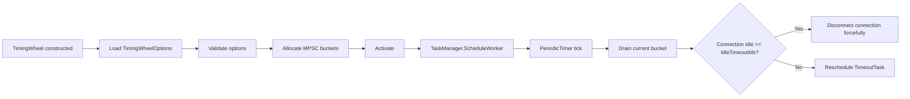

# Timing Wheel Options

`TimingWheelOptions` configures the hashed timing wheel used by `Nalix.Network` to
monitor idle connections and close connections that exceed the configured idle
threshold.

## Source Mapping

- `src/Nalix.Network/Options/TimingWheelOptions.cs`
- `src/Nalix.Network/Internal/Time/TimingWheel.cs`
- `src/Nalix.Hosting/Bootstrap.cs`

## Defaults and Validation

| Property | Default | Validation | Runtime effect |
| --- | ---: | --- | --- |
| `BucketCount` | `512` | `1..int.MaxValue` | Number of timing wheel buckets. Power-of-two values enable a bitmask fast path for bucket selection. |
| `TickDuration` | `1000` | `1..int.MaxValue` | Tick interval, in milliseconds, used by the background `PeriodicTimer`. |
| `IdleTimeoutMs` | `60000` | `1..int.MaxValue` | Idle threshold, in milliseconds, after which registered connections are force-closed. |

`Validate()` uses data-annotation validation through
`Validator.ValidateObject(..., validateAllProperties: true)` and rejects values
below `1` for every property.

## Hosting Initialization

`Bootstrap.Initialize()` loads `TimingWheelOptions` as part of server startup so the
configuration template is materialized into `server.ini`:

```csharp
_ = ConfigurationManager.Instance.Get<TimingWheelOptions>();
```

The `TimingWheel` constructor validates these options again before allocating wheel
buckets or starting the worker loop.

## Runtime Flow



`Activate(...)` starts a background worker through `TaskManager.ScheduleWorker(...)`.
The worker uses `PeriodicTimer(TimeSpan.FromMilliseconds(TickDuration))` and catches
up if ticks were missed under load.

## Bucket Selection

`TimingWheel` stores one `MpscBucket` per wheel slot. Producers enqueue
`TimeoutTask` instances with `Interlocked.CompareExchange`, and the single consumer
loop drains a bucket with `Interlocked.Exchange`.

If `BucketCount` is a power of two, the wheel uses a mask instead of modulo:

```csharp
_useMask = (_wheelSize & (_wheelSize - 1)) == 0 && _wheelSize > 0;
_mask = _useMask ? (_wheelSize - 1) : 0;
```

New registrations compute the destination bucket from the current logical tick plus
the configured idle timeout:

```csharp
long ticks = Math.Max(1, _idleTimeoutMs / (long)_tickMs);
int bucket = _useMask
    ? (int)((baseTick + ticks) & _mask)
    : (int)((baseTick + ticks) % _wheelSize);
```

## Connection Registration and Ownership

`Register(IConnection)`:

- no-ops when the connection is already registered;
- marks `connection.IsRegisteredInWheel = true`;
- rents a pooled `TimeoutTask`;
- copies `connection.TimeoutVersion` into the task;
- subscribes to `connection.OnCloseEvent`;
- enqueues the task into the computed bucket.

`Unregister(IConnection)` deliberately does **not** return the `TimeoutTask` to the
pool. It marks the connection as unregistered, increments `TimeoutVersion`, and
unsubscribes from `OnCloseEvent`. The background loop owns returning queued tasks to
the pool after it dequeues them and detects that they are stale.

This ownership rule prevents a race where returning the task from `Unregister(...)`
could clear `task.Conn` while the timing loop is about to read it.

## Idle Timeout Behavior

On each due task, the loop computes:

```csharp
long idleMs = Clock.UnixMillisecondsNow() - task.Conn.LastPingTime;
```

If `idleMs >= IdleTimeoutMs`, the connection is closed with `Disconnect("Idle timeout reached")`,
`IsRegisteredInWheel` is cleared, `TimeoutVersion` is incremented, and the task is
returned to the pool. Otherwise, the task is rescheduled based on the remaining idle
time.

## Shutdown Behavior

`Deactivate(...)` is reference-counted through `_activeListeners`. The last
activation owner cancels the worker, disposes the linked cancellation token source,
disposes the worker handle, then drains all buckets and returns still-owned tasks to
the pool.

`Dispose()` is idempotent and delegates to `Deactivate()` after setting the disposed
flag.

## Related APIs

- [Timing Wheel](../../network/time/timing-wheel.md)
- [TCP Listener](../../network/tcp-listener.md)
- [Network Options](./options.md)
