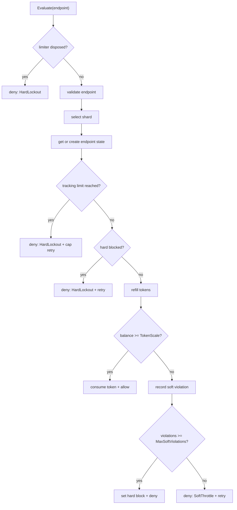

# Token Bucket Options

`TokenBucketOptions` configures the endpoint-keyed token-bucket limiter used by
`Nalix.Runtime.Throttling.TokenBucketLimiter`. The limiter enforces burst
capacity, sustained refill rate, soft throttling, optional hard lockout, endpoint
tracking caps, sharded storage, cleanup, and diagnostic report sizing.

## Source Mapping

- `src/Nalix.Runtime/Options/TokenBucketOptions.cs`
- `src/Nalix.Runtime/Throttling/TokenBucketLimiter.cs`
- `src/Nalix.Hosting/Bootstrap.cs`

## Defaults and Validation

| Property | Default | Valid range | Runtime effect |
| --- | ---: | --- | --- |
| `CapacityTokens` | `12` | `1..int.MaxValue` | Maximum whole-token burst capacity for each endpoint. |
| `RefillTokensPerSecond` | `6.0` | `0.001..double.MaxValue` | Sustained refill rate converted to fixed-point microtokens. |
| `HardLockoutSeconds` | `0` | `0..int.MaxValue` | Stopwatch-tick duration for hard lockout after soft violations escalate. |
| `StaleEntrySeconds` | `300` | `1..int.MaxValue` | Idle age before an endpoint can be removed by stale cleanup. |
| `CleanupIntervalSeconds` | `120` | `1..int.MaxValue` | Recurring cleanup cadence registered with `TaskManager`. |
| `TokenScale` | `1000` | `1..1000000` | Fixed-point units per whole token. One consumed request costs `TokenScale`. |
| `ShardCount` | `32` | `1..int.MaxValue`; power of two | Number of endpoint-map shards used by hash masking. |
| `SoftViolationWindowSeconds` | `5` | `1..int.MaxValue` | Window used to accumulate soft-throttle violations. |
| `MaxSoftViolations` | `3` | `1..int.MaxValue` | Violation count at which the endpoint escalates to hard lockout. |
| `CooldownResetSec` | `10` | `1..int.MaxValue` | Configured and reported as cooldown policy; not read by current limiter logic. |
| `MaxTrackedEndpoints` | `10000` | `0..int.MaxValue` | Maximum tracked endpoints; `0` disables the cap. |
| `InitialTokens` | `-1` | No DataAnnotation range | Initial tokens for new endpoints: `<0` full, `0` empty, `>0` clamped to capacity. |
| `MaxEvictionCapacity` | `4096` | `64..65536` | Initial pooled candidate-list capacity cap for over-limit eviction scans. |
| `MinReportCapacity` | `256` | `64..8192` | Minimum pooled snapshot-list capacity used by report generation. |

`Validate()` first runs DataAnnotation validation and then enforces:

- `ShardCount` must be positive;
- `ShardCount` must be a power of two;
- `CapacityTokens * TokenScale` must fit in `Int64`;
- `InitialTokens` must be `<= CapacityTokens`.

## Construction and Fixed-Point Materialization

`TokenBucketLimiter` accepts an optional `TokenBucketOptions` instance. If none is
provided, it loads the singleton from `ConfigurationManager` and validates it.
Construction materializes hot-path constants:

```csharp
_capacityMicro = (long)_options.CapacityTokens * _options.TokenScale;
_refillPerSecMicro = (long)Math.Round(_options.RefillTokensPerSecond * _options.TokenScale);
_initialBalanceMicro = CalculateInitialBalance();
```

Each endpoint state stores balances in fixed-point microtokens. A request consumes
exactly `_options.TokenScale`; whole-token credit in responses and reports is computed
by integer-dividing the microtoken balance by `TokenScale` and clamping to `ushort`.

!!! important "Bootstrap materialization"
    `Bootstrap.Initialize()` currently contains the `TokenBucketOptions` materialization
    call as a commented line. In the current source, these options are loaded when a
    `TokenBucketLimiter` instance is constructed, unless a caller passes options
    explicitly.

## Endpoint Sharding

The limiter creates `ShardCount` shard maps and selects a shard from the endpoint's
`GetHashCode()` after a Murmur-style finalizer mix:

```text
mixed_hash & (ShardCount - 1)
```

This bit-mask selection is why `ShardCount` must be a power of two. It avoids modulo
costs on the hot path while preserving stable endpoint partitioning.

## Evaluate Flow

`Evaluate(INetworkEndpoint key)` is the primary runtime API:



Endpoint validation requires a non-null endpoint and a non-empty `Address`.

## Initial Tokens

`CalculateInitialBalance()` implements the `InitialTokens` semantics:

- `< 0`: start new endpoints at full capacity (`CapacityTokens * TokenScale`);
- `0`: start empty for cold-start behavior;
- `> 0`: convert to microtokens and clamp to `[0, capacity]`.

The default `-1` therefore allows a new endpoint to spend the full burst immediately.

## Soft Throttle and Hard Lockout

When an endpoint has insufficient tokens, the limiter computes the required delay from
the missing microtokens and the refill rate. It then records a soft violation:

- if the previous violation is within `SoftViolationWindowSeconds`, increment
  `SoftViolations`;
- otherwise reset `SoftViolations` to `1`;
- update `LastViolationSw` to the current stopwatch tick.

If `SoftViolations >= MaxSoftViolations`, the endpoint escalates to hard lockout:

```text
HardBlockedUntilSw = now + TO_TICKS(HardLockoutSeconds)
```

`HardLockoutSeconds = 0` therefore produces a zero-duration hard-lock timestamp. The
escalation decision can still return `HardLockout`, but the next evaluation will not
remain blocked because the stored deadline is not greater than the new `now` tick.

!!! important "Cooldown reset option"
    `CooldownResetSec` is present in `TokenBucketOptions`, appears in the INI comment,
    and is included in high-level policy intent, but the current `TokenBucketLimiter`
    implementation does not read it. Soft violations reset by the soft violation window;
    hard lockout expiry is controlled by `HardLockoutSeconds`.

## Endpoint Tracking Cap

`MaxTrackedEndpoints` has two enforcement points:

1. before allocating a new endpoint state, the limiter rejects if the current count is
   already at or above the cap;
2. after a successful concurrent add, it double-checks the count and removes the newly
   added endpoint if the cap was exceeded.

When the cap is reached, evaluation returns a denial decision instead of creating more
state. If `MaxTrackedEndpoints <= 0`, the cap is disabled and endpoint tracking can
grow until cleanup removes stale entries.

## Cleanup and Eviction

Construction schedules a recurring cleanup job:

- name: `TaskNaming.Recurring.CleanupJobId("token.bucket", hash)`;
- interval: `CleanupIntervalSeconds`;
- `NonReentrant = true`;
- tag: `TaskNaming.Tags.Service`;
- jitter: `250 ms`;
- execution timeout: `2 s`;
- backoff cap: `15 s`.

The cleanup body uses an internal `CancellationTokenSource` with a `5 s` timeout. It:

1. removes stale endpoints where `now - LastSeenSw > StaleEntrySeconds`;
2. rotates the starting shard each cleanup run so timeout-limited scans do not always
   favor shard `0`;
3. enforces `MaxTrackedEndpoints` if the count remains above the cap.

Over-limit eviction collects candidate endpoints into a pooled list with initial
capacity:

```text
min(_totalEndpointCount * 2, MaxEvictionCapacity)
```

It sorts candidates by `LastSeen` and removes the oldest entries first. The current
source uses `MaxEvictionCapacity` as the pooled list's initial capacity cap; it does
not cap the number of candidates added to that list during collection.

## Diagnostics and Reporting

`GetReport()` collects a pooled snapshot of endpoint states with initial capacity at
least `MinReportCapacity`, counts currently hard-blocked entries, and renders the top
20 endpoints by pressure. The report header includes:

- `CapacityTokens`;
- `RefillPerSecond`;
- `TokenScale`;
- `Shards`;
- `HardLockoutSeconds`;
- `StaleEntrySeconds`;
- `CleanupIntervalSecs`;
- `MaxTrackedEndpoints`;
- `TrackedEndpoints`;
- `HardBlockedCount`.

`GetStats()` exposes the same core option values and runtime counts as structured
data.

## Disposal Contract

`Dispose()` marks the limiter disposed and cancels its recurring cleanup job via
`TaskManager.CancelRecurring()`. After disposal, `Evaluate()` does not throw; it
returns a denied `RateLimitDecision` with reason `HardLockout` and zero retry delay.

`DisposeAsync()` delegates to `Dispose()` and returns `ValueTask.CompletedTask`.

## Tuning Guidance

- Use `CapacityTokens` for burst tolerance and `RefillTokensPerSecond` for sustained
  throughput; both are per endpoint.
- Keep `ShardCount` a power of two and scale it with expected concurrent endpoint
  cardinality to reduce per-shard contention.
- Set `HardLockoutSeconds > 0` only when repeated soft throttles should become a
  persistent block.
- Avoid `MaxTrackedEndpoints = 0` on public servers unless another layer bounds
  endpoint cardinality.
- Treat `MaxEvictionCapacity` as a cleanup allocation sizing knob, not as a strict
  per-cycle removal limit in the current implementation.

## Related APIs

- [Network Options](./options.md)
- [Concurrency Options](./concurrency-options.md)
- [Token Bucket Limiter](../../runtime/middleware/token-bucket-limiter.md)
- [Policy Rate Limiter](../../runtime/middleware/policy-rate-limiter.md)
