# Nalix.Runtime.Handlers

`Nalix.Runtime.Handlers` provides the core controller pattern and built-in protocol handlers that manage the basic handshaking, session management, and system control logic of the Nalix framework.

## Packet Controller Execution Model

The following diagram illustrates how your controller classes are transformed into high-performance execution units during startup.

```mermaid
flowchart LR
    subgraph Compile[1. Registration Phase]
        Class[Controller Class]
        Scan[Attribute Scanner]
        Comp[Handler Compiler]
        
        Class --> Scan
        Scan --> Comp
    end

    subgraph Memory[2. Dispatch Registry]
        Table[OpCode Handler Table]
        Desc[Compiled Descriptor]
        
        Comp --> Desc
        Desc --> Table
    end

    subgraph Live[3. Execution Phase]
        Ctx[PacketContext]
        Inv[Compiled Lambda]
        Ret[IReturnHandler]
        
        Ctx --> Inv
        Inv --> Ret
        Ret --> Send[Outbound Transport]
    end

    Table -->|Resolve| Ctx
```



## Built-in Handlers

Nalix includes industrial-strength handlers for standard protocol features. You can explore their implementations in the `src/Nalix.Runtime/Handlers` directory.

### `HandshakeHandlers`

Manages the server-side **X25519 Handshake** flow.

- **Stage Resolution**: Orchestrates `CLIENT_HELLO` and `CLIENT_FINISH` stages.
- **Security**: Generates ephemeral keys, computes transcript hashes, and derives the session key.
- **Session Integration**: Automatically creates a resumable session entry upon a successful handshake.

### `SessionHandlers`

Manages the **Session Resumption** protocol.

- **Token Verification**: Validates session tokens against the `ISessionStore`.
- **State Restoration**: Reloads secret keys, permission levels, and connection attributes to restore a dropped connection instantly.

### `SystemControlHandlers`

Handles global **Control Signaling** (`ProtocolOpCode.CONTROL`).

- **Heartbeats**: Responds to Ping with Pong.
- **Utility**: Processes TimeSync requests and CipherUpdate acknowledgements.
- **Teardown**: Manages orderly disconnect sequences.

## Controller Implementation (Source-Verified)

To implement a custom handler, use the following pattern:

```csharp
[PacketController("MyModule")]
public class MyController 
{
    [PacketOpcode(0x1000)]
    public async ValueTask HandleRequestAsync(IPacketContext<MyPacket> context)
    {
        // Business logic here
        await context.Sender.SendAsync(new MyResponse());
    }
}
```

### Key Attributes

- `[PacketController(string tag)]`: Identifies a class as a candidate for scanning.
- `[PacketOpcode(ushort opcode)]`: Maps a specific opcode to a method.
- `[PacketEncryption(bool)]`: Overrides the default security requirement for this handler.
- `[PacketPermission(PermissionLevel)]`: Enforces specific access levels before execution starts.

## Related Information

- [Implementing Packet Handlers](../../../guides/application/packet-handlers.md)
- [Packet Attributes](../routing/packet-attributes.md)
- [Packet Metadata](../routing/packet-metadata.md)
- [Handler Result Types](../routing/handler-results.md)
