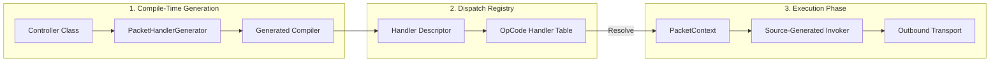

# Nalix.Runtime.Handlers

`Nalix.Runtime.Handlers` provides the core controller pattern and built-in protocol handlers that manage the basic handshaking, session management, and system control logic of the Nalix framework.

## Packet Controller Execution Model

The following diagram illustrates how your controller classes are transformed into high-performance execution units during startup.


```mermaid
flowchart LR
    subgraph Compile[1. Compile-Time Generation]
        Class[Controller Class]
        Scan[PacketHandlerGenerator]
        Gen[Generated Compiler]

        Class --> Scan
        Scan --> Gen
    end

    subgraph Memory[2. Dispatch Registry]
        Table[OpCode Handler Table]
        Desc[Handler Descriptor]

        Gen --> Desc
        Desc --> Table
    end

    subgraph Live[3. Execution Phase]
        Ctx[PacketContext]
        Inv[Source-Generated Invoker]

        Ctx --> Inv
        Inv --> Send[Outbound Transport]
    end

    Table -->|Resolve| Ctx
```

## Built-in Handlers

Nalix includes industrial-strength handlers for standard protocol features. You can explore their implementations in the `src/Nalix.Runtime/Handlers` directory.

### `HandshakeHandlers`

Manages the server-side **X25519 Handshake** flow using session protocol frames.

- **Session Init**: `HandleSessionInitAsync(IPacketContext<SessionInit>)` processes the client's `SessionInit` frame, generates server ephemeral keys, computes the shared secret, and replies with `SessionChallenge`.
- **Session Proof**: `HandleSessionProofAsync(IPacketContext<SessionProof>)` verifies the client's proof, derives the session key, sets `connection.Secret` and `connection.Algorithm`, persists resumable session state, and replies with `SessionEstablished`.
- **Security**: Marked with `[ReservedOpcodePermitted]`, `[PacketEncryption(false)]`, and `[PacketPermission(PermissionLevel.NONE)]` as the handshake runs before secure communications are established.
- **Session Integration**: Automatically creates a resumable session entry upon a successful handshake.

### `SessionHandlers`

Manages the **Session Resumption** protocol.

- **Token Verification**: Validates session tokens against the `ISessionService`.
- **State Restoration**: Reloads secret keys, permission levels, and connection attributes to restore a dropped connection instantly.

### `SystemControlHandlers`

Handles global **Control Signaling** (`ProtocolOpCode.CONTROL`).

- **Heartbeats**: Responds to Ping with Pong.
- **Utility**: Processes TimeSync requests and CipherUpdate acknowledgements.
- **Teardown**: Manages orderly disconnect sequences.

## Controller Implementation (Source-Verified)

To implement a custom handler, use the following pattern:

```csharp
[PacketController("MyModule")]
public class MyController 
{
    [PacketOpcode(0x1000)]
    public async ValueTask HandleRequestAsync(IPacketContext<MyPacket> context)
    {
        // Business logic here
        await context.Sender.SendAsync(new MyResponse());
    }
}
```

### Key Attributes

- `[PacketController(string tag)]`: Identifies a class as a candidate for source-generation by `PacketHandlerGenerator`.
- `[PacketOpcode(ushort opcode)]`: Maps a specific opcode to a method.
- `[PacketEncryption(bool, CipherSuiteType)]`: Overrides the default security requirement and algorithm for this handler.
- `[PacketPermission(PermissionLevel)]`: Enforces specific access levels before execution starts. Defaults to `PermissionLevel.USER`.

## Related Information

- [Implementing Packet Handlers](../../../guides/application/packet-handlers.md)
- [Packet Attributes](../../abstractions/packet-attributes.md)
- [Packet Metadata](../../abstractions/packet-metadata.md)
- [Handler Result Types](../routing/handler-results.md)
