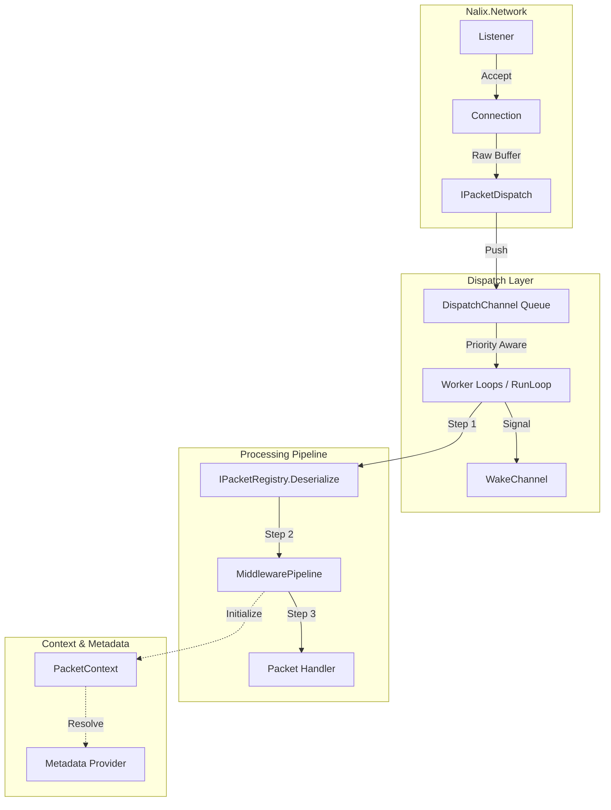

# Nalix.Runtime API Reference

`Nalix.Runtime` is the server-side execution layer that converts incoming raw buffers into structured packet handlers. It manages the dispatching lifecycle, middleware pipelines, and metadata resolution.

## Runtime Execution Landscape

The following diagram illustrates how a packet flows from the network layer into the application logic.

## Why This Package Exists

`Nalix.Network` focuses on "Moving Bytes" and managing connections, while `Nalix.Runtime` focuses on "Executing Logic". This separation allows for:
- **Independent Scaling**: You can scale the number of dispatch workers independently of the number of socket listeners.
- **Pluggable Protocols**: The runtime doesn't care if the packet came from TCP or UDP; it only cares about the dispatch contract.
- **Middleware Reuse**: Security, logging, and validation middleware can be shared across all transport types.

## Core Public Types

### Dispatching

- [IPacketDispatch](./routing/dispatch-contracts.md): The primary entry point for handing off buffers from transport to runtime.
- [PacketDispatchChannel](./routing/packet-dispatch.md): High-throughput dispatcher that uses worker loops and coalesce signaling to minimize context switching.
- [PacketDispatcherBase<TPacket>](./routing/dispatch-channel-and-router.md): The base execution engine that handles handler discovery and invocation.
- [PacketContext<TPacket>](./routing/packet-context.md): A pooled state object that carries the packet, connection, and metadata through the pipeline.
- [PacketSender<TPacket>](./routing/packet-sender.md): A metadata-aware response helper injected into handlers.

### Middleware & Routing

- [Middleware Overview](./middleware/index.md): Explains the packet-level pipeline (`MiddlewarePipeline`).
- [Routing Overview](./routing/index.md): Details how Nalix finds the right handler for each packet opcode.
- [Metadata Provider](./routing/packet-metadata.md): Service for enriching the dispatch context with session or business data.

## Architecture Notes

- **Zero-Allocation Contexts**: `PacketContext` is heavily pooled to prevent GC spikes during high-frequency dispatching.
- **Priority Weights**: The `PacketDispatchChannel` respects `PacketPriority`, ensuring critical system packets (like Heartbeats) are processed before bulk data.
- **Worker Fairness**: The dispatch loops use a "Drain" strategy to ensure one high-volume connection doesn't starve others in the same channel.

## Related APIs

- [Framework Core](../framework/index.md)
- [Network Transport](../network/index.md)
- [Common Contracts](../common/index.md)
