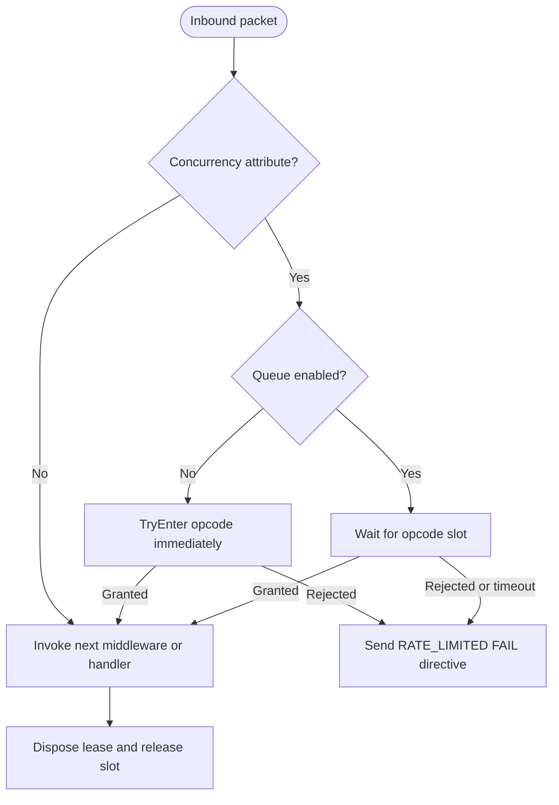

# Concurrency Gate

`ConcurrencyGate` is the runtime per-opcode concurrency limiter used by
`ConcurrencyMiddleware`. It protects handler execution by bounding how many
requests for the same packet opcode may run at once, optionally allowing excess
requests to wait in a bounded queue.

## Source mapping

- `src/Nalix.Runtime/Middleware/Standard/ConcurrencyMiddleware.cs`
- `src/Nalix.Runtime/Throttling/ConcurrencyGate.cs`
- `src/Nalix.Common/Networking/Packets/PacketConcurrencyLimitAttribute.cs`
- `src/Nalix.Runtime/Options/ConcurrencyOptions.cs`

## Runtime role

`ConcurrencyMiddleware` is an inbound middleware with `MiddlewareOrder(50)`, so
it runs after early security checks such as permission validation and alongside
other throttling gates. It only activates when packet metadata contains a
`PacketConcurrencyLimitAttribute`.

If no concurrency attribute is present, the middleware delegates immediately to
the next pipeline stage.

## Applying a limit

Concurrency limits are handler metadata:

```csharp
[PacketConcurrencyLimit(max: 4, queue: true, queueMax: 32)]
public async Task HandleUpload(PacketContext<UploadPacket> request)
{
    // At most four handlers for this opcode execute concurrently.
}
```

The attribute is declared for methods only:

| Property | Meaning |
| --- | --- |
| `Max` | Maximum simultaneous executions for the opcode. Must be greater than zero. |
| `Queue` | When `true`, excess requests wait for a slot. When `false`, they fail fast. |
| `QueueMax` | Maximum number of queued requests. Must not be negative. |

## Middleware behavior



### Fail-fast mode

When `Queue` is `false`, `ConcurrencyMiddleware` calls
`ConcurrencyGate.TryEnter(...)`. The call never waits:

- returns `true` with a `Lease` when a semaphore slot is available
- returns `false` when the opcode is saturated
- returns `false` when the circuit breaker is open
- treats disposed entries and non-fatal unexpected gate errors as rejection

On rejection, the middleware emits a transient directive if
`DirectiveGuard.TryAcquire(...)` allows it:

```text
ControlType   = FAIL
Reason        = RATE_LIMITED
Advice        = RETRY
SequenceId    = original packet sequence id
ControlFlags  = IS_TRANSIENT
Arg0          = packet opcode
```

If the directive guard suppresses the notification, the middleware returns
without invoking the handler.

### Queued mode

When `Queue` is `true`, `ConcurrencyMiddleware` calls
`ConcurrencyGate.EnterAsync(...)`. Queued entry:

1. validates the attribute
2. opens or reuses the per-opcode entry
3. increments the entry queue count
4. waits on the semaphore for `ConcurrencyOptions.WaitTimeoutSeconds`
5. returns a disposable `Lease` when a slot is granted

The queue path rejects by throwing:

| Exception | Runtime meaning |
| --- | --- |
| `ConcurrencyFailureException` | Circuit breaker is open, entry is disposing, queue is full, or no-queue async entry was saturated. |
| `TimeoutException` | Queued wait exceeded `WaitTimeoutSeconds`. |
| `OperationCanceledException` | Caller cancellation token fired while waiting. |

`ConcurrencyMiddleware` catches `ConcurrencyFailureException` and sends the same
`RATE_LIMITED` directive as fail-fast mode. Other exceptions continue through
the pipeline error path.

## Lease lifecycle

Successful entry returns a `ConcurrencyGate.Lease`. The middleware always
disposes the lease in `finally` after downstream execution completes.

Disposing the lease:

- releases the underlying per-opcode `SemaphoreSlim`
- decrements the entry active-user reference count
- tolerates `ObjectDisposedException` during cleanup races
- logs non-fatal release errors without rethrowing

## Per-opcode entries

The gate stores one `Entry` per opcode in a concurrent dictionary. Each entry
contains:

- a semaphore with capacity equal to `PacketConcurrencyLimitAttribute.Max`
- the queue-enabled flag and queue limit from the first created attribute
- current queue depth
- active-user reference count
- last-used timestamp
- disposal state

!!! important "Opcode-keyed configuration"
    Entry configuration is keyed by opcode. Once an opcode entry exists, later
    requests for the same opcode reuse that entry instead of rebuilding it from a
    different attribute shape.

## Cleanup and circuit breaker

The constructor loads `ConcurrencyOptions` from `ConfigurationManager`, validates
it, and schedules recurring cleanup through `TaskManager`.

Cleanup removes idle entries when they have no active users and have been idle
for at least `ConcurrencyOptions.MinIdleAgeMinutes`. The cleanup task runs every
`ConcurrencyOptions.CleanupIntervalMinutes` with non-reentrant scheduling,
jitter, and a short execution timeout.

The gate also has a rejection-pressure circuit breaker:

- it stays closed until at least `CircuitBreakerMinSamples` attempts exist
- it opens when rejection rate exceeds `CircuitBreakerThreshold`
- it rejects further entry attempts while open
- it resets after `CircuitBreakerResetAfterSeconds`
- closing the breaker resets acquired and rejected counters

## Diagnostics

`GetStatistics()` returns aggregate counters:

- total acquired
- total rejected
- total queued
- total cleaned entries
- circuit breaker trips
- circuit breaker open state
- tracked opcode count

`GenerateReport()` and `GetReportData()` add per-opcode details including:

- capacity, in-use count, and available slots
- queue depth and queue maximum
- whether queuing is enabled
- idle state and last-used timestamp
- the top 50 opcodes sorted by current pressure

## Dynamic Adjustment

While `ConcurrencyGate` typically uses static attributes, the underlying `SemaphoreSlim` can be adjusted at runtime using the **Advance & Retreat** pattern. For details on how to implement this in a custom transport policy, see the [Dynamic Concurrency Adjustment](../../../guides/advanced/dynamic-concurrency-adjustment.md) guide.

## Related APIs

- [Pipeline](./pipeline.md)
- [Permission Middleware](./permission-middleware.md)
- [Policy Rate Limiter](./policy-rate-limiter.md)
- [Packet Attributes](../routing/packet-attributes.md)
