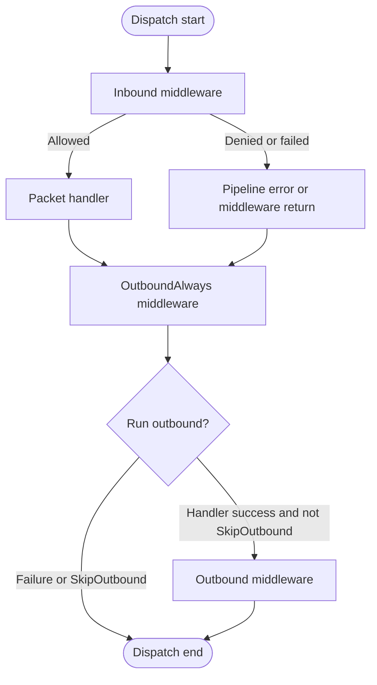

# Nalix.Runtime.Middleware

Runtime middleware is the packet execution layer between dispatch metadata and
handler invocation. It is used for fail-closed security checks, endpoint and
opcode throttling, concurrency limits, timeouts, diagnostics, and outbound
post-processing.

## Source mapping

- `src/Nalix.Runtime/Middleware/MiddlewarePipeline.cs`
- `src/Nalix.Abstractions/Middleware/IPacketMiddleware.cs`
- `src/Nalix.Runtime/Middleware/Standard/*Middleware.cs`
- `src/Nalix.Runtime/Throttling/*`

## Execution lifecycle

The pipeline executes immutable middleware snapshots. Metadata such as stage,
order, `AlwaysExecute`, and `ContinueOnError` is cached per middleware type so
runtime dispatch avoids repeated reflection.

For the detailed runner lifecycle, ordering rules, and error semantics, see the
[Pipeline](./pipeline.md) reference.

## Middleware stages

| Stage | Triggered when | Common use cases |
| --- | --- | --- |
| `Inbound` | Before the handler runs. | Permission checks, rate limits, concurrency gates, timeout wrappers. |
| `OutboundAlways` | During the outbound-always pass, including failure cases. | Auditing, metrics, cleanup, transaction finalization. |
| `Outbound` | After successful handler execution when outbound was not skipped. | Response transformation, compression, encryption updates. |

## Built-in runtime middleware

| Middleware | Order | Stage | Runtime behavior |
| --- | ---: | --- | --- |
| [Permission Middleware](./permission-middleware.md) | `-50` | Inbound | Enforces `[PacketPermission]` and rejects unauthorized packets with fail-closed directives. |
| [Policy Rate Limiter](./policy-rate-limiter.md) | `50` | Inbound | Enforces attribute-driven per-opcode/per-address policy limits and global endpoint fallback limits. |
| [Concurrency Gate](./concurrency-gate.md) | `50` | Inbound | Bounds simultaneous handler execution per opcode and optionally queues excess work. |
| [Timeout Middleware](./timeout-middleware.md) | `75` | Inbound | Applies method-level handler timeouts using a scoped cancellation token. |

## Security posture

Inbound security middleware follows a fail-closed model:

- permission failures stop handler execution
- limiter disposal during shutdown denies traffic rather than bypassing limits
- rate-limit and concurrency rejections emit transient `FAIL/RATE_LIMITED`
  directives when `DirectiveGuard` permits
- timeout responses are emitted only for middleware-owned timer cancellation
- directive sends use pooled `Directive` packets to avoid hot-path allocation

## Related information

- [Middleware Usage Guide](../../../guides/application/middleware-usage.md)
- [Packet Context](../routing/packet-context.md)
- [Packet Attributes](../../abstractions/packet-attributes.md)
- [Dispatch Options](../../options/runtime/dispatch-options.md)
