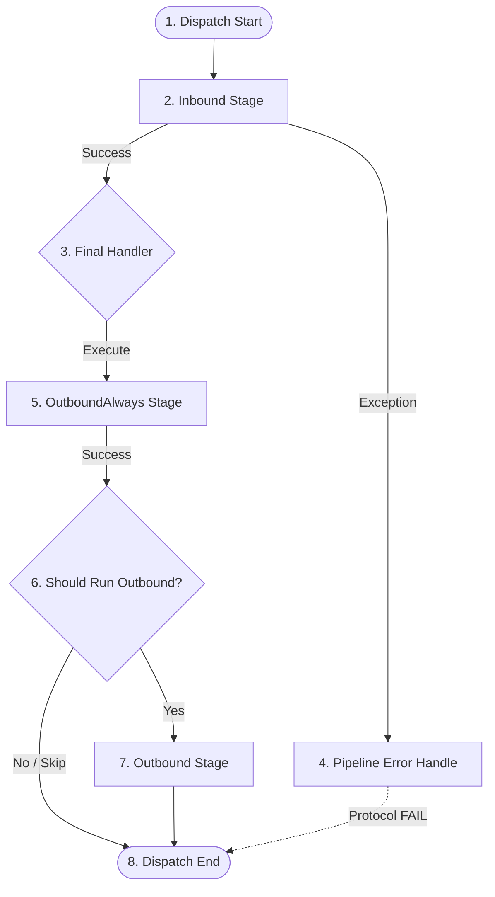

# Nalix.Runtime.Middleware

Middleware in Nalix allows you to intercept and transform packets at specific stages of the execution lifecycle. It is designed for cross-cutting concerns like security, rate limiting, logging, and data compression.

## Middleware Execution Lifecycle

Nalix uses a multi-stage pipeline. The following diagram illustrates the order of execution and how the system reacts to successes or failures.

## Middleware Stages (Source-Verified)

The `MiddlewarePipeline<TPacket>` executes in three distinct architectural stages:

| Stage | Triggered When | Common Use Cases |
|---|---|---|
| **Inbound** | Before the handler runs. | Authentication, Permissions, Rate Limiting, Validation. |
| **OutboundAlways** | Always, even after failures. | Request Logging, Metrics, Transaction Cleanup. |
| **Outbound** | On handler success + `!SkipOutbound`. | Cipher Updates, Response Transformation, Compression. |

## Core Pipelines

### [Packet Pipeline](./pipeline.md)
The primary execution engine for typed packet logic. It uses `MiddlewareOrderAttribute` to determine the sequence within each stage and supports `ContinueOnError` policies for specialized auditing requirements.

## Built-in Middlewares

Nalix provides several production-ready middleware components:

- [**Concurrency Gate**](./concurrency-gate.md): Limits total in-flight handlers to protect server resources.
- [**Permission Middleware**](./permission-middleware.md): Enforces `[PacketPermission]` requirements at the pipeline level.
- [**Policy Rate Limiter**](./policy-rate-limiter.md): Implements complex, sharded rate-limiting policies.
- [**Timeout Middleware**](./timeout-middleware.md): Ensures runaway handlers are cancelled before they consume too many resources.

## Related Information

- [Middleware Usage Guide](../../../guides/application/middleware-usage.md)
- [Packet Context](../routing/packet-context.md)
- [Dispatch Options](../options/dispatch-options.md)
