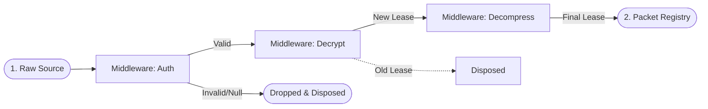

# Network Buffer Pipeline

The `NetworkBufferMiddlewarePipeline` is a high-performance interceptor that operates directly on raw `IBufferLease` objects before they are deserialized into typed packets.

## Layer 1 Buffer Transformation

The following diagram illustrates the linear execution model and the memory ownership rules of the buffer pipeline.



## Why This Pipeline Exists

By intercepting traffic before deserialization, the Network Buffer Pipeline provides several critical advantages:
- **Low-Cost Filtering**: Drop malicious or unauthorized payloads before spending CPU cycles on expensive object instantiation.
- **Global Security**: Perform server-wide decryption or integrity checks.
- **Transparent Compression**: Handle LZ4 or Zstd compression at the byte level, keeping the application handlers focused on domain logic.

## Execution Rules (Source-Verified)

The pipeline follows strict memory ownership rules to prevent leaks in high-concurrency environments:

1.  **Ownership Handoff**: The pipeline owns the currently active `IBufferLease`. 
2.  **Replacement Disposal**: If a middleware returns a *different* lease instance (e.g., after decompression), the pipeline automatically disposes of the previous lease to return its buffer to the pool.
3.  **Short-Circuiting**: If any middleware returns `null`, the pipeline immediately disposes of the active lease and terminates execution, effectively dropping the packet.

## Source Mapping

- `src/Nalix.Runtime/Middleware/NetworkBufferMiddlewarePipeline.cs`
- `src/Nalix.Network.Pipeline/Inbound`
- `src/Nalix.Common/Middleware`

## Configuration

You register buffer middleware through `PacketDispatchOptions`:

```csharp
options.WithBufferMiddleware(new DecryptionMiddleware())
       .WithBufferMiddleware(new DecompressionMiddleware());
```

!!! warning "Order Matters"
    Middlewares are executed in the order they are registered (or by their `MiddlewareOrderAttribute`). Ensure that decryption occurs *before* decompression if your protocol requires it.

## Related APIs

- [IPacketDispatch](../routing/dispatch-contracts.md)
- [Packet Dispatch Options](../routing/packet-dispatch-options.md)
- [Compression Options](../options/dispatch-options.md)
