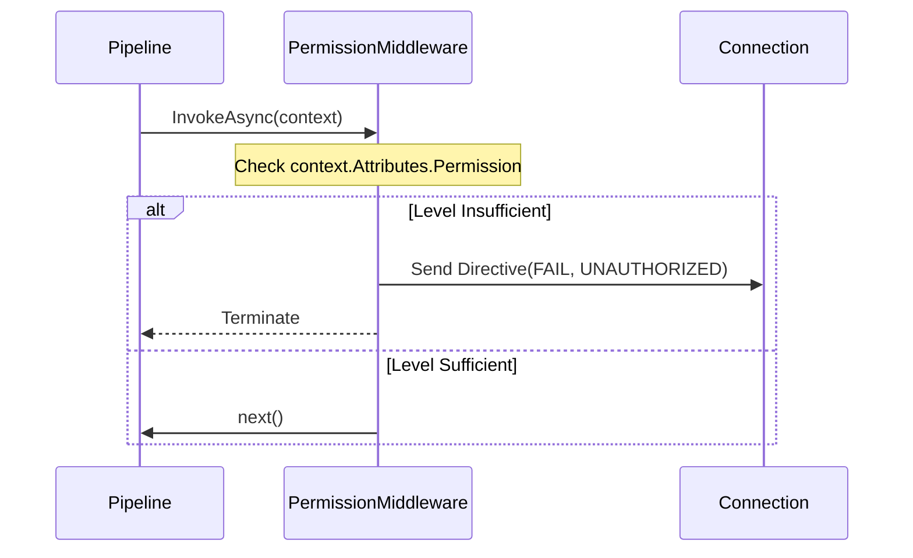

# Permission Middleware

The `PermissionMiddleware` is a security-focused inbound component that enforces authorization levels on incoming packets. It prevents unauthorized code execution by validating the connection's clearance against the required packet permissions early in the pipeline.

## Permission Flow



## Source mapping

- `src/Nalix.Network.Pipeline/Inbound/PermissionMiddleware.cs`

## Role and Design

Security in Nalix is enforced at the message level. `PermissionMiddleware` acts as a gatekeeper that inspects the declarative permissions of every packet.

- **Fail-Fast Security**: Positioned early in the pipeline (`Order = -50`) to ensure minimal resources are spent on unauthorized requests.
- **Declarative Authorization**: Integrates with the `[PacketPermission]` attribute, allowing developers to secure endpoints with a single line of code.
- **Transient Rejection**: Uses `Directive` frames to notify the client of the rejection without needing to drop the entire connection.

## Configuration

### Securing a Packet
```csharp
[PacketOpcode(0x2001)]
[PacketPermission(PermissionLevel.SYSTEM_ADMINISTRATOR)]
public class AdminCommandPacket : IPacket { ... }
```

### Pipeline Registration
```csharp
builder.ConfigureDispatch(options =>
{
    options.WithMiddleware(new PermissionMiddleware());
});
```

## Behavior

1. **Resolution**: Inspects `context.Attributes.Permission`.
2. **Comparison**: Checks if `context.Connection.Level` meets or exceeds the required level.
3. **Rejection**: If the level is insufficient:
    - Logs a `deny` event with the required and current levels.
    - Rents a `Directive` from the `ObjectPoolManager`.
    - Initializes it with `ControlType.FAIL` and `ProtocolReason.UNAUTHORIZED`.
    - Transmits the rejection and terminates the pipeline.

## Related APIs

- [Packet Pipeline](./pipeline.md)
- [Directive Frame](../../framework/packets/built-in-frames.md)
- [Timeout Middleware](./timeout-middleware.md)
- [Packet Attributes](../routing/packet-attributes.md)
