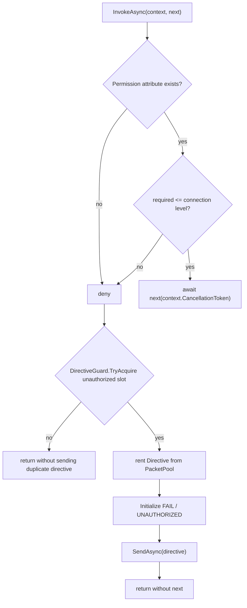

# Permission Middleware

`PermissionMiddleware` is the first built-in inbound security gate in the Nalix network
pipeline. It enforces handler permission metadata before packet handlers run and denies
packets fail-closed when permission metadata is missing or insufficient.

## Source Mapping

| Source | Responsibility |
| --- | --- |
| `src/Nalix.Runtime/Middleware/Standard/PermissionMiddleware.cs` | Runtime permission enforcement and unauthorized directive emission. |
| `src/Nalix.Abstractions/Middleware/MiddlewareOrderAttribute.cs` | Declares middleware order metadata. |
| `src/Nalix.Abstractions/Middleware/MiddlewareStageAttribute.cs` | Declares middleware stage metadata. |
| `src/Nalix.Abstractions/Networking/ConnectionAttributes.cs` | Stores per-connection directive throttle timestamps. |
| `src/Nalix.Runtime/Internal/RateLimiting/DirectiveGuard.cs` | Rate-gates repeated directive responses. |
| `src/Nalix.Codec/DataFrames/SignalFrames/Directive.cs` | Rejection signal frame sent to the client. |

## Runtime Metadata

| Metadata | Value |
| --- | ---: |
| Stage | `MiddlewareStage.Inbound` |
| Order | `-50` |
| Packet type | `IPacket` |

The low order makes the permission guard run before the built-in throttling and timeout
middleware in the current inbound stack.

## Enforcement Rule

The middleware allows a packet only when both conditions are true:

```csharp
context.Attributes.Permission is not null &&
context.Attributes.Permission.Level <= context.Connection.Level
```

Everything else is denied:

- missing `[PacketPermission]` metadata;
- a required permission level higher than the connection's current level.

!!! important "Fail-closed behavior"
    This is fail-closed behavior. A handler without permission metadata is not treated as
    public by this middleware; it is rejected as unauthorized.

## Permission Flow



## Rejection Directive

On denial, the middleware rents a `Directive` from `PacketPool<Directive>` through a
`PacketLease<Directive>` and initializes it as:

| Field | Runtime value |
| --- | --- |
| `ControlType` | `FAIL` |
| `ProtocolReason` | `UNAUTHORIZED` |
| `ProtocolAdvice` | `NONE` |
| `sequenceId` | `context.Packet.SequenceId` |
| `controlFlags` | `ControlFlags.NONE` |
| `arg0` | `0` |
| `arg1` | `0` |
| `arg2` | `context.Attributes.PacketOpcode.OpCode` |

`arg2` carries the denied opcode so the peer can correlate the authorization failure
with the attempted operation.

## Directive Rate Gate

Before sending the directive, the middleware calls:

```csharp
DirectiveGuard.TryAcquire(
    context.Connection,
    ConnectionAttributes.InboundDirectiveUnauthorizedLastSentAtMs)
```

If the guard rejects, the middleware returns without sending another directive. This
prevents unauthorized packet floods from producing unbounded failure responses.

## Error Handling

`SendAsync` is wrapped in a non-fatal exception filter. If directive sending fails, the
middleware logs through `context.Connection.ThrottledError(...)` with key
`middleware.permission.send_error`. The original request remains denied and the pipeline
is not continued.

## Registration

```csharp
builder.ConfigureDispatch(options =>
{
    options.WithMiddleware(new PermissionMiddleware());
});
```

The parameterless constructor resolves an optional `ILogger` from `InstanceManager`. The
explicit constructor requires a non-null `ILogger`.

## Securing a Packet

```csharp
[PacketOpcode(0x2001)]
[PacketPermission(PermissionLevel.SYSTEM_ADMINISTRATOR)]
public sealed class AdminCommandPacket : IPacket
{
    // packet members
}
```

Because the middleware fails closed, explicitly annotate every handler/packet that can
enter a pipeline containing `PermissionMiddleware`.

## Related APIs

- [Middleware Pipeline](./pipeline.md)
- [Directive Guard Options](../../options/network/directive-guard-options.md)
- [Directive Frame](../../codec/packets/built-in-frames.md)
- [Timeout Middleware](./timeout-middleware.md)
- [Packet Attributes](../../abstractions/packet-attributes.md)
