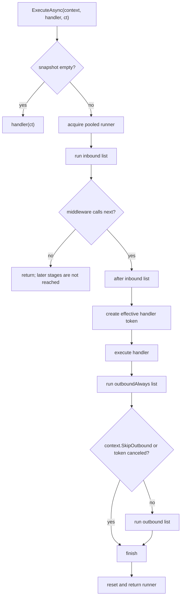

# Middleware Pipeline

Nalix uses `MiddlewarePipeline<TPacket>` to execute packet middleware around handler
execution. The pipeline is optimized for high-throughput networking: middleware metadata
is cached, execution snapshots are immutable, and runner contexts are pooled to avoid
per-packet chain allocations.

## Source Mapping

| Source | Responsibility |
| --- | --- |
| `src/Nalix.Runtime/Middleware/MiddlewarePipeline.cs` | Runtime pipeline registration, ordering, snapshots, pooled execution, inbound/outbound transition logic. |
| `src/Nalix.Abstractions/Middleware/IPacketMiddleware.cs` | Middleware invocation contract. |
| `src/Nalix.Abstractions/Middleware/MiddlewareOrderAttribute.cs` | Numeric middleware ordering metadata. |
| `src/Nalix.Abstractions/Middleware/MiddlewareStageAttribute.cs` | Stage metadata and outbound `AlwaysExecute` flag. |
| `src/Nalix.Runtime/Middleware/Standard/PermissionMiddleware.cs` | Built-in fail-closed permission guard. |
| `src/Nalix.Runtime/Middleware/Standard/RateLimitMiddleware.cs` | Built-in policy/global token-bucket throttling. |
| `src/Nalix.Runtime/Middleware/Standard/ConcurrencyMiddleware.cs` | Built-in per-opcode concurrency guard. |
| `src/Nalix.Runtime/Middleware/Standard/TimeoutMiddleware.cs` | Built-in timeout wrapper. |

## Middleware Contract

Packet middleware implements:

```csharp
ValueTask InvokeAsync(
    IPacketContext<TPacket> context,
    Func<CancellationToken, ValueTask> next);
```

The middleware receives the packet context and a `next` delegate. Calling `next(token)`
continues to the next middleware or stage transition. Returning without calling `next`
terminates the current pipeline path.

## Registration and Metadata

`Use(IPacketMiddleware<TPacket> middleware)`:

1. rejects `null` middleware;
2. prevents registering the same middleware instance twice;
3. reads metadata from the middleware type;
4. adds the entry to inbound, outbound, or both stage lists;
5. rebuilds an immutable execution snapshot.

Metadata defaults are source-defined:

| Metadata | Default when attribute is absent |
| --- | --- |
| `MiddlewareOrder` | `0` |
| `MiddlewareStage` | `Inbound` |
| `AlwaysExecute` | `false` |

Metadata is cached in a static `ConcurrentDictionary<Type, MiddlewareMetadata>`, so
reflection is paid once per middleware type.

## Ordering Semantics

Pipeline lists are sorted when snapshots are rebuilt:

| Stage list | Sort direction | Meaning |
| --- | --- | --- |
| inbound | ascending `Order` | lower order runs earlier before the handler. |
| outbound | descending `Order` | higher order runs earlier after the handler. |
| outbound always | descending `Order` | same outbound direction, but may run even when normal outbound is skipped. |

Built-in inbound middleware currently declares:

| Middleware | Stage | Order | Notes |
| --- | --- | ---: | --- |
| `PermissionMiddleware` | `Inbound` | `-50` | Runs early and fail-closes missing/insufficient permission metadata. |
| `RateLimitMiddleware` | `Inbound` | `50` | Uses packet policy limiter when `[PacketRateLimit]` exists, otherwise global endpoint token bucket. |
| `ConcurrencyMiddleware` | `Inbound` | `50` | Uses `[PacketConcurrencyLimit]`; no attribute means pass-through. |
| `TimeoutMiddleware` | `Inbound` | `75` | Wraps downstream work when `[PacketTimeout]` has a positive timeout. |

!!! important "Equal middleware order"
    `RateLimitMiddleware` and `ConcurrencyMiddleware` have the same order (`50`). The
    runtime sort compares only `Order`; do not rely on a documented tie-breaker between
    equal-order middleware. Assign distinct orders in custom pipelines when relative order
    matters.

## Full Execution Flow



The handler token is chosen by `CreateExecutionToken(inboundToken, rootToken, out token)`:

- if the inbound token cannot be canceled, the root execution token is used;
- if the inbound token is cancelable and is the same as the root token, it is reused;
- otherwise a linked token source is created and disposed after handler/outbound-always
  execution.

`OperationCanceledException` thrown by the handler is swallowed only when the effective
handler token is canceled. Other non-fatal exceptions follow normal pipeline error
handling.

## Pooled Runner Lifecycle

`ExecuteAsync` uses a local pool of 32 `PooledPipelineContext` runners before falling
back to `ObjectPoolManager`.

Fast path:

1. acquire a local or global runner;
2. initialize it with the snapshot, context, handler, and root token;
3. run the first step;
4. if the returned `ValueTask` completed successfully, synchronously observe completion;
5. reset the runner and return it immediately.

Async path:

1. await the pending `ValueTask`;
2. reset and return the runner in `finally`.

This design avoids building nested closures for every packet. The runner owns a reusable
`Func<CancellationToken, ValueTask>[]` step array that grows only when needed.

## Error Handling

`ConfigureErrorHandling(bool continueOnError, Action<Exception, Type>? errorHandler)`
stores the desired behavior in the next snapshot.

When `continueOnError` is false:

- synchronous non-fatal middleware exceptions return a faulted `ValueTask`;
- asynchronous middleware exceptions propagate to the caller.

When `continueOnError` is true:

- the optional error handler receives the exception and middleware type;
- the pipeline calls `next(token)` and continues.

The catch filters use `ExceptionClassifier.IsNonFatal`, so fatal runtime exceptions are
not hidden by the pipeline.

## Built-in Security and Throttling Behavior

### `PermissionMiddleware`

`PermissionMiddleware` is fail-closed:

- it only allows the request when `context.Attributes.Permission` exists and the required
  level is less than or equal to `context.Connection.Level`;
- missing `[PacketPermission]` metadata is denied;
- rejection sends `Directive(ControlType.FAIL, ProtocolReason.UNAUTHORIZED,
  ProtocolAdvice.NONE)` with `arg2 = opcode`;
- directive emission is rate-gated by `DirectiveGuard` using
  `InboundDirectiveUnauthorizedLastSentAtMs`.

### `RateLimitMiddleware`

`RateLimitMiddleware` chooses the limiter by metadata:

- `[PacketRateLimit]` present: call `PolicyRateLimiter.Evaluate(opcode, context)`;
- absent: call the global `TokenBucketLimiter.Evaluate(connection.NetworkEndpoint)`.

Denied requests send `Directive(ControlType.FAIL, ProtocolReason.RATE_LIMITED,
ProtocolAdvice.RETRY)` with `IS_TRANSIENT`, `arg0 = opcode`, `arg1 = RetryAfterMs`, and `arg2 = Credit`.
Directive spam is rate-gated by `DirectiveGuard` using
`InboundDirectiveRateLimitedLastSentAtMs`.

If the limiter was disposed and throws `ObjectDisposedException`, the middleware logs a
warning and denies fail-closed without sending a directive.

### `ConcurrencyMiddleware`

`ConcurrencyMiddleware` is opt-in per packet:

- no `[PacketConcurrencyLimit]`: pass-through;
- `Queue = true`: waits through `ConcurrencyGate.EnterAsync(...)`;
- `Queue = false`: calls `TryEnter(...)` and rejects immediately if the lease is not
  acquired.

Acquired leases are disposed in `finally`. Rejection or `ConcurrencyFailureException`
sends `FAIL / RATE_LIMITED / RETRY` with `IS_TRANSIENT` and `arg0 = opcode`, also gated
by `DirectiveGuard`.

### `TimeoutMiddleware`

`TimeoutMiddleware` is opt-in per packet:

- no `[PacketTimeout]` or `TimeoutMilliseconds <= 0`: pass-through;
- positive timeout: creates a linked cancellation token source when the context token is
  cancelable, otherwise creates an independent timeout token source;
- calls downstream `next(token)` and catches only timeout-triggered
  `OperationCanceledException`.

Timeout rejection sends `Directive(ControlType.TIMEOUT, ProtocolReason.TIMEOUT,
ProtocolAdvice.RETRY)` with `IS_TRANSIENT` and `arg0 = timeout / 100`, gated by
`InboundDirectiveTimeoutLastSentAtMs`.

## Mental Model

```text
socket receive
  -> frame parsing / decoding
  -> packet context + attributes
  -> inbound middleware, ascending order
  -> handler with effective cancellation token
  -> outboundAlways middleware, descending order
  -> outbound middleware, descending order when not skipped
  -> response path
```

## Authoring Guidance

- Use unique `MiddlewareOrder` values when relative order matters.
- Keep security middleware at low order values so it rejects before expensive work.
- Return without calling `next` only when the middleware intentionally terminates the
  pipeline.
- Prefer `ValueTask` fast paths when middleware usually completes synchronously.
- Avoid capturing per-packet closures in hot middleware where possible.
- Use `AlwaysExecute` only for outbound middleware; analyzers flag inbound usage because
  the flag affects outbound execution only.

## Related APIs

- [Permission Middleware](./permission-middleware.md)
- [Concurrency Gate](./concurrency-gate.md)
- [Policy Rate Limiter](./policy-rate-limiter.md)
- [Token Bucket Limiter](./token-bucket-limiter.md)
- [Timeout Middleware](./timeout-middleware.md)
- [Packet Dispatch](../routing/packet-dispatch.md)
- [Packet Attributes](../../abstractions/packet-attributes.md)
