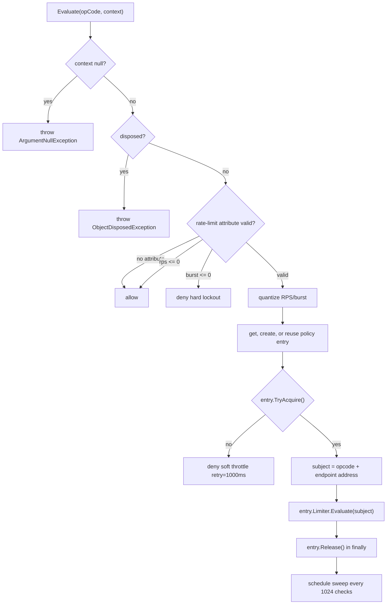

# Policy Rate Limiter

`PolicyRateLimiter` backs handler-level `[PacketRateLimit]` policies with shared
`TokenBucketLimiter` instances. It is used by `RateLimitMiddleware` when a packet context
contains rate-limit metadata; packets without the attribute are handled by the middleware's
global endpoint limiter instead.

## Source Mapping

| Source | Responsibility |
| --- | --- |
| `src/Nalix.Runtime/Throttling/PolicyRateLimiter.cs` | Policy quantization, shared limiter lifecycle, diagnostics, cleanup, and disposal. |
| `src/Nalix.Runtime/Middleware/Standard/RateLimitMiddleware.cs` | Chooses policy limiter vs. global token bucket and sends denial directives. |
| `src/Nalix.Common/Networking/Packets/PacketRateLimitAttribute.cs` | Method-level rate-limit metadata. |
| `src/Nalix.Runtime/Throttling/TokenBucketLimiter.cs` | Per-subject token-bucket implementation used by each policy entry. |
| `src/Nalix.Runtime/Options/TokenBucketOptions.cs` | Defaults copied into each policy-specific token bucket. |

## Attribute Shape

```csharp
[AttributeUsage(AttributeTargets.Method, AllowMultiple = false, Inherited = true)]
public sealed class PacketRateLimitAttribute(
    int requestsPerSecond,
    double burst = 1) : Attribute
```

| Property | Meaning |
| --- | --- |
| `RequestsPerSecond` | Requested steady-state rate. Values `<= 0` are treated as unlimited. |
| `Burst` | Requested burst size. Values `<= 0` are invalid and become hard denials. |

## Runtime Use

`RateLimitMiddleware` evaluates the policy limiter only when
`context.Attributes.RateLimit` is present:

```csharp
if (context.Attributes.RateLimit is not null)
{
    decision = policyRateLimiter.Evaluate(context.Packet.OpCode, context);
}
else
{
    decision = globalTokenBucket.Evaluate(context.Connection.NetworkEndpoint);
}
```

!!! important "Rate-limit fallback"
    `PolicyRateLimiter.Evaluate(...)` itself returns allowed when no rate-limit attribute is
    present. In the default middleware path, however, packets without the attribute do not
    call the policy limiter; they fall back to the global per-endpoint `TokenBucketLimiter`.

## Policy Quantization

Requested policies are rounded up into predefined tiers before a limiter is chosen:

| Dimension | Tiers |
| --- | --- |
| RPS | `1`, `2`, `4`, `8`, `16`, `32`, `64`, `128` |
| Burst | `1.0`, `2.0`, `4.0`, `8.0`, `16.0`, `32.0`, `64.0` |

Values above the highest tier clamp to the highest tier. The burst tier is also forced to
at least `1.0` before a token bucket is created.

Examples:

| Attribute | Effective policy |
| --- | --- |
| `[PacketRateLimit(1)]` | `(RPS: 1, Burst: 1.0)` |
| `[PacketRateLimit(5, 2.5)]` | `(RPS: 8, Burst: 4.0)` |
| `[PacketRateLimit(200, 100)]` | `(RPS: 128, Burst: 64.0)` |

## Subject Identity

Each policy entry evaluates a `RateLimitSubject` built from the packet opcode and the
connection endpoint:

```text
subject hash/equality = opCode + endpoint.Address
```

The endpoint port is intentionally excluded from equality to prevent port-rotation bypass
for the same remote address. The exposed address, port, IPv6, and `HasPort` values still
delegate to the underlying endpoint for reporting/string behavior.

## Entry Creation

When a quantized policy has no active entry, `PolicyRateLimiter` creates a
`TokenBucketLimiter` with:

| TokenBucketOptions field | Value source |
| --- | --- |
| `CapacityTokens` | quantized burst cast to `int` |
| `RefillTokensPerSecond` | quantized RPS |
| `TokenScale` | global `TokenBucketOptions` defaults |
| `ShardCount` | global defaults |
| `HardLockoutSeconds` | global defaults |
| `StaleEntrySeconds` | global defaults |
| `CleanupIntervalSeconds` | global defaults |
| `MaxTrackedEndpoints` | global defaults |
| `MaxSoftViolations` | global defaults |
| `SoftViolationWindowSeconds` | global defaults |
| `InitialTokens` | global defaults |

Defaults are loaded lazily from `ConfigurationManager.Instance.Get<TokenBucketOptions>()`.
If a logger has been attached with `WithLogging`, it is also applied to new token-bucket
limiters.

## Policy Capacity and Reuse

The limiter stores at most `64` active policy entries.

When the policy table is at capacity, a new requested policy does not allocate another
entry. Instead, the limiter finds the closest existing policy by:

```text
abs(existing.Rps - wanted.Rps) + abs(existing.Burst - wanted.Burst)
```

If a closest policy exists, that entry is touched and reused. This bounds memory growth
when many handlers request slightly different policies.

## Evaluation Flow



Missing `context.Connection?.NetworkEndpoint` is logged and denied as a soft throttle.

## Decisions

`Evaluate` returns `TokenBucketLimiter.RateLimitDecision`:

| Scenario | Allowed | Reason | RetryAfterMs | Credit |
| --- | ---: | --- | ---: | ---: |
| No attribute | `true` | `None` | `0` | `ushort.MaxValue` |
| `RequestsPerSecond <= 0` | `true` | `None` | `0` | `ushort.MaxValue` |
| `Burst <= 0` | `false` | `HardLockout` | `int.MaxValue` | `0` |
| Missing endpoint | `false` | `SoftThrottle` | `1000` | `0` |
| Entry acquisition failed | `false` | `SoftThrottle` | `1000` | `0` |
| Token bucket denied | `false` | Token bucket result | Token bucket result | Token bucket result |

## Cleanup Lifecycle

The policy table is swept every `1024` evaluations. The sweep is queued with
`ThreadPool.UnsafeQueueUserWorkItem` and removes entries that have been unused for more
than `1800` seconds.

Each entry tracks active users:

- `TryAcquire()` increments active users and resets an idle signal;
- `Release()` decrements active users and signals idle at zero;
- `Dispose()` finalizes immediately when idle;
- otherwise disposal is deferred to a thread-pool work item that waits up to `500 ms`
  for active users before finalizing.

`PolicyRateLimiter.Dispose()` is idempotent. It marks the limiter disposed, attempts up to
`10` passes to remove and dispose entries, clears any remaining entries, logs the disposal
summary, and suppresses finalization.

## Diagnostics

`GenerateReport()` returns a human-readable report containing:

- UTC timestamp;
- active policy count out of `64`;
- evaluation counter;
- active policies sorted by descending RPS and burst;
- last-used UTC time for each active policy.

`GetReportData()` returns key-value data with:

- `UtcNow`;
- `ActivePolicies`;
- `MaxPolicies`;
- `CheckCounter`;
- up to `32` active policy rows with `RPS`, `Burst`, and `LastUsedUtc`.

## Authoring Guidance

- Prefer a small set of policy values; quantization already groups nearby values, but
  deliberate reuse improves predictability.
- Use `RequestsPerSecond <= 0` only when the handler should bypass policy limits. In the
  default middleware path, the global endpoint limiter still protects unannotated packets.
- Do not use `Burst <= 0`; the policy limiter treats it as an invalid hard denial.
- Remember that policy limits are per opcode and remote address, not per connection port.

## Related APIs

- [Middleware Pipeline](./pipeline.md)
- [Token Bucket Limiter](./token-bucket-limiter.md)
- [Token Bucket Options](../../network/options/token-bucket-options.md)
- [Packet Attributes](../routing/packet-attributes.md)
