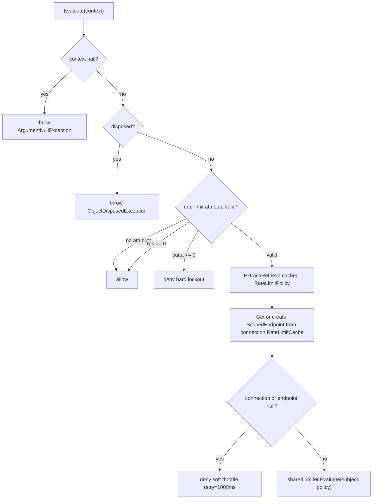

# Policy Rate Limiter

`PolicyRateLimiter` backs handler-level `[PacketRateLimit]` policies with shared
`TokenBucketLimiter` instances. It is used by `RateLimitMiddleware` when a packet context
contains rate-limit metadata; packets without the attribute are handled by the middleware's
global endpoint limiter instead.

## Source Mapping

| Source | Responsibility |
| --- | --- |
| `src/Nalix.Runtime/Throttling/PolicyRateLimiter.cs` | Policy quantization, shared limiter lifecycle, diagnostics, cleanup, and disposal. |
| `src/Nalix.Runtime/Middleware/Standard/RateLimitMiddleware.cs` | Chooses policy limiter vs. global token bucket and sends denial directives. |
| `src/Nalix.Abstractions/Networking/Packets/PacketRateLimitAttribute.cs` | Method-level rate-limit metadata. |
| `src/Nalix.Runtime/Throttling/TokenBucketLimiter.cs` | Per-subject token-bucket implementation used by each policy entry. |
| `src/Nalix.Runtime/Options/TokenBucketOptions.cs` | Defaults copied into each policy-specific token bucket. |

## Attribute Shape

```csharp
[AttributeUsage(AttributeTargets.Method, AllowMultiple = false, Inherited = true)]
public sealed class PacketRateLimitAttribute(
    int requestsPerSecond,
    double burst = 1) : Attribute
```

| Property | Meaning |
| --- | --- |
| `RequestsPerSecond` | Requested steady-state rate. Values `<= 0` are treated as unlimited. |
| `Burst` | Requested burst size. Values `<= 0` are invalid and become hard denials. |

## Runtime Use

`RateLimitMiddleware` evaluates the policy limiter only when
`context.Attributes.RateLimit` is present:

```csharp
if (context.Attributes.RateLimit is not null)
{
    decision = policyRateLimiter.Evaluate(context);
}
else
{
    decision = globalTokenBucket.Evaluate(context.Connection.NetworkEndpoint);
}
```

!!! important "Rate-limit fallback"
    `PolicyRateLimiter.Evaluate(...)` itself returns allowed when no rate-limit attribute is
    present. In the default middleware path, however, packets without the attribute do not
    call the policy limiter; they fall back to the global per-endpoint `TokenBucketLimiter`.

## Stateless Architecture

To optimize performance and minimize memory usage, `PolicyRateLimiter` delegates rate limit state management to a single shared `TokenBucketLimiter` engine. 

- **No Active Policy Allocation**: It completely eliminates quantization, background eviction threads, and per-policy limiter tables. Bounded memory is achieved because rate limit buckets are tracked via subjects in the shared engine.
- **Dynamic Policies**: The parameters of a policy are encapsulated in a `TokenBucketLimiter.RateLimitPolicy` struct. These policies are cached in a thread-safe `ConcurrentDictionary` mapped by `(rps, burst, hardLockout, maxViolations)` to eliminate allocation overhead during evaluation.

## Subject Identity & Scoped Endpoint Caching

For each check, rate limits are isolated by a composite `ScopedEndpoint` containing:

- The target packet operation code (`OpCode`).
- The Policy ID (if specified).
- The client IP address (excluding the port to prevent port-rotation bypass).

To achieve **zero-allocation** during checks:

- The `ScopedEndpoint` instance is created only once per operation code per connection.
- It is cached directly in the connection's thread-safe `RateLimitCache` (a `ConcurrentDictionary<ushort, object>`).
- Subsequent evaluations for the same OpCode on that connection retrieve the cached endpoint directly, avoiding garbage collector pressure.

## Evaluation Flow


```mermaid
flowchart TD
    A["Evaluate(context)"] --> N{"context null?"}
    N -- yes --> E["throw ArgumentNullException"]
    N -- no --> D{"disposed?"}
    D -- yes --> O["throw ObjectDisposedException"]
    D -- no --> R{"rate-limit attribute valid?"}
    R -- no attribute --> AL["allow"]
    R -- rps <= 0 --> AL
    R -- burst <= 0 --> HD["deny hard lockout"]
    R -- valid --> EXT["Extract/Retrieve cached RateLimitPolicy"]
    EXT --> SE["Get or create ScopedEndpoint from connection.RateLimitCache"]
    SE --> SE_Check{"connection or endpoint null?"}
    SE_Check -- yes --> SD["deny soft throttle retry=1000ms"]
    SE_Check -- no --> T["sharedLimiter.Evaluate(subject, policy)"]
```

## Decisions

`Evaluate` returns `TokenBucketLimiter.RateLimitDecision`:

| Scenario | Allowed | Reason | RetryAfterMs | Credit |
| --- | ---: | --- | ---: | ---: |
| No attribute | `true` | `None` | `0` | `ushort.MaxValue` |
| `RequestsPerSecond <= 0` | `true` | `None` | `0` | `ushort.MaxValue` |
| `Burst <= 0` | `false` | `HardLockout` | `int.MaxValue` | `0` |
| Missing endpoint | `false` | `SoftThrottle` | `1000` | `0` |
| Token bucket denied | `false` | Token bucket result | Token bucket result | Token bucket result |

## Lifecycle and Cleanup

Because the rate limiter is stateless and delegates state to the shared `TokenBucketLimiter`, there is no local policy entry sweep or cleanup required in `PolicyRateLimiter` itself.

- **Shared Cleanup**: Idle tracked endpoints are evicted at the shared `TokenBucketLimiter` level using its configured stale entry cleanup interval.
- **Disposal**: `PolicyRateLimiter.Dispose()` marks the instance as disposed. It does not dispose the shared `TokenBucketLimiter` engine because it is a singleton managed by the `InstanceManager` and may be shared with other components.

## Diagnostics

`GenerateReport()` returns a human-readable report containing:

- UTC timestamp;
- active policy count out of `64`;
- evaluation counter;
- active policies sorted by descending RPS and burst;
- last-used UTC time for each active policy.

`WriteReportData(Utf8JsonWriter)` writes zero-allocation JSON with:

- `UtcNow`;
- `ActivePolicies`;
- `MaxPolicies`;
- `CheckCounter`;
- `Policies` array containing `RPS`, `Burst`, and `LastUsedUtc` for each entry.

## Authoring Guidance

- Prefer a small set of policy values; quantization already groups nearby values, but
  deliberate reuse improves predictability.

- Use `RequestsPerSecond <= 0` only when the handler should bypass policy limits. In the
  default middleware path, the global endpoint limiter still protects unannotated packets.

- Do not use `Burst <= 0`; the policy limiter treats it as an invalid hard denial.
- Remember that policy limits are per opcode and remote address, not per connection port.

## Related APIs

- [Middleware Pipeline](./pipeline.md)
- [Token Bucket Limiter](./token-bucket-limiter.md)
- [Token Bucket Options](../../options/network/token-bucket-options.md)
- [Packet Attributes](../../abstractions/packet-attributes.md)
