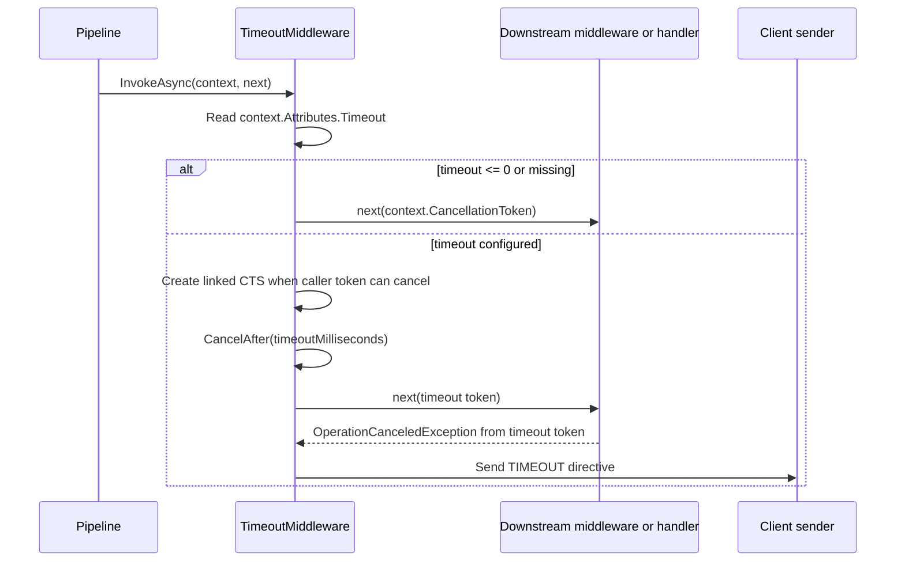

# Timeout Middleware

`TimeoutMiddleware` enforces per-handler execution time limits for inbound packet
processing. It wraps downstream middleware and the final handler in a timed
`CancellationToken` and emits a transient timeout directive when the local timer,
rather than the caller's cancellation token, causes execution to stop.

## Source mapping

- `src/Nalix.Network.Pipeline/Inbound/TimeoutMiddleware.cs`
- `src/Nalix.Common/Networking/Packets/PacketTimeoutAttribute.cs`

## Runtime role

`TimeoutMiddleware` is an inbound middleware with `MiddlewareOrder(75)`. It runs
late in the inbound chain so earlier security and throttling checks can reject
bad traffic before a per-request timer is allocated.

The middleware is metadata-driven. It reads `context.Attributes.Timeout`, which
is populated from `PacketTimeoutAttribute` on the handler method.

## Applying a timeout

```csharp
[PacketTimeout(5000)]
public async Task ProcessHeavyData(PacketContext<WorkPacket> request)
{
    // This handler is expected to finish within 5 seconds.
}
```

`PacketTimeoutAttribute` is declared for methods only and stores one value:
`TimeoutMilliseconds`.

## Execution behavior



If no timeout attribute exists, or the configured timeout is less than or equal
to zero, the middleware is a no-op and passes the original context cancellation
token to `next`.

When a positive timeout is configured:

1. if the context token can cancel, a linked `CancellationTokenSource` is created
2. otherwise a standalone `CancellationTokenSource` is created
3. `CancelAfter(timeoutMilliseconds)` arms the local timer
4. downstream execution receives the timeout token
5. the CTS is disposed when execution completes

## Timeout detection

The middleware only converts cancellation into a timeout response when both
conditions are true:

- the middleware-owned timeout token is canceled
- `context.CancellationToken` is not canceled

This distinction prevents normal connection shutdown or caller cancellation from
being reported as a handler timeout.

## Timeout directive

On a local timeout, `TimeoutMiddleware` first checks `DirectiveGuard` using
`ConnectionAttributes.InboundDirectiveTimeoutLastSentAtMs`. If notification is
allowed, it rents a pooled `Directive` and sends:

```text
ControlType   = TIMEOUT
Reason        = TIMEOUT
Advice        = RETRY
SequenceId    = original packet sequence id
ControlFlags  = IS_TRANSIENT
Arg0          = timeoutMilliseconds / 100
```

The directive send uses `CancellationToken.None`, so the timeout notification is
not canceled by the expired handler token.

If `DirectiveGuard` suppresses the response, the middleware returns silently.

## Error handling boundaries

`TimeoutMiddleware` catches only the timeout-shaped
`OperationCanceledException`. Other exceptions from downstream middleware or the
handler continue to the pipeline error path.

## Related APIs

- [Pipeline](./pipeline.md)
- [Permission Middleware](./permission-middleware.md)
- [Policy Rate Limiter](./policy-rate-limiter.md)
- [Packet Attributes](../routing/packet-attributes.md)
