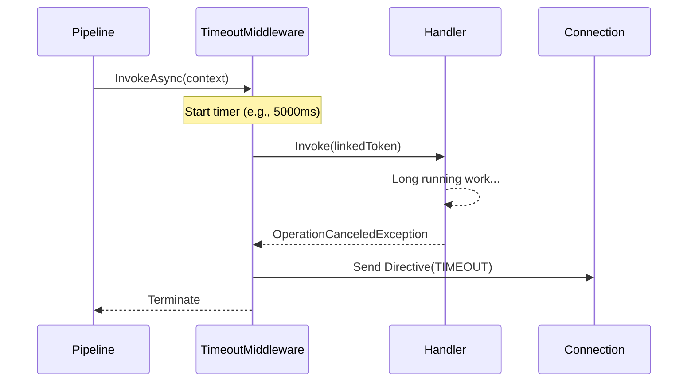

# Timeout Middleware

`TimeoutMiddleware` is an inbound security component that enforces execution time limits on packet handlers. If a handler (or subsequent middleware) fails to complete within the allotted time, it automatically cancels the operation and notifies the client.

## Timeout Flow



## Source mapping

- `src/Nalix.Network.Pipeline/Inbound/TimeoutMiddleware.cs`

## Role and Design

Preventing handlers from hanging indefinitely is critical for server availability. `TimeoutMiddleware` wraps the request execution in a linked `CancellationToken` that is automatically triggered after the `PacketTimeoutAttribute` duration.

- **Linked Cancellation**: Respects both the global session cancellation and the per-packet timeout timer.
- **Graceful Rejection**: Sends a `Directive` frame with `ControlType.TIMEOUT` so the client knows exactly why the request failed.
- **Zero-Allocation Erroring**: Uses pooled `Directive` instances to handle rejection traffic without stressing the GC.

## Configuration

The middleware looks for a `PacketTimeoutAttribute` on the packet metadata. If no attribute is found, it defaults to a no-op (infinite timeout).

### Applying the Attribute
```csharp
[PacketOpcode(0x1001)]
[PacketTimeout(5000)] // 5 second limit
public class ProcessHeavyDataPacket : IPacket { ... }
```

### Pipeline Registration
```csharp
builder.ConfigureDispatch(options =>
{
    options.WithMiddleware(new TimeoutMiddleware());
});
```

## Behavior

1. **Resolution**: Inspects `context.Attributes.Timeout`.
2. **Timer**: Creates a `CancellationTokenSource` with `CancelAfter`.
3. **Execution**: Delegates to the next handler using the timed-out token.
4. **Rejection**: If a `OperationCanceledException` is caught due to the timer:
    - Rents a `Directive` from the `ObjectPoolManager`.
    - Initializes it with `ControlType.TIMEOUT` and `ProtocolAdvice.RETRY`.
    - Transmits the rejection via the TCP transport.

## Related APIs

- [Packet Pipeline](./pipeline.md)
- [Directive Frame](../../framework/packets/built-in-frames.md)
- [Permission Middleware](./permission-middleware.md)
