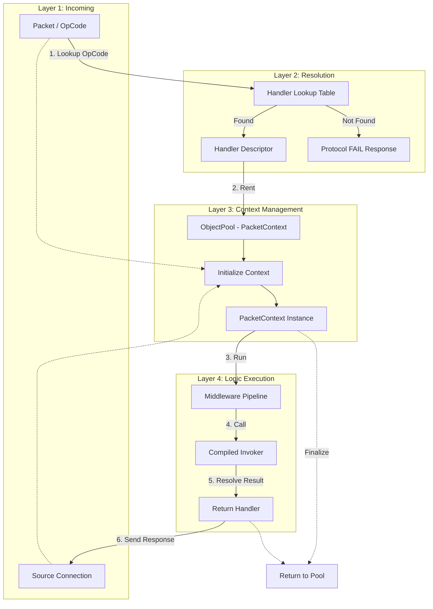

# Nalix.Runtime.Dispatching

`Nalix.Runtime.Dispatching` contains the execution APIs that bridge the gap between deserialized packets and application handlers. It manages opcode-to-handler resolution, context pooling, and result transformation.

## OpCode Dispatch Pipeline

The following diagram illustrates the internal resolution and execution path within the dispatch layer.

## Internal Workflow (Source-Verified)

1  **Resolution**: The `PacketDispatchOptions` uses a high-performance thread-safe dictionary to map `ushort` opcodes to pre-compiled `PacketHandler` descriptors.
2. **Zero-Allocation Pooling**: For every request, a `PacketContext` is rented from the `ObjectPoolManager`. This context carries the connection state, metadata, and handles the `CancellationToken` linkage.
3. **Type Safety Gate**: Before the handler runs, the dispatcher performs a runtime type check against the deserialized packet to ensure it matches the handler signature, preventing cast exceptions in the business logic.
4. **Middleware Orchestration**: The `MiddlewarePipeline` executes in three stages (Inbound, OutboundAlways, Outbound), allowing for complex cross-cutting concerns like authentication or encryption updates.
5. **Return Handling**: The `IReturnHandler` (resolved at compile-time) automatically detects the handler's return type (e.g., `ValueTask<T>`, `T`, or `void`) and packages the result into the appropriate outbound transport call.

## Public Surface

### Contracts

- [IDispatchChannel<`TPacket`>](./dispatch-channel-and-router.md): The queue contract for connection-aware packet routing.
- [IPacketDispatch](./dispatch-contracts.md): The high-level entry point for dispatchers.

### Core Implementations

- [PacketDispatchChannel](./packet-dispatch.md): The standard runtime dispatcher using worker loops and wake signaling.
- [PacketDispatchOptions<`TPacket`>](./packet-dispatch-options.md): Fluent configuration for handlers and middleware.
- [PacketContext<`TPacket`>](./packet-context.md): The state object representing a single packet execution.
- [PacketSender](./packet-sender.md): An abstraction for responding to packets within a context.

## Related APIs

- [Packet Attributes](./packet-attributes.md)
- [Packet Metadata](./packet-metadata.md)
- [Handler Result Types](./handler-results.md)
- [Runtime Overview](../index.md)
