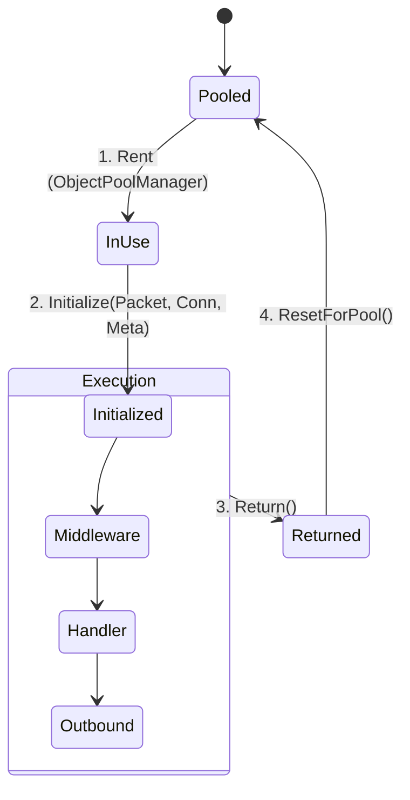

# Packet Context

`PacketContext<TPacket>` is the state object that represents a single packet execution within the Nalix runtime. It provides access to the packet payload, connection attributes, and metadata, while managing response-sending logic.

## Context Lifecycle & Pooling

To achieve ultra-low GC pressure, `PacketContext` instances are heavily pooled. The following diagram illustrates the lifecycle of a context object from the pool to execution and back.

## Why pooling is essential

In a system processing tens of thousands of packets per second, creating a new context object for every request would overwhelm the Garbage Collector. Nalix uses a generic `ObjectPoolManager` to:

- **Minimize Gen0 Allocations**: The object remains in memory and is reused millions of times.
- **Pre-allocation**: Contexts are pre-allocated during startup based on the `PoolingOptions.PacketContextPreallocate` setting.
- **Reference Cleanup**: Strict Reset/Return protocols ensure that application data from one request doesn't "leak" into the next request.

## Core Interface: `IPacketContext<TPacket>`

The context provides several critical properties for handler developers:

| Property | Description |
| --- | --- |
| **`Packet`** | The strongly-typed deserialized packet payload. |
| **`Connection`** | The source `IConnection` including IP, identity, and custom attributes. |
| **`Sender`** | A pooled `IPacketSender` for responding to this specific context. |
| **`Attributes`** | Read-only metadata resolved during dispatch (Ops, permissions). |
| **`CancellationToken`** | A token linked to the dispatch loop or connection shutdown. |

## Memory Safety Rules

1. **Handoff Exclusion**: Once a handler completes, the `PacketContext` is automatically returned to the pool. **Do not** store a reference to the context outside the handler scope.
2. **Sender Usage**: Always use `context.Sender` to respond. The internal sender object is also pooled and is synchronized with the context's reliable/unreliable transport state.
3. **Manual Return**: In advanced scenarios (like bypass dispatching), you must call `.Return()` to ensure the object is placed back in the pool and reference-cleaned.

## Related APIs

- [Packet Dispatch](./packet-dispatch.md)
- [Packet Metadata](../../abstractions/packet-metadata.md)
- [Packet Sender](./packet-sender.md)
- [Object Pooling](../../framework/memory/object-pooling.md)
