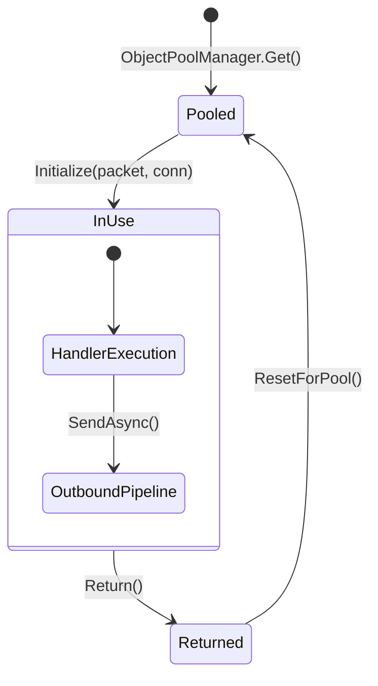

# Packet Context

`PacketContext<TPacket>` is the primary execution context for Nalix handlers. It provides a thread-safe, request-scoped container that carries the message, its connection state, resolved metadata, and a high-performance outbound sender.

## Context Lifecycle



## Source mapping

- `src/Nalix.Runtime/Dispatching/PacketContext.cs`

## Role and Design

To achieve millions of messages per second, Nalix avoids per-packet allocations for the context itself. Instances of `PacketContext<TPacket>` are pre-allocated and managed by the `ObjectPoolManager`.

- **Type Safety**: The generic `TPacket` ensures that handlers work with deserialized objects rather than raw byte spans.
- **Pooled Sender**: Every context is automatically paired with a `PacketSender<TPacket>` from the pool, enabling immediate, type-safe replies.
- **Metadata Awareness**: The context carries `PacketMetadata`, allowing middleware and handlers to check permissions, timeouts, and other attributes declared via C# attributes.

## API Reference

### Properties
| Member | Description |
|---|---|
| `Packet` | The deserialized message instance being processed. |
| `Connection` | The `IConnection` that received the packet. |
| `Sender` | A pooled `IPacketSender<TPacket>` for sending responses. |
| `Attributes` | Resolved `PacketMetadata` (Permissions, OpCodes, etc.). |
| `CancellationToken`| A token that triggers on session drop or request timeout. |
| `SkipOutbound` | If true, redirects the handler result away from the normal outbound pipeline. |

## Basic usage

### Standard Handler Context
```csharp
[PacketOpcode(0x1024)]
public async ValueTask Handle(IPacketContext<LoginPacket> context, CancellationToken ct)
{
    // Access the identity
    var user = context.Packet.Username;
    
    // Check permissions resolved by the dispatcher
    if (context.Attributes.Permission.Level > 0)
    {
        // Send a direct reply using the pooled sender
        await context.Sender.SendAsync(new LoginSuccessPacket(), ct);
    }
}
```

## Internal Mechanics

1. **Pre-allocation**: The static constructor reads `PoolingOptions` and warms up the pool with `PacketContextPreallocate` instances.
2. **Double-Return Guarding**: The `Return()` method uses an atomic `Interlocked.Exchange` to ensure a context is never returned to the pool twice, even under heavy concurrency.
3. **Recursive Cleanup**: When a context is returned, it automatically returns its internal `PacketSender` to the pool before clearing its own references.

## Related APIs

- [Packet Dispatch](./packet-dispatch.md)
- [Packet Sender](./packet-sender.md)
- [Packet Metadata](./packet-metadata.md)
- [Packet Attributes](./packet-attributes.md)
- [Handler Results](./handler-results.md)
