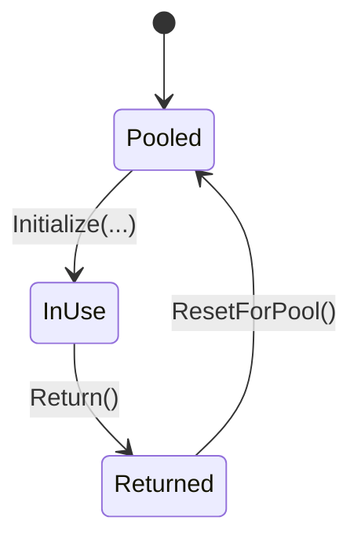

# Packet Context

`PacketContext<TPacket>` is the pooled runtime context passed through middleware and handler execution.

## Audit Summary

- Existing page had useful context but included generic claims not tied to explicit API boundaries.
- Needed stronger mapping between interface contract (`IPacketContext<TPacket>`) and concrete lifecycle in `PacketContext<TPacket>`.

## Missing Content Identified

- Clear distinction between public contract members and runtime-managed setters/lifecycle.
- Explicit note that initialization is runtime-internal and contexts are pool-returned, not user-constructed per request.

## Improvement Rationale

A precise lifecycle model helps contributors avoid context misuse and unnecessary allocations.

## Source Mapping

- `src/Nalix.Common/Networking/Packets/IPacketContext.cs`
- `src/Nalix.Runtime/Dispatching/PacketContext.cs`

## Why This Type Exists

Handlers need a single object that carries packet, connection, metadata, sender, and cancellation state. The runtime also needs this object to be reusable across high-throughput dispatch loops.

## Contract Surface (`IPacketContext<TPacket>`)

- `Packet`
- `Connection`
- `Attributes`
- `Sender`
- `CancellationToken`
- `SkipOutbound`

## Runtime Lifecycle (`PacketContext<TPacket>`)



### Lifecycle notes

- Runtime initializes context via internal `Initialize(...)`.
- `Sender` is automatically rented and attached during initialization.
- `Return()` is guarded to avoid double-return races.
- `ResetForPool()` clears references and returns nested sender to pool.

## Practical Example

```csharp
public static async ValueTask HandleAsync(IPacketContext<MyPacket> context)
{
    MyPacket packet = context.Packet;

    if (!context.SkipOutbound)
    {
        await context.Sender.SendAsync(new MyReply());
    }
}
```

## Best Practices

- Prefer `context.Sender` over direct socket sends when handler metadata should apply.
- Treat `PacketContext<TPacket>` as runtime-owned; avoid retaining references beyond handler scope.
- Use `SkipOutbound` only for intentional outbound middleware bypass scenarios.

## Related APIs

- [Packet Sender](./packet-sender.md)
- [Packet Metadata](./packet-metadata.md)
- [Packet Dispatch](./packet-dispatch.md)
