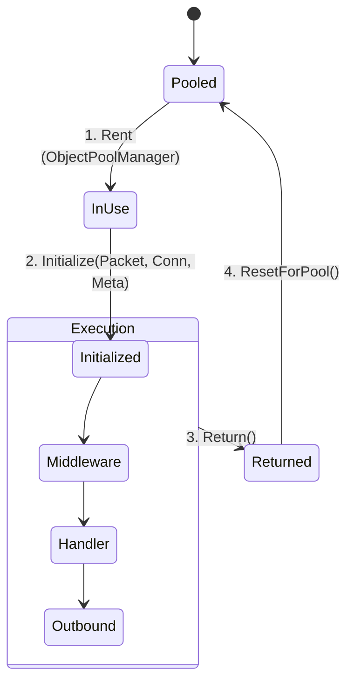

# Packet Context

`PacketContext<TPacket>` is the concrete pooled runtime object that represents a single packet execution within Nalix. Handler and middleware code usually consume it through `IPacketContext<TPacket>`, while the runtime keeps reusing the same concrete object shape underneath.

## Source Mapping

- `src/Nalix.Runtime/Dispatching/PacketContext.cs`

## Context Lifecycle & Pooling

To achieve ultra-low GC pressure, `PacketContext<TPacket>` instances are heavily pooled through `ObjectPoolManager`. The following diagram illustrates the lifecycle of a context object from the pool to execution and back.

```mermaid
stateDiagram-v2
    [*] --> Pooled
    
    Pooled --> InUse: 1. Rent (ObjectPoolManager)
    InUse --> Initialized: 2. Initialize(Packet, Conn, Meta)
    
    state Execution {
        Initialized --> Middleware
        Middleware --> Handler
        Handler --> Outbound
    }
    
    Execution --> Returned: 3. Return()
    Returned --> Pooled: 4. ResetForPool()
```

## Why pooling is essential

In a system processing tens of thousands of packets per second, creating a new context object for every request would overwhelm the Garbage Collector. Nalix uses `ObjectPoolManager` to:

- **Minimize Gen0 Allocations**: The object remains in memory and is reused millions of times.
- **Pre-allocation**: Contexts are pre-allocated during startup based on the `PoolingOptions.PacketContextPreallocate` setting.
- **Reference Cleanup**: Strict Reset/Return protocols ensure that application data from one request doesn't "leak" into the next request.

## Core Interface: `IPacketContext<TPacket>`

The context provides several critical properties for handler developers:

| Property | Description |
| --- | --- |
| **`Packet`** | The strongly-typed deserialized packet payload. |
| **`Connection`** | The source `IConnection` including IP, identity, and custom attributes. |
| **`Sender`** | A sender initialized for this specific context and used for reply paths or manual sends. |
| **`Attributes`** | Read-only metadata resolved during dispatch (Ops, permissions). |
| **`CancellationToken`** | A token linked to the dispatch loop or connection shutdown. |
| **`IsReliable`** | `true` when the packet was received over a reliable transport (TCP). |
| **`SkipOutbound`** | When `true`, outbound middleware is skipped for this context. |

## Memory Safety Rules

1. **Handoff Exclusion**: Once a handler completes, the context is automatically returned to the pool. **Do not** store a reference to the context outside the handler scope.
2. **Sender Usage**: Use `context.Sender` when replying manually. The sender is rebound during `Initialize(...)` so it follows the current connection and transport semantics for that execution.
3. **Manual Return**: In advanced scenarios (like bypass dispatching), call `.Return()` or `.Dispose()` exactly once when you are done. The current implementation makes the transition idempotent, but the ownership contract is still single-return.

## Related APIs

- [Packet Dispatch](./packet-dispatch.md)
- [Packet Metadata](../../abstractions/packet-metadata.md)
- [Packet Sender](./packet-sender.md)
- [Object Pooling](../../framework/memory/object-pooling.md)
