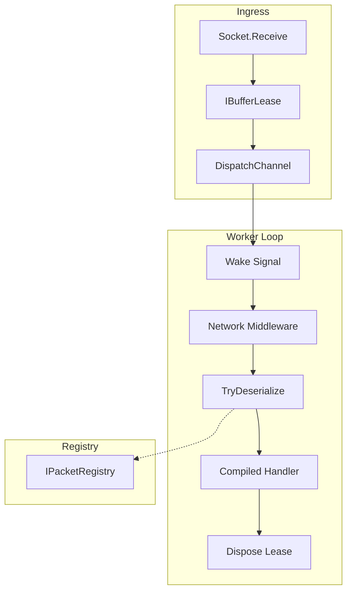

# Packet Dispatch

`PacketDispatchChannel` is the engine of the Nalix runtime. It is responsible for the asynchronous queuing, processing, and routing of incoming network frames. By decoupling network I/O from handler execution, it enables high concurrency and provides backpressure and priority-aware scheduling.

## Dispatch Pipeline



## Source mapping

- `src/Nalix.Runtime/Dispatching/PacketDispatchChannel.cs`
- `src/Nalix.Runtime/Dispatching/PacketDispatcherBase.cs`
- `src/Nalix.Runtime/Dispatching/PacketDispatchOptions.cs`

## Architecture and Performance

The dispatcher is designed for maximum throughput with minimal overhead. It uses a custom `DispatchChannel` that organizes work by connection and priority, preventing "noisy neighbors" from starving other clients.

- **Asynchronous Workers**: Starts `DispatchLoopCount` workers (defaulting to CPU core count) to process packets in parallel.
- **Coalesced Wake-ups**: Uses a low-overhead signaling mechanism (`Channel<byte>`) to wake idle workers only when new work is available.
- **Priority Awareness**: Supports `PacketPriority` (Low, Normal, High, Urgent) to ensure critical control traffic is processed before bulk data.
- **Allocation-Free**: Heavily utilizes `ValueTask` and object pooling to maintain zero-allocation paths during steady-state processing.

## API Reference

### Primary Methods
| Method | Description |
|---|---|
| `Activate()` | Boots the background worker loops and clears diagnostic counters. |
| `Deactivate()`| Gracefully shuts down workers and signals the exit path. |
| `HandlePacket(lease, conn)` | The primary entry point for raw network data. Enqueues the lease for processing. |
| `HandlePacket(packet, conn)`| A fast-path for pre-deserialized packets; skips the queue and executes immediately. |

## Inbound Flow

1. **Ingress**: A raw `IBufferLease` is accepted from the transport (TCP/UDP).
2. **Buffering**: The lease is pushed into the `DispatchChannel`.
3. **Waking**: A worker is signaled via the wake channel.
4. **Middleware**: Raw `INetworkBufferMiddleware` is executed (e.g., integrity checks or logging).
5. **Deserialization**: The `IPacketRegistry` attempts to turn the buffer into a typed `IPacket`.
6. **Execution**: The compiled handler pipeline (including `IPacketMiddleware`) is invoked.
7. **Cleanup**: The `IBufferLease` is disposed, returning memory to the pool.

## Diagnostics and Telemetry

The dispatcher provides deep visibility into the runtime state via `GenerateReport()` and `GetReportData()`.

- **Monitoring**: Track pending packet counts and ready connection counts.
- **Hotspots**: Identify "top connections" that are generating the most load.
- **Throughput**: Monitor wake signals and read signals to verify worker efficiency.

```csharp
// Export structured data for Prometheus or custom dashboards
var metrics = dispatchChannel.GetReportData();
Console.WriteLine($"Queue Depth: {metrics["TotalPackets"]}");
```

## Related APIs

- [Packet Context](./packet-context.md)
- [Packet Metadata](./packet-metadata.md)
- [Handler Results](./handler-results.md)
- [Middleware Pipeline](../middleware/pipeline.md)
- [Dispatch Options](../options/dispatch-options.md)
