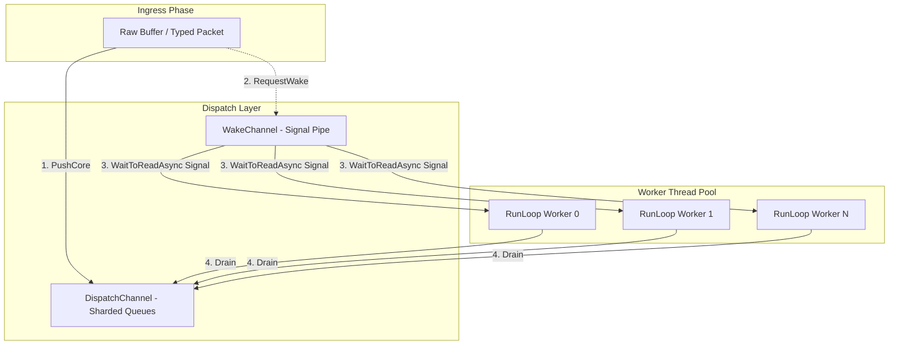
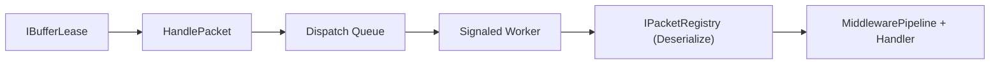

# Packet Dispatch

`PacketDispatchChannel` is the high-performance execution engine that bridges the gap between raw transport buffers and your application handlers. It is designed to handle extreme message rates while maintaining connection affinity and low CPU overhead.

## Multi-Worker Wake Model

The following diagram illustrates the lock-free signaling and worker-loop model used to process thousands of concurrent packets.

## Why This Type Exists

`PacketDispatchChannel` decouples the "Receive" concerns of the network layer from the "Execute" concerns of the business logic. This separation allows Nalix to:
- **Scale Workers Independently**: You can have more worker threads than network listeners to handle CPU-heavy tasks.
- **Maintain Ordering**: Packets from the same `IConnection` are always processed sequentially within the same channel to prevent state corruption.
- **Coalesce Wakeups**: Multiple packet arrivals can trigger a single worker wake-up signal, significantly reducing context switches under load.

## Architectural Pipeline (Source-Verified)

## Sharding and Scaling

`PacketDispatchChannel` is **shard-aware**. It maintains internal connection queues and distributes them across a pool of worker loops.

- **Connection Affinity**: Nalix ensures that all packets from a single endpoint are processed by the same worker loop across the lifecycle, preserving reliable message order (FIFO).
- **Worker Configuration**: The number of shards (worker loops) is defined by `Options.DispatchLoopCount`. If unset, it defaults to `ProcessorCount` (clamped between 1 and 64).
- **Efficient Signaling**: Uses `System.Threading.Channels` for wake signaling, which provides a thread-safe, non-blocking way to wake up sleeping workers.

## Operational Notes

### 1. High-Performance Drain
A worker loop doesn't just process one packet and sleep. It attempts to "drain" up to `MaxDrainPerWake` (default 2048) packets in a tight loop before returning to the wait state, maximizing L1 cache hits and instruction pipelining.

### 2. Diagnostics & Reporting
`PacketDispatchChannel` provides deep visibility into its internal state:
- **`TotalPackets`**: Global count of packets currently in flight across all shards.
- **`ReadyConnections`**: Number of connections that have at least one packet waiting for a worker.
- **`WakeSignals`**: Counter representing how many times the wake channel has been signaled.

!!! tip "Performance Tuning"
    Monitor `WakeSignals` vs `TotalPackets`. A high ratio of signals to packets might indicate that `MaxDrainPerWake` is set too low for your traffic pattern, causing excessive wake/sleep cycles.

### 3. Custom Routing & Shard Keys
Developers can override the default connection-based sharding by wrapping `IPacketDispatch` in a custom router. This is useful for grouping related connections (e.g., all devices for a single User) into the same sequential worker loop.

!!! example "Shard Wrapping"
    See the [Custom Packet Router Guide](../../guides/extensibility/custom-packet-router.md) for a detailed implementation of a Shard Proxy and Custom Router.

## Related APIs

- [Dispatch Contracts](./dispatch-contracts.md)
- [Packet Dispatch Options](./packet-dispatch-options.md)
- [Packet Context](./packet-context.md)
- [Middleware Pipeline](../middleware/pipeline.md)
