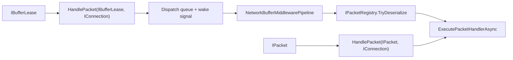

# Packet Dispatch

`PacketDispatchChannel` is the primary `IPacketDispatch` implementation in `Nalix.Runtime`.

## Audit Summary

- Existing page explained the flow well but mixed guaranteed behavior with high-level claims.
- Needed tighter wording around defaults and dispatch entry paths based on actual code.

## Missing Content Identified

- Explicit distinction between raw-buffer path and typed-packet fast path.
- Lifecycle and diagnostics behavior mapped to concrete public members.

## Improvement Rationale

Clear execution-path documentation reduces integration mistakes in transport-to-runtime wiring.

## Source Mapping

- `src/Nalix.Runtime/Dispatching/PacketDispatchChannel.cs`
- `src/Nalix.Runtime/Dispatching/PacketDispatcherBase.cs`
- `src/Nalix.Runtime/Dispatching/PacketDispatchOptions.cs`

## Why This Type Exists

`PacketDispatchChannel` decouples network receive loops from handler execution. It can queue raw inbound buffers and dispatch them on worker loops, or execute already-typed packets directly.

## Mental Model

## Core APIs

- `Activate(CancellationToken)`
- `Deactivate(CancellationToken)`
- `HandlePacket(IBufferLease, IConnection)`
- `HandlePacket(IPacket, IConnection)`
- `GenerateReport()`
- `GetReportData()`

## Sharding and Scaling

`PacketDispatchChannel` is **shard-aware**. It maintains internal connection queues and distributes them across a pool of worker loops.

- **Connection Affinity**: Packets from the same connection are always processed sequentially to preserve order.
- **Configurable Parallelism**: The number of shards is determined by `Options.DispatchLoopCount`.
- **Low-Latency Signaling**: Shards use lock-free wake channels to minimize worker contention.

For deep-dive configuration and sharding strategies, see the [Shard-Aware Dispatch](../../../../guides/shard-aware-dispatch.md) guide.

## Operational Notes

- Worker loops count is `Options.DispatchLoopCount` when set, otherwise `Math.Clamp(Environment.ProcessorCount, 1, 64)`.
- Raw buffer path executes network buffer middleware before deserialization.
- Lease disposal is handled by runtime paths; callers should not dispose after successful handoff.

## Best Practices

- Use raw-buffer overload for normal transport ingress.
- Keep metadata and handler registration complete before activation.
- Use `GetReportData()` for machine-readable telemetry and `GenerateReport()` for operator diagnostics.

## Related APIs

- [Dispatch Contracts](./dispatch-contracts.md)
- [Packet Context](./packet-context.md)
- [Middleware Pipeline](../middleware/pipeline.md)
- [Dispatch Options](../options/dispatch-options.md)
