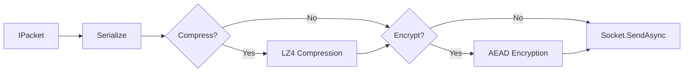

# Packet Sender

`PacketSender<TPacket>` is the default runtime component responsible for serializing and transforming outbound packets. It is automatically resolved and paired with every `PacketContext`, providing a type-safe API for handlers to send replies without worrying about low-level framing, compression, or encryption.

## Transform Pipeline



## Source mapping

- `src/Nalix.Runtime/Dispatching/PacketSender.cs`

## Role and Design

The sender acts as the "exit gate" for the runtime. It ensures that every outbound message is correctly framed and transformed according to both the global server configuration and per-connection security states.

- **Automated Transforms**: Automatically detects if a packet meets the threshold for compression or requires encryption based on the `PacketMetadata`.
- **Zero-Allocation Execution**: Managed by the `ObjectPoolManager`, senders are rented and returned as part of the `PacketContext` lifecycle to avoid GC pressure.
- **Atomic Operations**: Uses `BufferLease` to manage raw memory across transformation boundaries, ensuring that buffers are safely returned to the pool even if a transform fails.

## Outbound Logic Branches

The sender dynamically chooses one of four execution paths for every message:

| Scenario | Rule | Resulting Packet Flags |
|---|---|---|
| **Plain** | Small payload, no encryption required. | `CONTROL.NONE` |
| **Compress only** | Payload $>$ `MinSizeToCompress`. | `PacketFlags.COMPRESSED` |
| **Encrypt only** | `Security` required for the session. | `PacketFlags.ENCRYPTED` |
| **Full Transform**| Large, sensitive payload. | `COMPRESSED \| ENCRYPTED` |

> [!NOTE]
> Compression always happens **before** encryption. This ensures data is as small as possible before being scrambled, which maximizes compression efficiency and reduces encrypted payload size.

## API Reference

### Primary Methods
| Method | Description |
|---|---|
| `SendAsync(packet, ct)` | Sends a packet using the default security rules resolved for the request. |
| `SendAsync(packet, force, ct)` | Overrides the default security rules to force encryption on a specific message. |

## Basic usage

### Manual Response in handler
```csharp
public async ValueTask Handle(IPacketContext<Handshake> context, CancellationToken ct)
{
    // The sender is already initialized and scoped to this context.
    await context.Sender.SendAsync(new LoginSuccess(), ct);
}
```

### Forcing Encryption
```csharp
// Force encryption for a sensitive reply, even if the request was plain text.
await context.Sender.SendAsync(sensitivePacket, forceEncrypt: true, ct);
```

## Internal Mechanics

1. **Renting**: A raw buffer is rented from the pool based on the `packet.Length`.
2. **Serialization**: The `IPacket` is serialized into the rented span.
3. **Branching**: The sender evaluates `CompressionOptions` and `context.Attributes.Encryption`.
4. **Transforming**: If needed, new leases are rented for compressed or encrypted results, and the intermediate leases are disposed immediately.
5. **Transmitting**: The final `ReadOnlyMemory<byte>` is passed to the `ITcpSession` or `IUdpSession`.

## Related APIs

- [Packet Context](./packet-context.md)
- [Packet Dispatch](./packet-dispatch.md)
- [Compression Options](../../framework/options/compression-options.md)
- [Connection Security](../../security/handshake.md)
