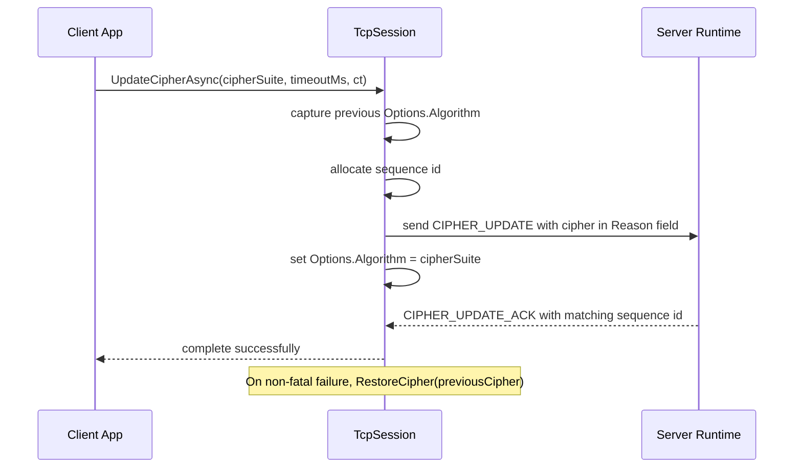

# Cipher Updates

`CipherExtensions` provides a focused client-side helper for switching the active cipher suite on a connected `TcpSession`.

## Source mapping

- `src/Nalix.SDK/Transport/Extensions/CipherExtensions.cs`

## Implementation Flow



## Role and Design

This helper is meant for sessions that need to rotate or negotiate a new cipher without rebuilding the connection.

- **Coordinated switch**: The client sends a `CONTROL` update that the server can acknowledge.
- **Sequence tracking**: Each request uses a sequence id so the ACK can be matched safely.
- **Minimal surface area**: The API stays on `TcpSession` because it depends on the live transport state.

## API Reference

| Method | Description |
|---|---|
| `UpdateCipherAsync` | Switches the active cipher suite for an already connected `TcpSession`. |

## Basic usage

```csharp
await client.UpdateCipherAsync(CipherSuiteType.Chacha20Poly1305);
```

## Important notes

- Call this only after the session is connected.
- The method updates the local session options after the update frame is sent.
- The ACK is matched by both control type and sequence id.

## Related APIs

- [Session Extensions](./tcp-session-extensions.md)
- [Handshake Protocol](../security/handshake.md)
