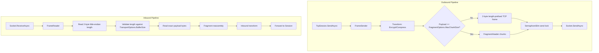

# Frame Reader and Sender

`FrameReader` and `FrameSender` are the internal workhorses of the `Nalix.SDK` transport layer. They manage the low-level serialization of frames, socket I/O, and payload transformations, abstracting these complexities away from the `TcpSession`.

## Internal Pipeline

## Source mapping

- `src/Nalix.SDK/Transport/Internal/FrameReader.cs`
- `src/Nalix.SDK/Transport/Internal/FrameSender.cs`
- `src/Nalix.Framework/DataFrames/Transforms/FramePipeline.cs`

## Frame Sender (`FrameSender`)

The `FrameSender` provides a thread-safe, ordered outbound pipeline. The current implementation does **not** use an intermediate channel queue. Instead, it applies transforms, frames the payload, then serializes socket writes with a `SemaphoreSlim` send lock.

- **Strict ordering**: concurrent send calls are serialized by `_sendLock`, so frame bytes cannot interleave on the socket.
- **Direct socket writes**: after the caller enters the send lock, the sender loops until the full frame has been written with `Socket.SendAsync`.
- **Automatic fragmentation**: payloads whose transformed length is greater than or equal to `FragmentOptions.MaxChunkSize` are split into `FragmentHeader` chunks.
- **Frame-size guardrails**: normal TCP frames must fit in the 2-byte length prefix (`ushort.MaxValue`). Fragment chunks must also fit after adding the TCP header and `FragmentHeader.WireSize`.
- **Transformation**: integrates with the centralized `FramePipeline` to encrypt and compress payloads before framing.
- **Error contract**: non-fatal send exceptions invoke the configured error callback and cause `SendAsync` to return `false`.
- **Pooled memory**: temporary frame buffers are rented from `BufferLease.ByteArrayPool` and returned after each send attempt.

## Frame Reader (`FrameReader`)

The `FrameReader` manages the long-running socket receive loop. It is responsible for reassembling protocol frames from the raw TCP stream.

- **Header parsing**: reads the 2-byte little-endian length prefix to determine the total frame length.
- **Length validation**: rejects frames smaller than `TcpSession.HeaderSize` or larger than `TransportOptions.BufferSize` with a cached `SocketError.MessageSize` exception.
- **Exact reads**: repeatedly calls `Socket.ReceiveAsync` until the requested header or payload span is filled; a zero-byte receive is treated as `ConnectionReset`.
- **Fragment management**: synchronized with the sender's chunking logic to reassemble fragmented payloads before delivering them upward.
- **Transform application**: integrates with the centralized `FramePipeline` to decrypt and decompress payloads in-place.
- **Ownership handoff**: wraps each frame in a `BufferLease` and forwards the processed lease to the session callback.

## Ownership and Performance

A critical aspect of the SDK pipeline is its zero-copy (or minimized copy) architecture.

1. **Renting**: Buffers are rented from the `ArrayPool<byte>` via the `BufferLease` abstraction.
2. **Transformation**: LZ4 decompression and AEAD decryption are performed directly on these rented blocks.
3. **Dispatch**: The final lease is delivered to the user's `OnMessageReceived` handler.
4. **Cleanup**: The user **must** dispose of the lease (usually via `using var`) to return the memory to the pool.

## Related APIs

- [TCP Session](./tcp-session.md)
- [Fragmentation](../framework/packets/fragmentation.md)
- [Buffer Management](../framework/memory/buffer-management.md)
- [Object Pooling](../framework/memory/object-pooling.md)
- [Handshake Extensions](./handshake-extensions.md)
