# Frame Reader and Sender

`FrameReader` and `FrameSender` are the internal workhorses of the `Nalix.SDK` transport layer. They manage the low-level serialization of frames, socket I/O, and payload transformations, abstracting these complexities away from the `TcpSession`.

## Internal Pipeline

```mermaid
graph TD
    subgraph Outbound [Outbound Pipeline]
        S[TcpSession.SendAsync] --> FS[FrameSender]
        FS --> T[Transform: Encrypt/Compress]
        T --> Q[Bounded Channel Queue]
        Q --> D[Single Drain Loop]
        D --> SK[Socket.SendAsync]
    end
    
    subgraph Inbound [Inbound Pipeline]
        RSK[Socket.ReceiveAsync] --> FR[FrameReader]
        FR --> H[Read Header: 2 Bytes]
        H --> L[Read Payload]
        L --> FA[Fragment Reassembly]
        FA --> IT[Inbound Transform]
        IT --> Callback[Forward to Session]
    end
```

## Source mapping

- `src/Nalix.SDK/Transport/Internal/FrameReader.cs`
- `src/Nalix.SDK/Transport/Internal/FrameSender.cs`
- `src/Nalix.Framework/DataFrames/Transforms/FramePipeline.cs`

## Frame Sender (`FrameSender`)

The `FrameSender` provides a thread-safe, ordered outbound pipeline. It uses a `System.Threading.Channels` bounded queue to ensure that concurrent send requests never interleave their bytes on the socket.

- **Strict Ordering**: Guaranteed by a single-reader drain loop.
- **Backpressure**: Prevents memory exhaustion if the network is slower than the application (via `BoundedChannelFullMode.Wait`).
- **Automatic Fragmentation**: Large payloads are automatically split into chunks using the `FragmentHeader` and `FragmentStreamId` protocol.
- **Transformation**: Integrates with the centralized `FramePipeline` to encrypt and compress payloads before framing and queuing.
- **Pooled Memory**: Rents byte arrays for framing to minimize GC pressure during high-throughput bursts.

## Frame Reader (`FrameReader`)

The `FrameReader` manages the long-running socket receive loop. It is responsible for reassembling the protocol frames from the raw TCP stream.

- **Header Parsing**: Reads the 2-byte little-endian length prefix to determine the coming payload size.
- **Fragment Management**: Synchronized with the server's chunking logic to reassemble fragmented payloads before delivering them upward.
- **Transform Application**: Integrates with the centralized `FramePipeline` to decrypt and decompress payloads in-place.
- **Ownership Handoff**: Rents a `BufferLease` for every frame. Once transformed, ownership of this lease is handed off to the session's receive event.

## Ownership and Performance

A critical aspect of the SDK pipeline is its zero-copy (or minimized copy) architecture.

1. **Renting**: Buffers are rented from the `ArrayPool<byte>` via the `BufferLease` abstraction.
2. **Transformation**: LZ4 decompression and AEAD decryption are performed directly on these rented blocks.
3. **Dispatch**: The final lease is delivered to the user's `OnMessageReceived` handler.
4. **Cleanup**: The user **must** dispose of the lease (usually via `using var`) to return the memory to the pool.

## Related APIs

- [TCP Session](./tcp-session.md)
- [Fragmentation](../framework/packets/fragmentation.md)
- [Buffer Management](../framework/memory/buffer-management.md)
- [Object Pooling](../framework/memory/object-pooling.md)
- [Handshake Extensions](./handshake-extensions.md)
