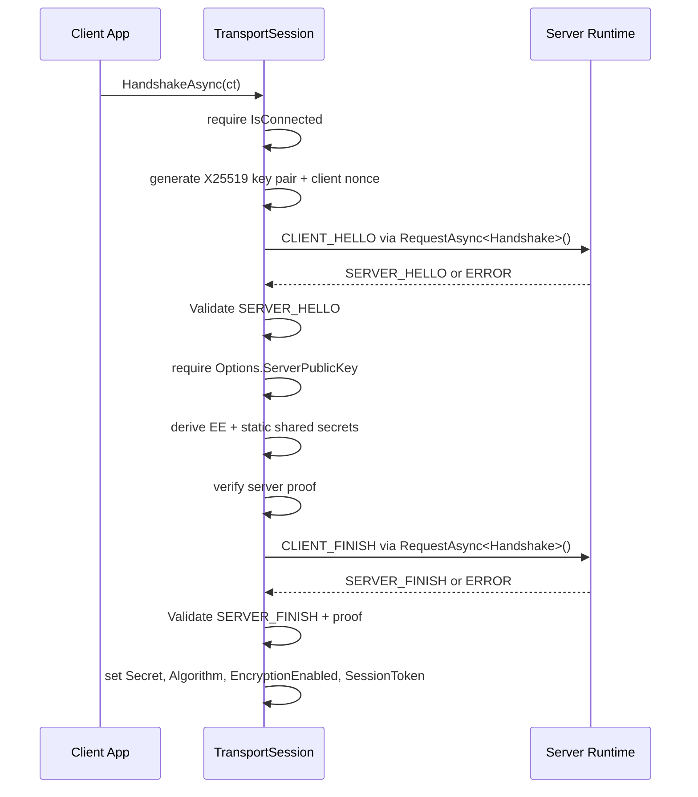

# Handshake Extensions

`HandshakeExtensions` provides the client-side X25519 handshake used to establish an encrypted `TransportSession`.
For reconnect flows, see [`ResumeExtensions`](./resume-extensions.md).

## Source mapping

- `src/Nalix.SDK/Transport/Extensions/HandshakeExtensions.cs`

## Implementation Flow



## Role and Design

This helper performs the full client-side handshake sequence after a transport is connected.

- **Ephemeral key exchange**: Generates a fresh X25519 key pair for each handshake.
- **Proof verification**: Validates the server's response before deriving session material.
- **Session activation**: Updates `TransportOptions.Secret`, `TransportOptions.Algorithm`, `TransportOptions.EncryptionEnabled`, and `TransportOptions.SessionToken` on success.

## API Reference

| Method | Description |
|---|---|
| `HandshakeAsync` | Performs the client-side X25519 handshake on a connected `TransportSession`. |

## Basic usage

```csharp
// 1. Configure the expected server public key (Identity Pinning)
client.Options.ServerPublicKey = "your-server-public-key-hex";

// 2. Connect and perform authenticated handshake
await client.ConnectAsync();
await client.HandshakeAsync();
```

## Important notes

- Call this only after the session is connected.
- **Identity Pinning is Mandatory**: The client MUST provide the expected server public key via `TransportOptions.ServerPublicKey`. Anonymous handshakes are strictly forbidden to prevent MitM attacks.
- On success, the session switches to `CipherSuiteType.Chacha20Poly1305`.

## Related APIs

- [Session Extensions](./tcp-session-extensions.md)
- [Handshake Protocol](../security/handshake.md)
