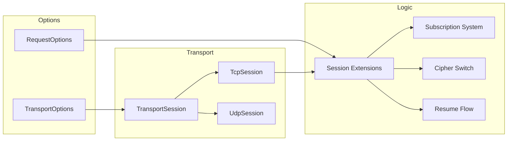

# SDK Overview

`Nalix.SDK` is the high-performance client transport layer for the Nalix ecosystem. It provides the essential building blocks for building low-latency, resilient, and secure distributed applications. 

## Client runtime shape



## Source mapping

- `src/Nalix.SDK/Transport/TransportSession.cs`
- `src/Nalix.SDK/Transport/TcpSession.cs`
- `src/Nalix.SDK/Transport/UdpSession.cs`
- `src/Nalix.SDK/Options/TransportOptions.cs`
- `src/Nalix.SDK/Options/RequestOptions.cs`
- `src/Nalix.SDK/Transport/Extensions/ControlExtensions.cs`
- `src/Nalix.SDK/Transport/Extensions/RequestExtensions.cs`
- `src/Nalix.SDK/Transport/Extensions/HandshakeExtensions.cs`
- `src/Nalix.SDK/Transport/Extensions/ResumeExtensions.cs`
- `src/Nalix.SDK/Transport/Extensions/CipherExtensions.cs`
- `src/Nalix.SDK/Transport/Extensions/TcpSessionSubscriptions.cs`
- `src/Nalix.SDK/IThreadDispatcher.cs`
- `src/Nalix.SDK/Extensions/ProtocolStringExtensions.cs`

## Module Summary

| Component | Description |
| --- | --- |
| **Transports** | Abstract `TransportSession` with concrete `TcpSession` (reliable) and `UdpSession` (datagram) implementations. |
| **Options** | Strongly-typed configuration for socket tuning, reconnect policies, and request-specific timeouts/retries. |
| **Extensions** | Fluent builders for `CONTROL` frames, cryptographic handshakes, cipher updates, and race-condition-free `RequestAsync` helpers. |
| **Subscriptions** | Type-safe event system that handles `IBufferLease` ownership and automatic unsubscription. |
| **Utils** | Thread dispatching abstractions for UI/Game engine integration and protocol string translation. |

## Quick Start

1. **Load Options**: Load `TransportOptions` from your configuration source.
2. **Initialize Session**: Create a `TcpSession` or `UdpSession`.
3. **Secure Connection**: Perform `HandshakeAsync` if encryption is required.
4. **Exchange Packets**: Use `SendAsync`, `RequestAsync`, or `On<T>` to interact with the server.

```csharp
var options = ConfigurationManager.Instance.Get<TransportOptions>();
var client = new TcpSession(options, catalog);

// Secure the connection via X25519
await client.ConnectAsync();
await client.HandshakeAsync();

// Strongly-typed request with automatic retry
var response = await client.RequestAsync<UserLoginResponse>(
    new UserLoginPacket { Username = "NalixUser" },
    RequestOptions.Default.WithRetry(2)
);
```

## Key Documentation

- [TCP Session](./tcp-session.md) — Reliable, stream-oriented client.
- [UDP Session](./udp-session.md) — Low-latency, datagram-oriented client.
- [Transport Session](./transport-session.md) — The base transport contract.
- [Handshake Extensions](./handshake-extensions.md) — Perform the client-side X25519 handshake.
- [Resume Extensions](./resume-extensions.md) — Resume an existing session or fall back to a fresh handshake.
- [Session Extensions](./tcp-session-extensions.md) — Handshakes, Controls, Requests, and cipher switching.
- [Cipher Updates](./cipher-extensions.md) — Rotate the active cipher on a live TCP session.
- [Subscriptions](./subscriptions.md) — Packet-aware event system.
- [Transport Options](./options/transport-options.md) — Socket and connectivity settings.
- [Request Options](./options/request-options.md) — Per-request tuning.
- [Thread Dispatching](./thread-dispatching.md) — Marshaling work to the UI thread.
- [Protocol Strings](./protocol-string-extensions.md) — Human-readable error codes.
