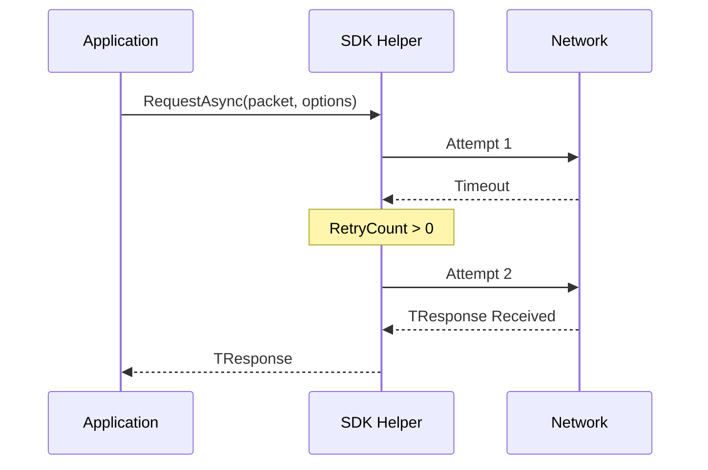

# Request Options

`RequestOptions` is the fluent configuration record used by `RequestAsync<TResponse>()`. It controls per-attempt timeout, retry count, and whether the outbound request should be encrypted.

## Retry and Timeout Flow



## Source mapping

- `src/Nalix.SDK/Options/RequestOptions.cs`

## Role and Design

`RequestOptions` is designed as a C# `record` so you can clone and tweak options without mutating a shared instance. That makes it easy to build one-off request settings from `RequestOptions.Default`.

- **Timeout per attempt**: `TimeoutMs` applies to each individual attempt, not the total request time.
- **Selective retries**: retries are only triggered by `TimeoutException`. Fatal transport errors, send failures, and disconnects propagate immediately.
- **Encryption opt-in**: `Encrypt` allows specific requests to be secured even if the base transport is not globally encrypting. The SDK only applies this to `TcpSession`.
- **Input validation**: `TimeoutMs` must be non-negative, and `RetryCount` must be non-negative.

## API Reference

### Properties
| Member | Default | Description |
|---|---|---|
| `TimeoutMs` | `5000` | Milliseconds to wait for a response on each attempt. |
| `RetryCount` | `0` | Additional attempts after the first timeout. |
| `Encrypt` | `false` | Whether to apply AEAD encryption to the outbound frame. |

### Fluent Helpers
| Method | Description |
|---|---|
| `WithTimeout(ms)` | Returns a clone with the specified timeout. |
| `WithRetry(count)`| Returns a clone with the specified retry count. |
| `WithEncrypt(bool)`| Returns a clone with encryption toggled. |

## Basic usage

```csharp
// Standard request
var response = await client.RequestAsync<LoginResponse>(packet);

// High-reliability request
var opts = RequestOptions.Default
    .WithTimeout(3000)
    .WithRetry(2)
    .WithEncrypt();

var secureResponse = await client.RequestAsync<SecretData>(sensitivePacket, opts);

// Explicit predicate for correlated replies
var matchingResponse = await client.RequestAsync<SecretData>(
    sensitivePacket,
    RequestOptions.Default.WithTimeout(2000),
    predicate: response => response.RequestId == sensitivePacket.RequestId);
```

## Important notes

- **Total wait time**: the maximum delay a caller might face is approximately `TimeoutMs * (RetryCount + 1)`.
- **Encryption compatibility**: `Encrypt = true` is only supported when using `TcpSession`. The helper validates this before sending.
- **Predicate quality**: when you provide a predicate, it should identify the correlated response, not just the packet type.
- **Failure semantics**: transport disconnects surface as `NetworkException`; only `TimeoutException` is retryable.

## Related APIs

- [TCP Session](../tcp-session.md)
- [Transport Options](./transport-options.md)
- [Subscriptions](../subscriptions.md)
