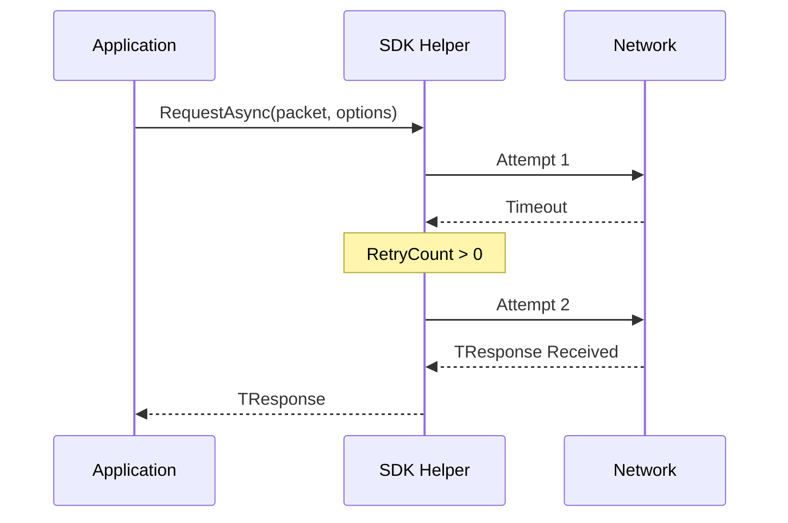

# Request Options

`RequestOptions` is a fluent configuration record that controls the behavior of the `RequestAsync` helper. It determines how long to wait for a response, how many times to retry on timeout, and whether the outbound request should be encrypted.

## Retry and Timeout Flow



## Source mapping

- `src/Nalix.SDK/Options/RequestOptions.cs`

## Role and Design

`RequestOptions` is designed as a C# `record` to support non-destructive mutation and fluent chaining. This makes it trivial to create one-off request configurations without affecting the global default.

- **Timeout per Attempt**: The `TimeoutMs` applies to each individual attempt, not the total request time.
- **Selective Retries**: Retries are only triggered by `TimeoutException`. Fatal transport errors (like a closed socket) are propagated immediately to avoid redundant work on broken channels.
- **Encryption Opt-in**: The `Encrypt` flag allows specific requests to be secured even if the base transport is not globally encrypting.

## API Reference

### Properties
| Member | Default | Description |
|---|---|---|
| `TimeoutMs` | `5000` | Milliseconds to wait for a response on each attempt. |
| `RetryCount` | `0` | Additional attempts after the first timeout. |
| `Encrypt` | `false` | Whether to apply AEAD encryption to the outbound frame. |

### Fluent Helpers
| Method | Description |
|---|---|
| `WithTimeout(ms)` | Returns a clone with the specified timeout. |
| `WithRetry(count)`| Returns a clone with the specified retry count. |
| `WithEncrypt(bool)`| Returns a clone with encryption toggled. |

## Basic usage

```csharp
// Standard request
var response = await client.RequestAsync<LoginResponse>(packet);

// High-reliability request
var opts = RequestOptions.Default
    .WithTimeout(3000)
    .WithRetry(2)
    .WithEncrypt();

var secureResponse = await client.RequestAsync<SecretData>(sensitivePacket, opts);
```

## Important notes

- **Total Wait Time**: The maximum delay a caller might face is approximately `TimeoutMs * (RetryCount + 1)`.
- **Encryption Compatibility**: `Encrypt = true` is currently only supported when using `TcpSession`. Applying it to `UdpSession` will trigger a validation nudge from the analyzer.

## Related APIs

- [TCP Session](../tcp-session.md)
- [Transport Options](./transport-options.md)
- [Session Extensions](../tcp-session-extensions.md)
