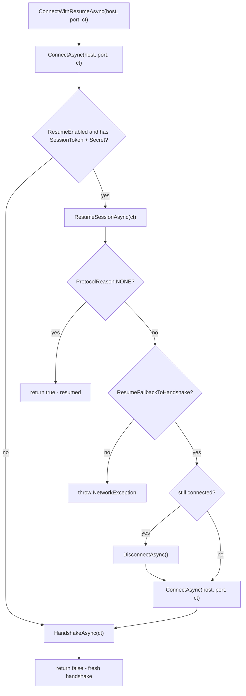

# Resume Extensions

`ResumeExtensions` provide high-level abstractions for managing session reconnection and state restoration. These helpers ensure that the transition from a disconnected state to a resumed secure session is handled atomically and with robust fallback mechanisms.

## Source Mapping

- `src/Nalix.SDK/Transport/Extensions/ResumeExtensions.cs`
- `src/Nalix.Codec/DataFrames/SignalFrames/SessionResume.cs`
- `src/Nalix.SDK/Options/TransportOptions.cs`

## Implementation Flow



## 1. Role and Design

The primary role of these extensions is to orchestrate the `SESSION_SIGNAL` flow (REQUEST/RESPONSE) while abstracting the complexities of state restoration from the main application logic.

- **State Awareness**: The SDK automatically determines if enough state (Token + Secret) exists to attempt a resume.
- **Atomic Transition**: On a successful resume, the `TcpSession` or `UdpSession` is immediately updated with the restored security context and any rotated tokens.
- **Fallback Integrity**: In environments with short-lived session caches, the extensions provide a seamless transition from a failed resume to a fresh full handshake.
- **Stable State**: If resume fails, the SDK preserves the session token so the caller can inspect or retry without losing reconnect state.

## 2. API Reference

### TCP Resumption

These methods are primary extension points for `TcpSession`.

| Method | Returns | Description |
| --- | --- | --- |
| `ResumeSessionAsync` | `Task<ProtocolReason>` | Explicitly attempts to resume the session on a connected transport. `ProtocolReason.NONE` means success. |
| `ConnectWithResumeAsync` | `Task<bool>` | Connects the transport, attempts resume, and falls back to a handshake when allowed. |

---

## 3. Usage Patterns

### Standard Reconnection Flow

The most common pattern is to use `ConnectWithResumeAsync`, which handles the entire lifecycle of connecting and re-securing the session.

```csharp
using Nalix.SDK.Transport;
using Nalix.SDK.Transport.Extensions;

// 1. Initialize session with previously saved options
var session = new TcpSession(savedOptions, catalog);

// 2. Connect and restore state
// Returns true if resumed, false if a fresh handshake was performed
bool resumed = await session.ConnectWithResumeAsync(cancellationToken);

if (resumed)
{
    Console.WriteLine($"Restored session {session.Options.SessionToken}");
}
```

### Manual Control

For granular control over the connection lifecycle, you can use `ResumeSessionAsync` directly after a manual `ConnectAsync`.

```csharp
using Nalix.Abstractions.Networking.Protocols;

await session.ConnectAsync();

if (!session.Options.SessionToken.IsEmpty && session.Options.Secret.Length > 0)
{
    ProtocolReason reason = await session.ResumeSessionAsync();
    if (reason == ProtocolReason.NONE)
    {
        // Resume succeeded
    }
}
```

---

## 4. Operational Notes

- **Encryption Switch**: Upon a successful resume, the SDK automatically sets `Options.EncryptionEnabled = true`.
- **Structural Validation**: Receiving a malformed or out-of-sequence resume response now throws a `NetworkException` thanks to strict structural validation via `IPacketValidatable`.
- **Handshake Fallback**: `ConnectWithResumeAsync()` reconnects before falling back to a fresh handshake when resume fails.
- **MTU Considerations**: `SESSION_SIGNAL` packets are fixed at 52 bytes and are designed to fit within standard MTU windows.
- **UDP Specifics**: While these extensions focus on TCP, the `SessionToken` logic is shared with `UdpSession` for datagram authentication.

---

## Related APIs

- [Session Resumption Protocol](../security/session-resume.md)
- [Handshake Extensions](./handshake-extensions.md)
- [Transport Options](../options/sdk/transport-options.md)
- [TCP Session](./tcp-session.md)
