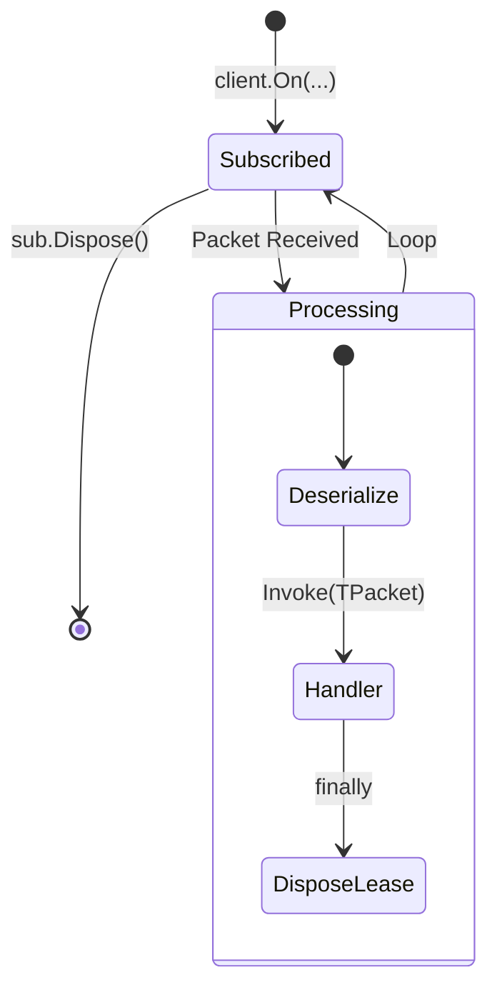

# SDK Subscriptions

The subscription system in `Nalix.SDK` provides a high-level, packet-oriented event model. It abstracts away the complexities of `IBufferLease` management, ensuring that memory is safely returned to the pool once your handler completes.

!!! important "Client-side helper"
    SDK subscriptions are client-side helpers for `TransportSession` instances. Server-side packet dispatch should use runtime handlers and middleware, not SDK subscription extensions.

## Subscription Lifecycle



## Source mapping

- `src/Nalix.SDK/Transport/Extensions/TcpSessionSubscriptions.cs`
- `src/Nalix.SDK/Extensions/SubscriptionExtensions.cs`

## Role and Design

While `TransportSession.OnMessageReceived` provides raw access to byte buffers, application logic usually prefers working with strongly-typed `IPacket` instances.

The subscription helpers provide:

- **Type Safety**: `On<TPacket>()` ignores packets of other types and only invokes your handler when the payload matches.
- **Strict Debugging**: `OnExact<TPacket>()` reports unexpected packets without crashing the receive loop.
- **Lease Ownership**: The helper owns the `IBufferLease`. It ensures the lease is disposed even if your handler throws an exception.
- **Predicated Filtering**: Filter messages before they even reach your handler (e.g., only `PONG` controls with a specific sequence ID).

## API Reference

| Method | Description |
| --- | --- |
| `On<TPacket>` | Subscribes to a packet type and ignores non-matching packets. |
| `On(Func<IPacket, bool>, Action<IPacket>)` | Subscribes to packets matching a predicate filter. |
| `OnExact<TPacket>` | Strict subscription that logs unexpected packet types without stopping the receive loop. |
| `OnOnce<TPacket>` | Fires exactly once for the first matching packet, then auto-unsubscribes. |
| `SubscribeTemp<TPacket>` | Combines a typed message handler with an `OnDisconnected` hook—ideal for transient flows. |
| `SubscribeTemp<TPacket>(predicate)` | Predicate overload for filtered transient subscriptions. |
| `Subscribe(TransportSession, params IDisposable[])` | Groups multiple subscriptions into a `CompositeSubscription`. |
| `CompositeSubscription` | A container to group and dispose multiple subscriptions at once. Supports `Add(IDisposable)`. |

## Basic usage

### Strongly-Typed Handler

```csharp
using var sub = client.On<ChatPacket>(chat => 
{
    Console.WriteLine($"[{chat.Sender}]: {chat.Message}");
});
```

### Strict Typed Handler

```csharp
using var sub = client.OnExact<ChatPacket>(chat =>
{
    Console.WriteLine($"[{chat.Sender}]: {chat.Message}");
});
```

### One-Shot with Predicate

```csharp
using var once = client.OnOnce<Control>(
    predicate: c => c.Type == ControlType.PONG,
    handler: pong => Console.WriteLine("Received PONG!")
);
```

### Composite Subscriptions

Use `CompositeSubscription` when you have multiple related event listeners that should be torn down together (e.g., when a UI view is closed).

```csharp
var group = new CompositeSubscription();

group.Add(client.On<PlayerPos>(p => UpdatePos(p)));
group.Add(client.On<PlayerStats>(s => UpdateStats(s)));

// Later, or in Dispose():
group.Dispose(); // Unsubscribes all
```

## Important notes

- **Thread Safety**: Handlers are invoked on the background receive thread. Use a [Thread Dispatcher](./thread-dispatching.md) before updating UI state.
- **Async Handlers**: If your handler is `async`, the lease is disposed as soon as the synchronous part of the handler finishes. Ensure you copy any data you need before the first `await`.
- **Unexpected Packets**: `On<TPacket>()` silently skips non-matching packets by design. Use `OnExact<TPacket>()` when you want protocol violations to be logged explicitly without tearing down the session.
- **Error Handling**: Any exception thrown by a subscription callback is isolated from the transport receive loop.

## Related APIs

- [Session Extensions](./tcp-session-extensions.md)
- [Handshake Extensions](./handshake-extensions.md)
- [Thread Dispatching](./thread-dispatching.md)
- [TCP Session](./tcp-session.md)
