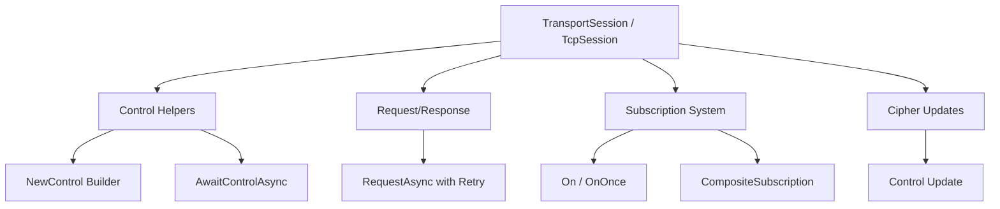

# Session Extensions

The `Nalix.SDK.Transport.Extensions` namespace provides high-level abstractions for managing control flows, cipher updates, and event subscriptions. These helpers turn raw transport sessions into a rich, packet-oriented client runtime.

## Capability Map



## Source mapping

- `src/Nalix.SDK/Transport/Extensions/ControlExtensions.cs`
- `src/Nalix.SDK/Transport/Extensions/RequestExtensions.cs`
- `src/Nalix.SDK/Transport/Extensions/CipherExtensions.cs`
- `src/Nalix.SDK/Transport/Extensions/TcpSessionSubscriptions.cs`

## Core Modules

### 1. Control Helpers (`ControlExtensions`)
Facilitates the creation and awaiting of `CONTROL` frames. These are system-level packets used for signaling, keep-alive, and protocol state management.

| Method | Target | Description |
|---|---|---|
| `NewControl` | `TransportSession` | Starts a fluent `ControlBuilder` for pre-stamped control frames. |
| `AwaitControlAsync`| `TcpSession` | Correlates and waits for a specific control response. |
| `SendControlAsync` | `TcpSession` | Fluent shortcut for creating and transmitting a control frame. |

### 2. Cipher Updates (`CipherExtensions`)
Lets an already connected `TcpSession` switch its active cipher suite in sync with the server.

- **Protocol-Safe Switch**: Uses a dedicated `CONTROL` update and sequence id to coordinate the change.
- **Immediate Transition**: Sends the update with the old cipher, then swaps the local algorithm before awaiting the ACK.
- **Session-Side Update**: Updates `TransportOptions.Algorithm` after the request is sent.
- **Rollback Safety**: If the ACK does not arrive, the SDK restores the previous cipher to keep client and server aligned.

### 3. Request/Response (`RequestExtensions`)
Provides an unified `RequestAsync<TResponse>` method that handles the full cycle of subscribing, sending a request, awaiting the response with a timeout, and retrying if necessary.

- **Race-Free**: Subscribes before sending to ensure no responses are missed.
- **Resilient**: Configurable retry logic via `RequestOptions`.

### 4. Subscriptions (`TcpSessionSubscriptions`)
A specialized event system that handles buffer ownership and fault tolerance.

- **Safe Disposal**: Handlers are automatically wrapped to ensure `IBufferLease` is released.
- **Lifecycle Management**: Supports `OnOnce` for transient events and `CompositeSubscription` for bulk cleanup.
- **Fault Isolation**: Subscriber exceptions are logged instead of faulting the receive loop.

## Basic usage

### Handshake & Secure Request
```csharp
// 1. Connect and secure
await client.ConnectAsync();

// 2. Perform a secure request
var response = await client.RequestAsync<ProfileData>(
    new GetProfilePacket { UserId = 101 },
    RequestOptions.Default.WithEncrypt()
);
```

### Control Flow
```csharp
// Build a tagged PING
var ping = client.NewControl(opCode: 10, ControlType.PING)
                 .WithSeq(42)
                 .Build();

// Send and wait for PONG
await client.SendAsync(ping);
var pong = await client.AwaitControlAsync(c => c.Type == ControlType.PONG && c.SequenceId == 42, 5000);
```

### Temporary Subscriptions
```csharp
using var sub = client.On<NoticePacket>(notice => 
{
    Console.WriteLine($"[SYSTEM]: {notice.Message}");
});

// Subscription auto-removed when 'sub' is disposed
```

## Related APIs

- [TCP Session](./tcp-session.md)
- [Handshake Extensions](./handshake-extensions.md)
- [Request Options](./options/request-options.md)
- [Cipher Updates](./cipher-extensions.md)
- [Control Type Enum](../common/protocols/control-type.md)
